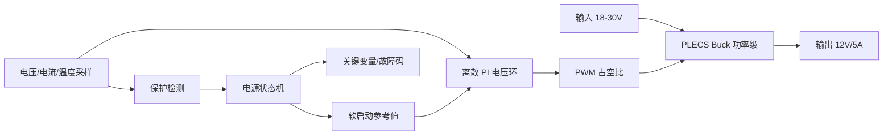

# digital-power-buck-sim-lab

这是一个面向开关电源软件工程师作品集的数字 Buck 电源仿真项目。项目主线不是单独学习 MATLAB 或 PLECS，而是把功率级建模、数字控制、保护状态机、测试矩阵、C 风格控制代码和问题复盘组织成一个可展示的工程资产。

## 项目目标

第一阶段只做低压 DC-DC，不碰市电输入。目标规格：

| 项目 | 目标值 |
| --- | --- |
| 拓扑 | Buck |
| 输入电压 | 18 V 到 30 V，标称 24 V |
| 输出电压 | 12 V |
| 最大输出电流 | 5 A |
| 最大输出功率 | 60 W |
| 开关频率 | 100 kHz 到 300 kHz，初始按 200 kHz 设计 |
| 控制方式 | 离散 PI 电压环 |
| 保护 | UVLO、OVP、OCP、OTP |

## 职责边界

```text
PLECS              功率级模型、开关波形、负载/输入扰动
MATLAB/Simulink    数字控制、测试矩阵、波形处理、报告脚本
controller/        接近 MCU 固件的 C 风格控制逻辑
docs/              设计决策、调试记录、测试报告
blog/              面向 CSDN 的问题型复盘草稿
```

实时控制、保护检测、状态切换分层实现，避免把所有判断塞进一个控制器里。

## 系统架构



## 当前仓库结构

```text
models/plecs/       PLECS 功率级模型
models/simulink/    Simulink 控制模型
controller/         C 风格控制代码
scripts/            MATLAB 测试和波形脚本
docs/               工程文档
waveforms/          启动、负载突变、故障保护波形
blog/               CSDN 博客草稿
```

## 阶段计划

1. PLECS 建开环 Buck 功率级，验证 Vout 与 duty 的关系。
2. 加入离散 PI 电压环，完成稳态调压。
3. 加入软启动、占空比限幅和抗积分饱和。
4. 加入 UVLO、OVP、OCP、OTP 和故障状态机。
5. 建立测试矩阵，覆盖启动、负载突变、输入扰动、故障注入。
6. 将控制逻辑整理成 C 风格代码，准备后续迁移到 STM32G4 或 TI C2000。
7. 输出 GitHub 文档、CSDN 博客、波形报告和面试讲解稿。

## 验证标准

每个阶段必须留下可复查证据：

- 模型文件或脚本
- 关键参数
- 仿真工况
- 波形截图
- 根因分析
- 最小修改
- 验证结果

不伪造仿真结果。没有完成的波形和数据在文档中保持 `TODO`，等模型跑通后再补。
