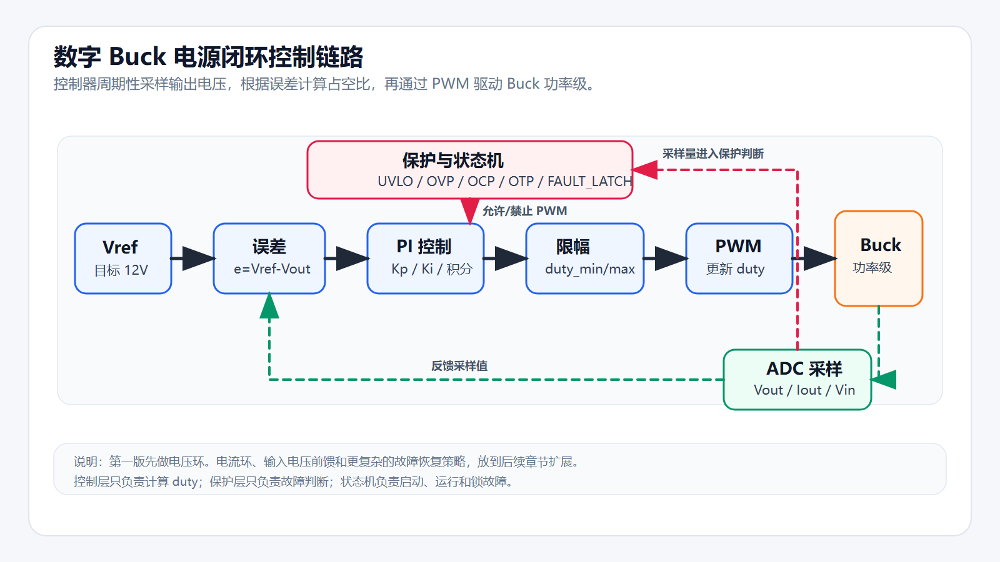
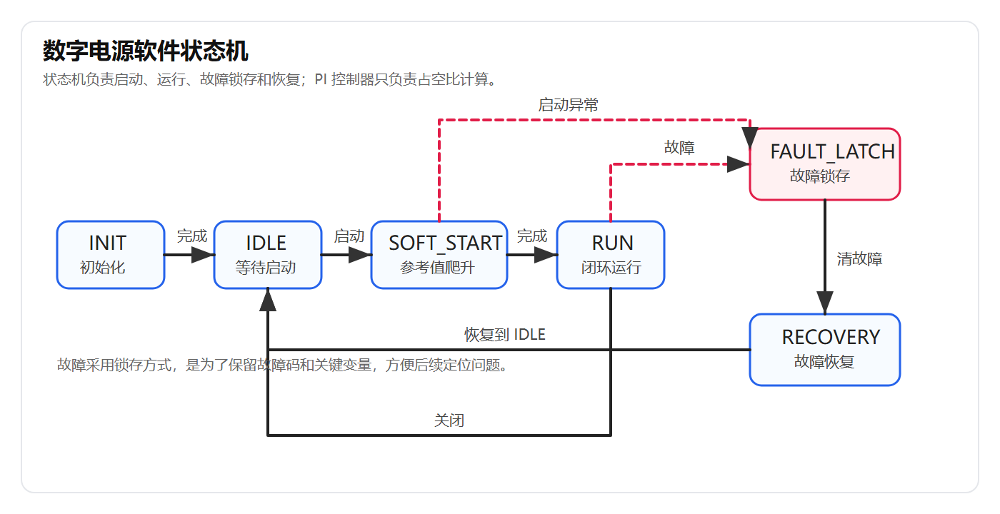

# 【数字电源/MATLAB+PLECS】如何进行 Buck 数字电源仿真（一）Buck 电路介绍与项目准备

Buck 电路是一种最常见的 DC-DC 降压型开关电源拓扑。它可以把较高的直流输入电压转换成较低、相对稳定的直流输出电压，常见于嵌入式设备、工业控制、电机驱动、通信电源、3D 打印机和机器人供电系统中。

本系列准备使用 MATLAB/Simulink 和 PLECS，从零搭建一个 Buck 数字电源仿真项目。内容会从 Buck 功率级开始，逐步加入开环测试、离散 PI 电压环、软启动、占空比限幅、保护状态机、测试矩阵以及 C 风格控制代码。

本文是系列第一篇，主要解决三个问题：

```text
1. Buck 电路到底在做什么
2. 为什么数字电源仿真适合从 Buck 开始
3. 后续 MATLAB + PLECS 项目会按什么路线展开
```

先说明一点：本文不会一上来就调 PI，也不会直接堆公式。数字电源学习最容易卡住的地方，不是某一个公式，而是不知道功率级、采样、控制器、PWM 和保护逻辑之间是什么关系。本文先把这条主线建立起来。

## 本系列适合哪些读者

如果你已经能熟练设计 PFC、LLC、移相全桥，或者已经做过数字电源量产项目，这个系列会比较基础。

但如果你现在处在下面这种状态，本系列会比较适合：

```text
知道 Buck 是降压电路，但没有完整搭过模型
知道 PWM 和 ADC，但不知道它们怎么组成闭环电源
听过 PI 控制，但不知道怎么落到数字控制器里
会一点 STM32 或 C 语言，但不知道电源软件怎么分层
有 MATLAB/PLECS，但不知道从哪个项目开始练
```

这个系列的目标不是把所有电源拓扑一次讲完，而是先用一个足够典型、复杂度可控的 Buck 项目，把数字电源软件开发的基本链路跑通。

## Buck 电路介绍

Buck 电路也叫降压斩波电路，核心作用是：

```text
把较高的直流输入电压，变成较低的直流输出电压。
```

理想情况下，Buck 输出电压和占空比之间满足：

```text
Vout = D * Vin
```

其中：

| 名称 | 含义 |
| --- | --- |
| Vin | 输入电压 |
| Vout | 输出电压 |
| D | PWM 占空比 |

例如输入电压为 24V，希望输出 12V，则理想占空比大约为：

```text
D = Vout / Vin = 12 / 24 = 0.5
```

也就是说，在理想模型中，占空比为 50% 时，24V 输入可以得到 12V 输出。

但是实际电路不会这么理想。MOSFET 有导通损耗，二极管有压降，电感有直流电阻，电容有 ESR，负载也会变化。因此工程上不能只记公式，还要观察波形、分析误差，并通过控制器不断修正占空比。

这也是数字电源仿真的价值：先在模型里看清楚这些变量之间的关系，再考虑真实硬件。

## Buck 电路基本组成

典型 Buck 电路主要由以下部分组成：

| 模块 | 功能 |
| --- | --- |
| 输入电源 Vin | 提供直流输入电压 |
| 开关管 MOSFET | 根据 PWM 信号周期性导通和关断 |
| 二极管或同步 MOSFET | 在主开关关断时，为电感电流提供续流路径 |
| 电感 L | 储能并平滑电流 |
| 输出电容 C | 滤除输出纹波，稳定输出电压 |
| 负载 Load | 消耗输出功率 |
| ADC 采样 | 采集输出电压、电流等反馈量 |
| 控制器 | 根据反馈量调整 PWM 占空比 |

在 PLECS 中，第一阶段会先搭建功率级，也就是输入电源、开关管、续流器件、电感、输出电容和负载。采样、控制器和保护逻辑会在后续章节逐步加入。

下图是本系列第一阶段要搭建的 Buck 功率级拓扑：


这张图里建议重点看三个位置：

| 位置 | 为什么重要 |
| --- | --- |
| SW 节点 | 这里能看到开关波形，是判断 PWM 和功率级是否工作的关键位置 |
| 电感 L | 电感电流决定 Buck 是否工作在合理状态 |
| 输出端 Vout | 后续闭环控制的目标就是让这里稳定在 12V |

学习 Buck 时不要只盯着 Vout。很多问题其实先出现在 SW 节点或电感电流上，最后才表现为输出电压异常。

## 本系列项目规格

第一阶段项目规格如下：

| 项目 | 参数 |
| --- | --- |
| 拓扑 | Buck 降压电路 |
| 输入电压范围 | 18V - 30V |
| 标称输入电压 | 24V |
| 输出电压 | 12V |
| 最大输出电流 | 5A |
| 最大输出功率 | 60W |
| 初始开关频率 | 200kHz |
| 控制方式 | 数字 PI 电压环 |
| 仿真工具 | MATLAB/Simulink、PLECS |
| 后续扩展 | C 风格控制代码、STM32G4 或 TI C2000 迁移 |

这里特意选择低压 DC-DC，不涉及 220V 市电，也不涉及 PFC、LLC、反激等复杂拓扑。

原因不是这些拓扑不重要，而是第一阶段最重要的事情是先把下面这条链路跑通：

```text
功率级建模
-> 开环验证
-> ADC 采样
-> 数字控制器
-> PWM 更新
-> 保护逻辑
-> 状态机
-> 测试报告
```

如果一开始就做复杂拓扑，很容易把时间耗在磁性器件、隔离反馈、谐振参数和驱动保护上，反而看不清数字控制软件的主线。

## 为什么先做开环，再做闭环

这是本系列很重要的一个学习顺序。

很多人一上来就想加 PI 控制器，然后开始调参数。但如果功率级模型本身有问题，后面调 PI 只会越来越乱。

所以第一步应该是开环测试：

```text
给 Buck 一个固定占空比
观察 Vout 是否接近 D * Vin
观察电感电流是否合理
观察 SW 节点是否有正确的开关波形
```

只有开环模型可信，闭环控制才有意义。

可以把这个过程理解为：

```text
先确认被控对象是正常的
再设计控制器
最后再分析控制效果
```

这也是工程调试里很重要的习惯。不要在根因不清楚的时候直接堆控制算法。

## MATLAB 与 PLECS 的分工

本系列会同时使用 MATLAB/Simulink 和 PLECS。它们不是互相替代的关系，而是分工不同。

| 工具 | 作用 |
| --- | --- |
| PLECS | 搭建 Buck 功率级模型，观察开关波形、电感电流、输出纹波、负载突变等现象 |
| MATLAB/Simulink | 搭建数字控制器，编写测试脚本，进行参数扫描和波形处理 |
| C 代码 | 将控制逻辑整理成接近 MCU 固件的形式 |
| GitHub | 保存工程文件、代码、文档和波形 |
| CSDN | 记录教程步骤、问题分析和学习过程 |

简单来说：

```text
PLECS 负责电路和功率级
MATLAB/Simulink 负责控制和测试
C 风格代码负责贴近真实嵌入式实现
```

后续文章中，PLECS 主要用来观察电气波形；MATLAB/Simulink 主要用来组织控制逻辑、测试矩阵和数据分析。

## 数字 Buck 控制链路

数字 Buck 电源的基本控制过程可以理解为：

```text
采样输出电压
计算输出误差
PI 控制器计算占空比
限制占空比范围
更新 PWM
Buck 功率级响应
再次采样输出电压
```

如果输出电压低于目标值，控制器会增大 duty；如果输出电压高于目标值，控制器会减小 duty。

下图是数字 Buck 电源的基本闭环控制链路：



例如目标输出电压为 12V：

| 实际输出电压 | 控制动作 |
| --- | --- |
| Vout < 12V | 增大 duty |
| Vout > 12V | 减小 duty |
| Vout ≈ 12V | 保持或小幅调整 duty |

但真实数字电源软件不能只写这一个闭环。至少还要考虑：

```text
启动时不能直接给满目标电压
占空比不能无限增大
积分项不能一直累加
输入欠压时要禁止启动或关断
输出过压时要进入保护
输出过流时要锁存故障
调试时要能看到关键变量
```

这些内容会在后续章节逐步加入。

## 软件状态机设计

为了让控制逻辑更接近真实工程，本项目不会把所有判断都写在一个控制器函数中，而是采用状态机方式组织。

初步状态如下：

| 状态 | 功能 |
| --- | --- |
| INIT | 初始化控制参数 |
| IDLE | 等待启动命令 |
| SOFT_START | 软启动过程 |
| RUN | 正常闭环运行 |
| FAULT_LATCH | 故障锁存 |
| RECOVERY | 故障恢复 |

状态切换关系如下图所示：



这里的关键原则是分层：

```text
PI 控制器：只负责误差计算和 duty 输出
保护模块：只负责判断是否发生故障
状态机：只负责决定当前处于启动、运行、故障还是恢复
```

这样做的好处是调试时更容易追根因。

例如输出过流时，不需要到处找是哪一段代码把 PWM 关掉了；只要看保护模块是否给出了 OCP 故障码，再看状态机是否进入 FAULT_LATCH 即可。

## 关键观测变量

数字电源调试不能只看输出电压。输出电压只是最终结果，根因往往藏在其他变量里。

本项目会重点观察以下变量：

| 变量 | 作用 |
| --- | --- |
| Vin | 输入电压，判断输入扰动和欠压 |
| Vout | 输出电压，判断稳态误差和动态响应 |
| Iout | 输出电流，判断负载变化和过流 |
| IL | 电感电流，判断功率级工作状态 |
| duty | PWM 占空比，判断控制器是否打满 |
| Vref | 输出电压参考值，判断软启动过程 |
| state | 当前电源状态，判断状态机是否走错 |
| fault_code | 故障码，定位保护触发原因 |
| pi_integrator | PI 积分项，分析积分饱和和恢复速度 |

后续每次出现问题，都尽量按下面的顺序分析：

```text
先看现象
再看关键变量
再判断是哪一层职责
最后做最小修改验证
```

这样可以避免一遇到波形不对就盲目调参数。

## 常见误区

在开始做模型前，先把几个容易踩的坑列出来。

| 误区 | 问题 |
| --- | --- |
| 一上来就调 PI | 如果开环功率级不对，PI 参数没有意义 |
| 只看 Vout | 很多问题需要看 SW 节点、电感电流和 duty |
| 把保护写进 PI 控制器 | 控制职责和保护职责混在一起，后续很难调试 |
| 只跑稳态 | 电源软件更怕启动、负载突变和故障工况 |
| 仿真结果不记录 | 没有波形和测试矩阵，后面很难复现问题 |

本系列后续会刻意围绕这些问题展开，而不是只演示一个能跑的模型。

## 后续教程安排

本系列计划按照如下顺序展开：

| 篇章 | 内容 |
| --- | --- |
| 第 1 篇 | Buck 电路介绍与项目准备 |
| 第 2 篇 | PLECS 搭建开环 Buck 功率级 |
| 第 3 篇 | Buck 电感、电容和开关频率初步计算 |
| 第 4 篇 | MATLAB/Simulink 搭建离散 PI 控制器 |
| 第 5 篇 | 占空比限幅与抗积分饱和 |
| 第 6 篇 | 软启动功能设计 |
| 第 7 篇 | UVLO、OVP、OCP 保护逻辑 |
| 第 8 篇 | 电源状态机设计 |
| 第 9 篇 | 负载突变测试与波形分析 |
| 第 10 篇 | 将仿真控制逻辑整理为 C 风格代码 |

每一篇尽量只解决一个核心问题，例如如何搭电路、如何看波形、为什么输出会下陷、为什么 duty 会打满、为什么要做软启动等。

## 本篇总结

本文主要完成了 Buck 数字电源仿真项目的准备工作。

本系列会从一个 24V 输入、12V/5A 输出的 Buck 电路开始，逐步完成 PLECS 功率级建模、MATLAB/Simulink 数字控制、保护状态机、测试矩阵以及 C 风格控制代码。

第一阶段不要急着追求复杂拓扑。先把这条主线跑通：

```text
开环功率级
-> 采样
-> 控制
-> PWM
-> 保护
-> 状态机
-> 测试和调试
```

下一篇开始进入实操：在 PLECS 中搭建开环 Buck 模型。先通过固定占空比观察输出电压、电感电流和 SW 节点波形，为后续闭环控制打基础。
