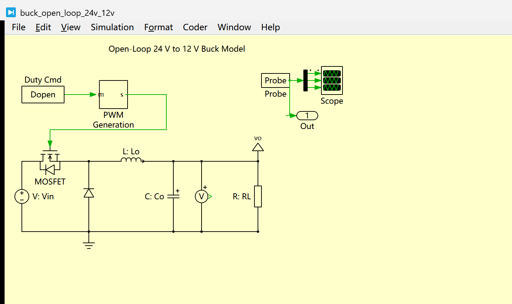
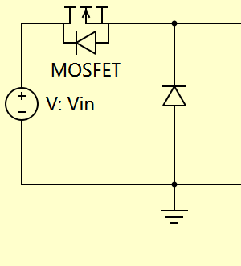
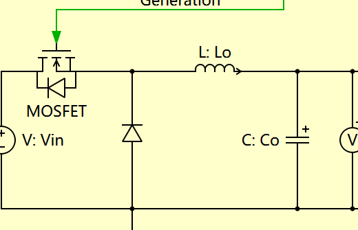
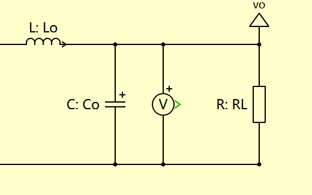
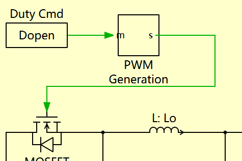
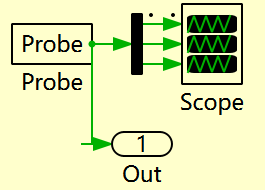
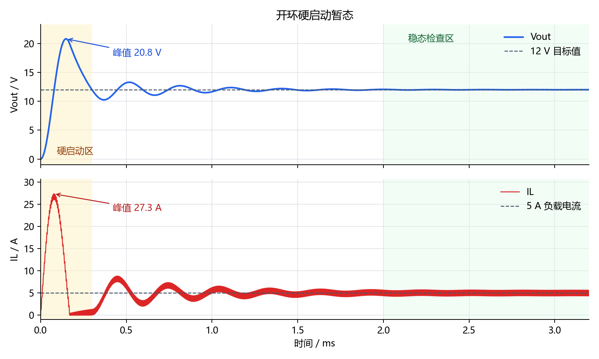
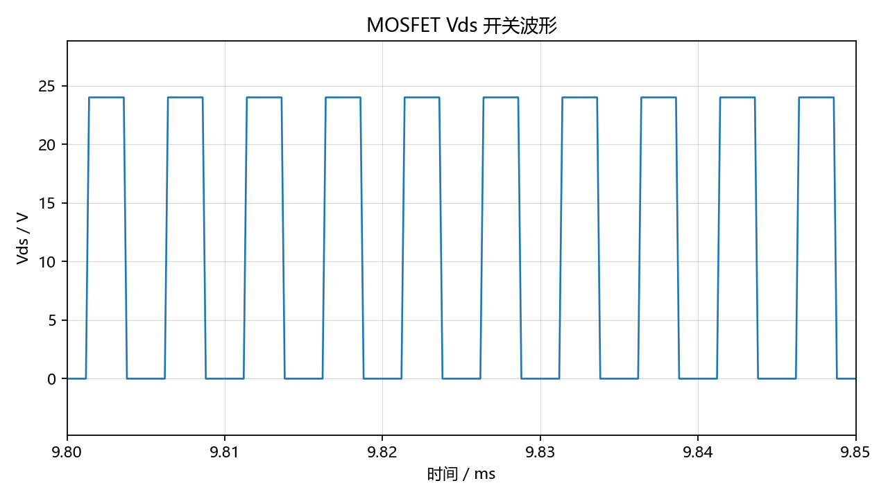
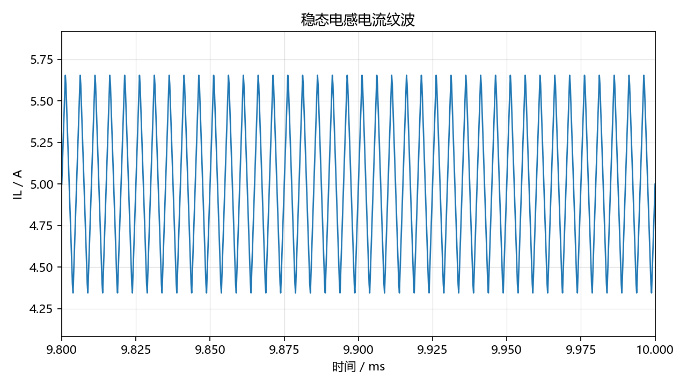
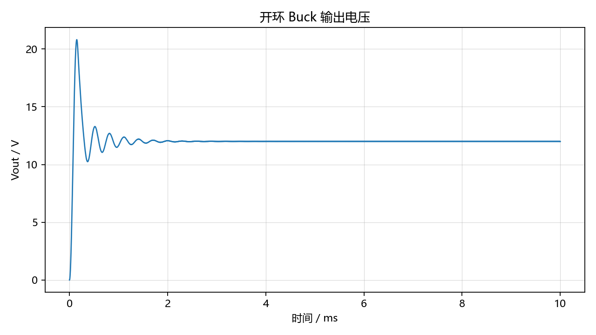

# 【数字电源/MATLAB+PLECS】如何进行 Buck 数字电源仿真（二）PLECS 搭建开环 Buck 功率级

上一篇主要介绍了 Buck 电路、数字电源控制链路以及本系列的整体路线。本文开始进入实操，在 PLECS 中先搭建一个开环 Buck 功率级模型。

> 配套 GitHub 仓库：[digital-power-buck-sim-lab](https://github.com/Old-Ding/digital-power-buck-sim-lab)
> 本章的 PLECS 模型、导出脚本、原始 CSV 数据和波形图都已经放到仓库中，读者可以对照本文复现。

这里先强调一个顺序：

> 先开环
> 再闭环
> 先验证功率级
> 再设计控制器

不要一开始就急着加 PI 控制器。因为如果功率级模型本身接错了，或者电感、电容、负载参数不合理，后面调 PI 参数只会把问题掩盖得更深。

## 先看本篇成品

本文最后搭出来的 PLECS 模型如下：

这张图先看两条链路：

> Dopen -> PWM Generation 的 m 输入
> PWM Generation 的 s 输出 -> MOSFET gate

也就是说，`Dopen` 不是直接驱动 MOSFET，而是先作为占空比指令进入 PWM 模块，再由 PWM 模块输出开关信号。这个关系必须看清楚，否则后面做闭环时很容易把“占空比指令”和“实际开关脉冲”混在一起。

仿真结果先给结论：

| 项目 | 结果 |
| --- | --- |
| 输入电压 | 24V |
| 开环占空比 | 0.5 |
| 稳态输出电压 | 约 12V |
| 稳态电感电流 | 约 5A |
| MOSFET Vds | 0V / 24V 周期切换 |

本文的目标是：

> 固定占空比 duty
> 观察输出电压 Vout
> 观察电感电流 IL
> 观察 MOSFET Vds 开关波形
> 确认 Buck 功率级模型符合基本规律

## 本篇要完成的内容

本文只做开环 Buck，不做闭环控制。

本篇完成后，模型中应该至少包含：

> 输入电源 Vin
> PWM 信号
> 高边开关管
> 续流二极管
> 电感 L
> 输出电容 C
> 负载 R
> Probe 三路采样
> Scope 波形观察

本篇不会加入：

> PI 控制器
> 软启动
> 过压保护
> 过流保护
> 状态机
> C 代码

这些内容放到后续章节。这样做的原因是职责要清楚：本文只证明“被控对象”是正常的。

## 开环 Buck 的验证思路

理想 Buck 电路中，输出电压近似满足：

> Vout = D * Vin

其中：

| 名称 | 含义 |
| --- | --- |
| Vin | 输入电压 |
| Vout | 输出电压 |
| D | PWM 占空比 |

本系列标称输入电压为 24V，目标输出电压为 12V，所以开环测试时可以先取：

> D = 0.5

理论上：

> Vout = 0.5 * 24V = 12V

实际仿真中，如果考虑器件压降、电感电阻、电容 ESR，输出电压会略有偏差。第一版模型可以先从理想器件开始，确认拓扑正确后，再逐步加入非理想参数。

## 初始参数设计

先给出一组适合入门仿真的参数。

| 参数 | 初始值 | 说明 |
| --- | --- | --- |
| Vin | 24V | 标称输入电压 |
| Vout | 12V | 目标输出电压 |
| Iout | 5A | 最大输出电流 |
| Pout | 60W | 最大输出功率 |
| fsw | 200kHz | PWM 开关频率 |
| duty | 0.5 | 开环固定占空比 |
| L | 22uH | 初始电感值 |
| C | 100uF | 初始输出电容 |
| Rload | 2.4Ω | 满载等效负载 |

负载电阻的计算如下：

> Rload = Vout / Iout = 12V / 5A = 2.4Ω

电感值可以按电感电流纹波估算。假设电感电流纹波取满载电流的 30%：

> ΔIL = 5A * 30% = 1.5A

Buck 电感估算公式：

> L = (Vin - Vout) * D / (ΔIL * fsw)

代入参数：

> L = (24V - 12V) * 0.5 / (1.5A * 200kHz)
> L ≈ 20uH

因此第一版可以选一个常见值：

> L = 22uH

输出电容先取：

> C = 100uF

这里不追求一次算得非常精确。第一版重点是把模型跑起来，并能解释波形。后续章节会再讨论电感、电容、纹波和动态响应之间的关系。

## PLECS 元件清单

在 PLECS 中，可以按下面的元件搭建第一版开环 Buck：

| 元件 | 作用 |
| --- | --- |
| DC Voltage Source | 输入电源 Vin |
| MOSFET | 高边开关管 |
| Diode | 开关关断时的续流通路 |
| Inductor | Buck 电感 |
| Capacitor | 输出电容 |
| Resistor | 等效负载 |
| Constant | 固定占空比指令 Dopen |
| PWM Generation | 将 duty 指令转换成开关脉冲 |
| Plecs Probe | 采样 Vout、IL 和 MOSFET Vds |
| Scope | 观察仿真波形 |
| Electrical Reference | 电气参考地 |

这里没有直接使用库里的 Pulse Generator，而是用了一个 `PWM Generation` 子系统。这样做是为了给后续闭环控制留接口：现在输入是常数 `Dopen`，后面可以把它替换成 PI 控制器输出的 duty，而功率级不用重搭。

第一版模型先使用理想器件。等开环模型验证正确后，再加入器件导通压降、导通电阻、电容 ESR 和寄生参数。

## 搭建步骤

### 1. 新建 PLECS 模型

打开 PLECS，新建一个模型文件，建议命名为：

> buck_open_loop_24v_12v.plecs

后续可以放到 GitHub 仓库：

> models/plecs/buck_open_loop_24v_12v.plecs

### 2. 放置输入电源和参考地

先放置 DC Voltage Source，并设置：

> Vin = 24V

再放置 Electrical Reference，作为电路地。

这一步的目标是先建立输入电源和公共参考点。电源仿真中如果忘记参考地，模型很容易报错或者波形异常。

### 3. 搭建高边开关和续流路径

Buck 的核心是开关管周期性导通和关断。

先放置高边开关管，再在 SW 节点到地之间放置续流二极管。

这里的 SW 节点非常重要。第一版模型先通过 MOSFET Vds 间接判断开关动作，后续如果要分析尖峰、振铃和吸收回路，再单独加入 SW 节点电压测量。

> 开关管导通时：SW 节点接近 Vin
> 开关管关断时：电感电流通过二极管续流，SW 节点电压下降

### 4. 放置电感、输出电容和负载

在 SW 节点后面接入电感 L，再接输出电容 C 和负载 R。

第一版参数：

> L = 22uH
> C = 100uF
> Rload = 2.4Ω

输出端命名为：

> Vout

### 5. 加入 PWM 信号

开环模型不需要控制器，只需要固定占空比指令。

本文模型中使用一个 Constant 作为占空比输入：

> Dopen = 0.5

然后把 `Dopen` 接到 `PWM Generation` 子系统的 `m` 输入端。`PWM Generation` 内部用三角波和占空比指令比较，输出开关信号 `s`，再由 `s` 去驱动 MOSFET gate。

此时模型的逻辑是：

> Dopen 固定 duty 指令
> -> PWM Generation 产生开关脉冲
> -> MOSFET 周期性导通/关断
> -> Buck 功率级自然响应
> -> 输出电压由 duty 和 Vin 决定

这个地方是新手最容易看错的点：`m` 是调制指令，`s` 才是开关信号。画图时也要把这两条线分开，不要让读者误以为 `Dopen` 直接接到了 MOSFET。

### 6. 加入测量点和 Scope

为了判断模型是否正确，至少需要观察三个波形：

| 波形 | 作用 |
| --- | --- |
| MOSFET Vds | 判断开关管是否按固定频率切换 |
| 电感电流 IL | 判断电感电流是否连续、纹波是否合理 |
| 输出电压 Vout | 判断输出是否接近理论值 |

建议 Scope 中至少放入：

> MOSFET Vds
> IL
> Vout

Probe 输出三路信号：输出电容电压、电感电流、MOSFET Vds。这里没有直接额外放一个 SW 节点电压传感器，是为了保持第一版模型足够干净；Vds 已经能证明开关动作是否正常。

## 仿真设置建议

第一版仿真可以先设置：

| 项目 | 建议值 |
| --- | --- |
| 仿真时间 | 5ms - 10ms |
| 初始 duty | 0.5 |
| 输入电压 | 24V |
| 负载 | 2.4Ω |
| 开关频率 | 200kHz |

仿真时间不要太短，否则输出电压还没稳定就结束；也不要一开始设得太长，避免仿真速度变慢。

如果仿真步长可以设置，建议先使用 PLECS 默认设置。等后续出现波形抖动、开关细节看不清楚、仿真速度过慢等问题时，再调整求解器和步长。

## Scope 里为什么看起来跳来跳去

第一次运行这个开环模型时，Scope 里很容易看到下面这种现象：

| 看到的现象 | 真实原因 | 正确读法 |
| --- | --- | --- |
| Vout 启动时冲到 20V 左右，然后再掉下来 | 开环硬启动激励了 LC 输出滤波器的自然响应 | 先确认后面是否衰减到 12V 附近 |
| IL 启动时冲到 20A 以上 | 电容从 0V 被突然充电，电感电流先承担启动能量转移 | 这是启动冲击电流，不是稳态负载电流 |
| MOSFET Vds 像一整块绿色色带 | 200kHz 开关波形被压缩到 0ms - 3ms 的全局时间尺度里 | 要放大到几个开关周期再判断高低电平 |

这里不要急着改拓扑，也不要急着调求解器。本文这个模型本来就没有软启动、没有闭环、没有限流，`Dopen = 0.5` 是在仿真开始时直接给到 PWM 模块的。对 Buck 来说，这相当于一上电就用固定占空比硬推输出电容，所以 Vout 和 IL 在启动阶段出现过冲是合理的。

下面这张图专门看启动阶段：

从这张图可以看出，本模型的启动峰值大约为：

> Vout 启动峰值 ≈ 20.8V
> IL 启动峰值 ≈ 27.3A

这两个数不能拿来评价稳态输出质量。开环功率级验证应该分成两张尺度来看：

> 启动总览：看 Vout/IL 是否过冲后衰减
> 稳态局部：放大到几个开关周期，看 Vds、IL 纹波和 Vout 纹波

写教程时也建议按这个顺序放图。不要只贴 Scope 的全局截图，因为全局截图会把高频开关细节压成一片，读者会误以为模型乱跳。

## 预期波形

开环 Buck 正常工作时，要按时间尺度分别观察下面几类波形。

### 1. MOSFET Vds 波形

MOSFET Vds 应当是一个高低切换的开关波形。

大致特征：

> 开关管导通时：Vds 接近 0V
> 开关管关断时：Vds 接近 Vin
> 频率等于 PWM 开关频率
> 在 Dopen = 0.5 时，高低电平时间大致各占一半

注意，这里看的是 MOSFET Vds，不是 gate 信号。Vds 低电平对应开关管导通，Vds 高电平对应开关管关断。如果以后 duty 不是 0.5，Vds 的高电平时间和 gate 导通时间是互补关系，不能直接把 Vds 高电平比例当成 gate duty。

实际仿真波形如下：

这张图只截取了稳态后的局部时间窗口。不要用 0ms - 3ms 的全局窗口判断 Vds 细节，否则 200kHz 的高低电平会在 Scope 里压成一整块色带。

### 2. 电感电流 IL

电感电流应该呈现上升和下降的锯齿形纹波。

开关管导通时：

> 电感电流上升

开关管关断时：

> 电感电流下降

如果参数合理，满载下电感电流应当大致围绕 5A 上下波动，而不是直接降到 0A。

实际仿真中，稳态电感电流围绕 5A 呈连续锯齿波。这里看的是稳态局部放大图，不是启动冲击电流：

### 3. 输出电压 Vout

输出电压会从 0V 进入启动暂态，最终稳定到接近 12V。

如果使用理想器件和 duty=0.5，稳态输出应接近：

> Vout ≈ 12V

启动阶段的过冲前面已经单独分析过。这里重点看稳态结果：过冲衰减后，输出是否回到 `D * Vin` 附近。

如果输出明显偏离 12V，需要先检查：

> Vin 是否为 24V
> duty 是否为 0.5
> 负载是否为 2.4Ω
> 电感和电容是否接对
> 二极管方向是否正确
> 测量点是否接在输出端

实际仿真中，输出最终稳定在 12V 附近：

## 开环验证表

仿真完成后，可以按下面的表格记录结果。下面的数据由 `scripts/export_open_loop_waveforms.py` 调用 PLECS RPC 导出，不是手工编出来的截图结论。

| 检查项 | 预期结果 | 实际结果 |
| --- | --- | --- |
| PWM 频率 | 200kHz | Vds 周期约 5us，对应 200kHz |
| duty | 0.5 | Dopen = 0.5 |
| MOSFET Vds | 有高低切换 | 0V / 24V 高低切换 |
| IL | 有锯齿纹波 | 稳态均值约 5A，峰峰值约 1.31A |
| Vout | 接近 12V | 稳态均值约 12V，峰峰值约 8.5mV |
| 启动 Vout 峰值 | 开环硬启动允许出现过冲 | 约 20.8V，随后衰减到 12V 附近 |
| 启动 IL 峰值 | 开环硬启动会有冲击电流 | 约 27.3A，随后回到 5A 附近 |
| 输出是否稳定 | 经过启动后趋于稳定 | 有开环启动过冲，约 3ms 后稳定 |

这一张表很重要。后续如果加入 PI 控制后出现问题，可以回头对比开环模型是否本来就是正常的。

## 常见问题

### 1. Vout 不接近 12V

优先检查：

> duty 是否设置为 0.5
> Vin 是否设置为 24V
> 负载是否设置为 2.4Ω
> 电感是否串在 SW 和 Vout 之间
> 输出电容是否接在 Vout 和 GND 之间
> 二极管方向是否正确

不要一上来就怀疑 PLECS 或求解器。大多数初期问题都是连接错误、参数错误或测量点放错。

### 2. 电感电流直接降到 0

这可能说明 Buck 工作在断续电流模式，或者负载太轻、电感值太小。

可以先检查：

> 负载电阻是否过大
> 电感值是否过小
> 开关频率是否设置正确

### 3. 启动过冲是不是说明模型错了

不一定。

本文是开环模型，没有软启动，也没有闭环阻尼。输入 24V、占空比直接给到 0.5 时，LC 输出端会出现启动振铃，Vout 先冲高再回到 12V 附近，这是合理现象。

真正要判断的是：

> 稳态是否接近 12V
> 电感电流是否连续
> MOSFET Vds 是否按 200kHz 切换

如果这三件事都对，说明功率级搭建基本可信。启动过冲留到后面用软启动和闭环控制解决。

### 4. 仿真报错或无法运行

优先检查：

> 是否存在电路悬空
> 是否缺少 Electrical Reference
> 是否有理想电压源和理想开关形成不合理回路
> 开关控制信号是否连接正确

### 5. 波形看起来很乱

先不要急着调复杂参数。先判断它是“真的乱”，还是“显示尺度不对”。

> 看启动：用 0ms - 3ms，总览 Vout 和 IL 的过冲衰减
> 看开关：放大到几个 us，观察 MOSFET Vds 的 0V / 24V 切换
> 看纹波：放大到稳态局部，观察 IL 和 Vout 的峰峰值

调试顺序应该先分清时间尺度，再判断电路行为。如果 Vout 最终能回到 12V 附近、IL 稳态围绕 5A、Vds 按 200kHz 切换，那么这张 Scope 全局图虽然看起来跳，但模型本身是合理的。

## 本篇总结

本文完成了开环 Buck 功率级的搭建思路。

本篇的核心不是让输出电压“看起来对”，而是证明：

> PWM 能驱动开关管
> MOSFET Vds 有正确开关波形
> 电感电流有合理纹波
> 输出电压接近 D * Vin

只要这几个条件满足，说明功率级模型基本可信。下一篇可以继续讨论 Buck 电感、电容和开关频率的参数估算，并进一步解释为什么电感值、负载和开关频率会影响输出纹波和动态响应。

## 本章对应的 GitHub 开源内容

为了方便复现，本章对应的模型、脚本、数据和说明已经整理到 GitHub。主要文件如下：

仓库入口：[https://github.com/Old-Ding/digital-power-buck-sim-lab](https://github.com/Old-Ding/digital-power-buck-sim-lab)

本章直达：

| 内容 | 链接 |
| --- | --- |
| 第二章复现说明 | [docs/02-open-loop-buck-reproduce.md](https://github.com/Old-Ding/digital-power-buck-sim-lab/blob/master/docs/02-open-loop-buck-reproduce.md) |
| PLECS 开环 Buck 模型 | [models/plecs/buck_open_loop_24v_12v.plecs](https://github.com/Old-Ding/digital-power-buck-sim-lab/blob/master/models/plecs/buck_open_loop_24v_12v.plecs) |
| 波形导出脚本 | [scripts/export_open_loop_waveforms.py](https://github.com/Old-Ding/digital-power-buck-sim-lab/blob/master/scripts/export_open_loop_waveforms.py) |
| 仿真原始数据 | [waveforms/02-open-loop-data.csv](https://github.com/Old-Ding/digital-power-buck-sim-lab/blob/master/waveforms/02-open-loop-data.csv) |

| 类型 | 文件 | 作用 |
| --- | --- | --- |
| PLECS 模型 | `models/plecs/buck_open_loop_24v_12v.plecs` | 开环 Buck 功率级模型 |
| Python 脚本 | `scripts/export_open_loop_waveforms.py` | 导出仿真数据、关键指标和波形图 |
| 原始数据 | `waveforms/02-open-loop-data.csv` | PLECS 导出的 Vout、IL、Vds 数据 |
| 指标汇总 | `waveforms/02-open-loop-summary.csv` | 本章验证表中的关键数值来源 |
| 波形图片 | `waveforms/02-open-loop-*.png` | 本文使用的真实仿真波形 |
| 复现说明 | `docs/02-open-loop-buck-reproduce.md` | 第二章的运行步骤和结果判断 |

如果你想自己复现，建议按这个顺序走：先看复现说明，再打开 PLECS 模型，最后运行导出脚本，并用 `waveforms/` 里的 CSV 和波形图核对结果。

本文图片和波形对应文件如下：

| 文件 | 内容 |
| --- | --- |
| models/plecs/buck_open_loop_24v_12v.plecs | PLECS 开环 Buck 模型 |
| scripts/export_open_loop_waveforms.py | 调用 PLECS RPC 导出仿真数据和波形图 |
| assets/screenshots/02-plecs-open-loop-buck-model.png | PLECS 完整开环模型 |
| assets/screenshots/02-step-01-input-reference.png | 输入电源与参考地局部图 |
| assets/screenshots/02-step-02-switch-freewheel.png | 高边 MOSFET 与续流二极管局部图 |
| assets/screenshots/02-step-03-lc-output-load.png | 电感、输出电容和负载局部图 |
| assets/screenshots/02-step-04-pwm-chain.png | Dopen、PWM Generation 和 MOSFET gate 局部图 |
| assets/screenshots/02-step-05-probe-scope.png | Probe 与 Scope 信号连接局部图 |
| waveforms/02-open-loop-mosfet-vds.png | MOSFET Vds 开关波形 |
| waveforms/02-open-loop-il.png | 电感电流波形 |
| waveforms/02-open-loop-vout.png | 输出电压波形 |
| waveforms/02-open-loop-startup-overview.png | 开环硬启动暂态总览 |
| waveforms/02-open-loop-summary.csv | 开环仿真关键指标 |
