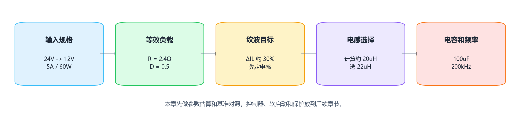
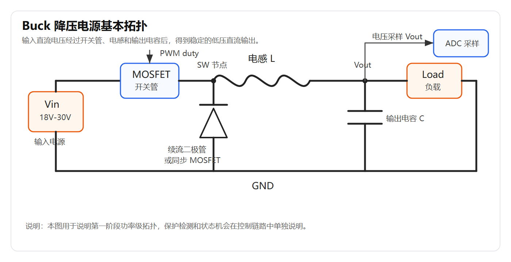
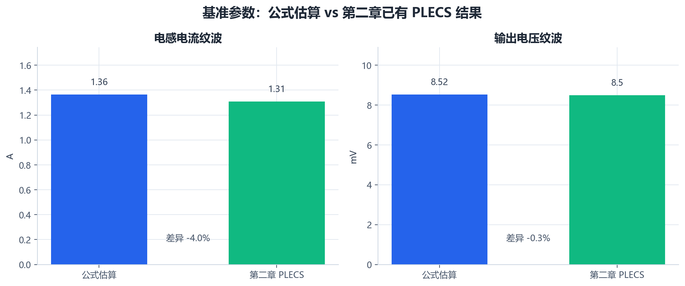
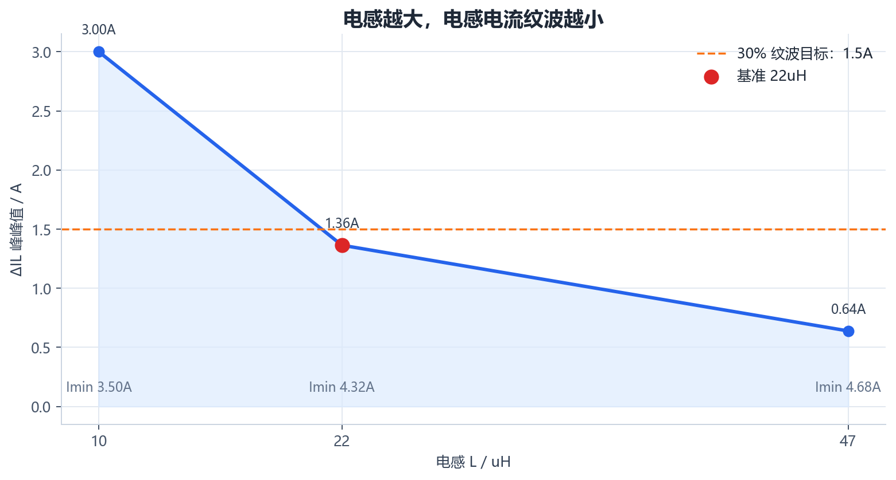
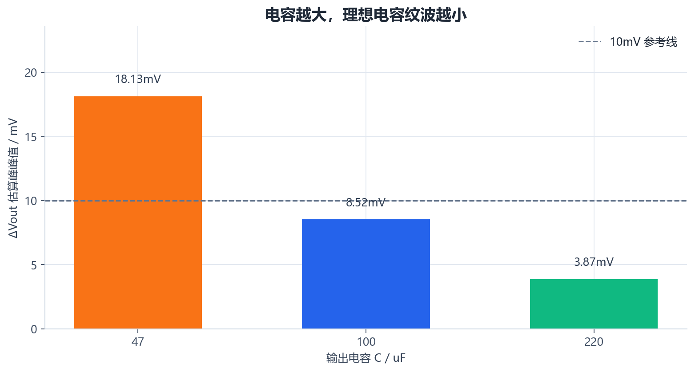
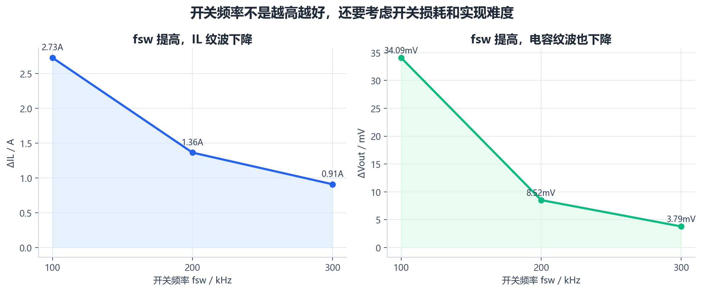
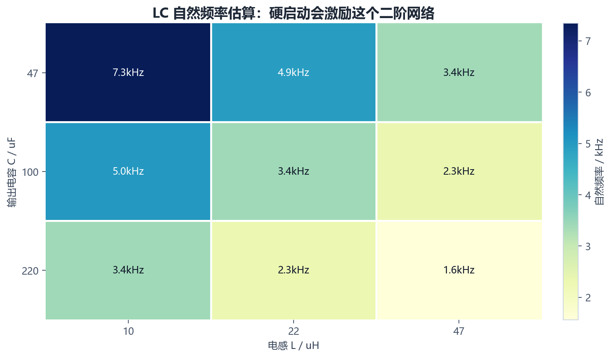

# 【数字电源/MATLAB+PLECS】如何进行 Buck 数字电源仿真（三）电感、电容和开关频率怎么初步选择

第二章已经把开环 Buck 功率级搭起来了，也确认了固定占空比下，输出电压能回到 12V 附近，电感电流有连续纹波，MOSFET Vds 也在按 200kHz 正常切换。

这一篇先不急着做 PI。

因为控制器不是用来掩盖功率级参数问题的。如果电感、电容、负载和开关频率之间的关系没有搞清楚，后面看到输出纹波、启动过冲或者负载突变，很容易把功率级本身的问题误判成 PI 参数没有调好。

> 配套 GitHub 仓库：[digital-power-buck-sim-lab](https://github.com/Old-Ding/digital-power-buck-sim-lab)
> 本章提供参数估算脚本、CSV 表格和图表。图表来自公式估算，并使用第二章已有 PLECS 结果做基准对照；本章没有重新运行 PLECS 参数扫描。

## 本章先回答什么问题

本章只做 Buck 功率级参数初选，目标是回答下面几个问题：

> 为什么电感先选 22uH
> 为什么输出电容先选 100uF
> 为什么开关频率先选 200kHz
> L、C、fsw 改变后，IL 纹波和 Vout 纹波怎么变
> 开环硬启动过冲和 LC 参数有什么关系

本章不会加入：

> PI 控制器
> 软启动
> 占空比限幅
> 过流保护
> 状态机
> C 代码

这些内容放在后续章节。第三章的边界很明确：先把“功率级参数为什么这样选”讲清楚。

整体路线如下：



## 先回到 Buck 拓扑

本文讨论的仍然是第二章里的非隔离 Buck：



先看能量路径，不要一上来就背公式。

开关管导通时，输入电源通过电感给负载和输出电容供能，电感电流上升。

开关管关断时，电感电流通过续流二极管继续流动，电感电流下降。

所以电感电流天然不是一条完全平直的直线，而是围绕平均值上下摆动。这个上下摆动就是电感电流纹波。

输出电容的作用，是把电感电流纹波里的一部分交流分量吸收掉，让输出电压纹波变小。

开关频率越高，一个周期越短，电感电流每个周期内上升和下降的时间越短，纹波会下降。但频率提高也会带来开关损耗、驱动要求、采样计算时间和仿真步长压力，所以不能简单说越高越好。

## 设计输入先固定

本系列先做一组低压 DC-DC 参数：

| 参数 | 数值 | 说明 |
| --- | --- | --- |
| Vin | 24V | 标称输入电压 |
| Vout | 12V | 目标输出电压 |
| Iout | 5A | 满载输出电流 |
| Pout | 60W | 满载输出功率 |
| fsw | 200kHz | 初始开关频率 |
| L | 22uH | 第二章使用的初始电感 |
| C | 100uF | 第二章使用的初始输出电容 |

满载等效负载先按电阻处理：

> Rload = Vout / Iout = 12V / 5A = 2.4Ω

理想 Buck 在连续电流模式下，输出电压近似满足：

> Vout = D * Vin

所以开环占空比先取：

> D = Vout / Vin = 12V / 24V = 0.5

这个 0.5 不是控制器输出，只是开环固定占空比。第二章已经用它验证了功率级模型可以工作。

## 电感怎么先估

Buck 电感纹波可以先用下面这个公式估算：

> ΔIL = (Vin - Vout) * D / (L * fsw)

其中：

| 符号 | 含义 |
| --- | --- |
| ΔIL | 电感电流峰峰值纹波 |
| Vin | 输入电压 |
| Vout | 输出电压 |
| D | 占空比 |
| L | 电感值 |
| fsw | 开关频率 |

如果反过来根据目标纹波求电感：

> L = (Vin - Vout) * D / (ΔIL * fsw)

入门仿真里，电感电流纹波可以先取满载电流的 20% 到 40%。这里先按 30% 估算：

> ΔIL = 5A * 30% = 1.5A

代入：

> L = (24V - 12V) * 0.5 / (1.5A * 200kHz)
> L = 20uH

工程上不会只盯着计算值，还要选常见标称值，所以第一版取：

> L = 22uH

这个选择对应的公式估算结果为：

> ΔIL ≈ 1.36A
> 电感电流最小值约 4.32A

也就是说，满载下电感电流仍然大于 0A，处在连续电流模式。第二章已有 PLECS 结果中，稳态电感纹波约 1.31A，和公式估算非常接近。

下面这张图把公式估算和第二章已有 PLECS 结果放在一起：



这张图要读出一个重点：公式不是为了替代仿真，而是为了在仿真前先判断量级。这里两者接近，说明 22uH、100uF、200kHz 这组基准参数不是拍脑袋来的。

## 不同电感值会发生什么

保持 Vin=24V、Vout=12V、Iout=5A、C=100uF、fsw=200kHz 不变，只改变电感值，可以得到：

| 电感 | ΔIL 估算 | 占满载电流比例 | 电感电流最小值 |
| --- | --- | --- | --- |
| 10uH | 3.00A | 60.0% | 3.50A |
| 22uH | 1.36A | 27.3% | 4.32A |
| 47uH | 0.64A | 12.8% | 4.68A |

图上更直观：



这张图的读法是：

> 电感太小，IL 纹波变大，电流峰值压力更大
> 电感变大，IL 纹波会下降
> 但电感不是越大越好，体积、DCR、成本和动态响应都会受到影响

如果只看纹波，47uH 看起来更漂亮。但后面做负载突变时，大电感会让电流变化更慢，动态响应会变钝。第三章先选 22uH，是为了在纹波、动态响应和器件规模之间取一个适合教学仿真的中间点。

## 输出电容怎么先估

输出电容纹波先用理想电容公式估算：

> ΔVout_C ≈ ΔIL / (8 * fsw * C)

这个公式只看电容充放电引起的纹波，没有包含 ESR。真实硬件里还要加上：

> ΔVout_ESR ≈ ΔIL * ESR

也就是说，实际输出纹波通常由两部分组成：

> 电容充放电纹波
> 电容 ESR 纹波

第二章模型是比较理想化的开环模型，所以公式估算和 PLECS 结果会比较接近。对 22uH、100uF、200kHz 来说：

> ΔVout_C ≈ 8.52mV

第二章已有 PLECS 结果为：

> ΔVout ≈ 8.50mV

继续保持 L=22uH、fsw=200kHz，只改变输出电容，可以得到：

| 输出电容 | ΔVout 估算 |
| --- | --- |
| 47uF | 18.13mV |
| 100uF | 8.52mV |
| 220uF | 3.87mV |

对应图表如下：



电容越大，理想电容纹波越小。但同样不能只看这一个指标。

电容变大后，启动时要充的能量更多，硬启动冲击会更明显；实际器件还会涉及 ESR、ESL、直流偏压、纹波电流能力、体积和成本。第一版仿真取 100uF，是因为它能把纹波压到一个比较小的量级，同时不会让模型一开始就过于笨重。

## 开关频率为什么先取 200kHz

保持 L=22uH、C=100uF，只改变开关频率：

| fsw | ΔIL 估算 | ΔVout 估算 |
| --- | --- | --- |
| 100kHz | 2.73A | 34.09mV |
| 200kHz | 1.36A | 8.52mV |
| 300kHz | 0.91A | 3.79mV |

图上可以看到趋势：



频率提高后，IL 纹波下降，输出电压纹波也下降。这里输出纹波下降更快，是因为在 L 和 C 固定时，fsw 提高不仅直接出现在电容纹波公式里，也会先让 ΔIL 变小。

但是频率提高有代价：

> MOSFET 开关损耗增加
> 驱动损耗增加
> 死区、采样、计算延时更敏感
> 仿真需要更细的时间分辨率
> 后续数字控制器的采样频率和计算周期要跟得上

所以 200kHz 是一个适合本系列的折中点：纹波不大，波形细节还能看清楚，后续做离散控制也比较容易展开。

## 启动过冲和 LC 参数有什么关系

第二章里开环硬启动时，已经看到：

| 指标 | 第二章已有 PLECS 结果 |
| --- | --- |
| Vout 启动峰值 | 约 20.8V |
| IL 启动峰值 | 约 27.3A |

这个现象不是由 PI 引起的，因为此时根本没有 PI。它来自开环硬启动对 LC 输出网络的激励。

LC 网络的自然频率可以先估算为：

> f0 = 1 / (2π * sqrt(L * C))

对 22uH 和 100uF 来说：

> f0 ≈ 3.39kHz

下面这张图展示了不同 L/C 组合下的 LC 自然频率：



这张图不要读成“自然频率越低就一定越好”，也不要读成“只靠换电感电容就能解决启动过冲”。

正确理解是：

> L 和 C 决定了输出滤波器的二阶特性
> 开环硬启动相当于给这个二阶网络一个阶跃激励
> 负载阻尼、等效电阻、初始条件和器件非理想参数都会影响过冲
> 启动过冲最终要靠软启动、限流和闭环控制继续处理

所以本章只把关系讲清楚，不在这里强行解决过冲。后续做软启动时，会回到这组数据。

## 如何判断这组参数是否适合继续往后做

第三章结束时，不需要把参数调到“看起来最完美”。更重要的是确认它们适合进入下一阶段。

这组基准参数的判断如下：

| 检查项 | 结果 | 判断 |
| --- | --- | --- |
| 负载 | 2.4Ω | 对应 12V/5A |
| duty | 0.5 | 对应 24V 转 12V |
| 电感纹波 | 公式约 1.36A，PLECS 约 1.31A | 约 27% 满载电流，合适 |
| 电感电流最小值 | 约 4.32A | 满载下连续电流模式 |
| 输出纹波 | 公式约 8.52mV，PLECS 约 8.50mV | 理想模型下量级合理 |
| LC 自然频率 | 约 3.39kHz | 明显低于 200kHz 开关频率 |
| 启动过冲 | Vout 约 20.8V，IL 约 27.3A | 开环硬启动问题，后续处理 |

因此第三章的结论是：

> 22uH、100uF、200kHz 可以作为后续闭环控制章节的基准参数

它不是唯一正确答案，但它是一个能解释、能复现、能继续往后推的答案。

## 本章配套文件

本章对应的文件如下：

仓库入口：[https://github.com/Old-Ding/digital-power-buck-sim-lab](https://github.com/Old-Ding/digital-power-buck-sim-lab)

| 类型 | 文件 | 作用 |
| --- | --- | --- |
| 教程文章 | `blog/03-buck-parameter-design.md` | 本章正文 |
| 复现说明 | `docs/03-buck-parameter-design-reproduce.md` | 运行步骤和结果说明 |
| 参数估算脚本 | `scripts/export_parameter_sweep.py` | 生成公式估算 CSV 和图表 |
| 参数汇总 CSV | `waveforms/03-parameter-sweep-summary.csv` | L/C/fsw 扫描结果 |
| 设计路线图 | `assets/figures/03-parameter-design-flow.png` | 参数选择流程 |
| 图表 | `waveforms/03-*.png` | 本章使用的参数估算图 |

运行方式：

```powershell
python scripts\export_parameter_sweep.py
```

脚本会明确提示：本章图表是公式估算，并读取第二章已有 PLECS 结果做基准对照，没有重新运行 PLECS 参数扫描。

## 技术交流

如果你在复现模型、运行脚本或判断波形时遇到问题，可以加入技术交流群交流。

本仓库中的模型、脚本、数据和图表可以直接使用；交流群主要用于复现答疑和后续技术交流。

| 渠道 | 信息 |
| --- | --- |
| QQ 群 | 嵌入式交流群：1056095456 |
| 加群链接 | [https://qm.qq.com/q/rygrSD2Ddu](https://qm.qq.com/q/rygrSD2Ddu) |
| 微信交流 | 微信入口会不定期更新，可在 QQ 群内获取 |

提问时建议附上参数表、运行输出、波形图和你自己的判断过程。这样更容易定位问题，也更容易形成有效交流。
