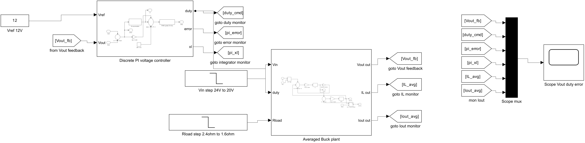
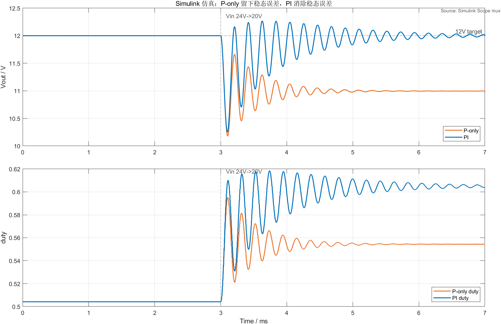
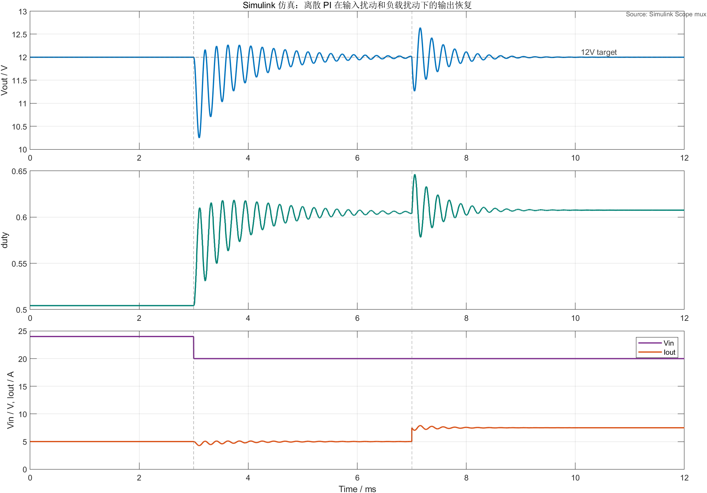
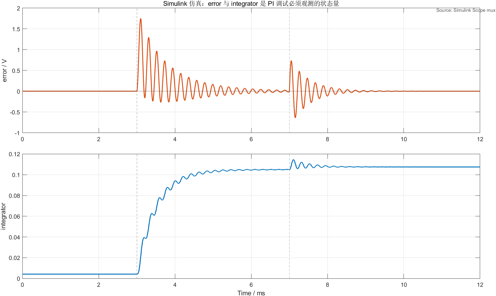
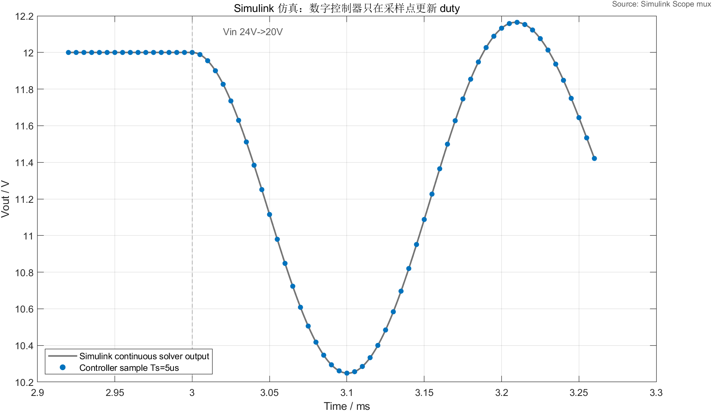

# 【数字电源/MATLAB+PLECS】如何进行 Buck 数字电源仿真（四）离散 PI 电压环怎么把输出拉回 12V

前面几篇已经完成了 Buck 项目准备、开环功率级搭建和参数初选：24V 输入、12V/5A 输出、22uH 电感、100uF 输出电容、200kHz 开关频率。

到这里，开环占空比 `D = 0.5` 时，输出可以回到 12V 附近。很多人会自然产生一个疑问：

> 既然开环已经能输出 12V，为什么还要加 PI？

答案是：开环只能在“条件刚好不变”时成立。一旦输入电压变了、负载变了、器件有压降、采样有误差，固定 duty 就不能自动修正输出。数字电源软件真正要做的事情，是不断采样输出电压，根据误差调整 PWM 占空比，让输出在扰动后回到目标值。

> 配套 GitHub 仓库：[digital-power-buck-sim-lab](https://github.com/Old-Ding/digital-power-buck-sim-lab)
> 本章提供 Simulink 离散 PI 平均模型、Simulink 仿真波形导出脚本、CSV 原始数据和 Python 对照脚本。正文中的主波形来自 Simulink 模型运行后的导出结果，不是手工画出来的示意图。

## 本章先回答什么问题

本文只做一件事：

> 把 Buck 输出电压反馈到离散 PI 控制器，并观察 PI 如何调整 duty，让 Vout 在输入和负载扰动后回到 12V。

本章会讲清楚：

> P-only 为什么会留下稳态误差
> PI 中的比例项和积分项分别在做什么
> MCU 里的控制器为什么是按采样周期更新，而不是连续时间更新
> Vin 从 24V 掉到 20V 时，PI 如何把 duty 从约 0.5 推高
> 负载从 5A 增加到 7.5A 时，输出为什么会先下陷再恢复
> 调试 PI 时为什么必须同时看 error、integrator 和 duty

本章暂时不处理：

> duty 上下限
> 抗积分饱和
> 软启动
> 过压、过流、欠压保护
> 状态机
> C 代码落地

这些内容不是不重要，而是职责边界要清楚。第四章只验证“离散 PI 电压环”的基本数据流；第五章再专门处理 duty 限幅和抗积分饱和。

## 为什么不能只靠固定 duty

理想 Buck 的关系很简单：

> Vout = D * Vin

在 24V 输入、目标 12V 输出时：

> D = 12V / 24V = 0.5

如果 Vin 永远等于 24V，负载也不变，开环固定 duty 可以看起来正常。

但是输入电压掉到 20V 后，如果 duty 还保持 0.5：

> Vout = 0.5 * 20V = 10V

这时输出就不可能继续稳定在 12V。控制器必须把 duty 提高到接近：

> D = 12V / 20V = 0.6

这就是闭环控制的价值：不是让 24V 转 12V 这个静态计算更好看，而是在输入、负载和模型参数变化后，仍然自动修正输出。

## 本章使用的模型

本章不重新画一张脱离仿真的手绘图，而是用 Simulink 搭了一个离散 PI + Buck 平均功率级模型：



这张图建议按下面顺序看：

| 位置 | 作用 |
| --- | --- |
| Vref 12V | 输出电压参考值 |
| Vout feedback | 从 Buck 平均功率级反馈回来的输出电压 |
| Discrete PI voltage controller | 离散 PI 控制器，输入 Vref/Vout，输出 duty |
| Vin step 24V to 20V | 3ms 时输入电压从 24V 阶跃到 20V |
| Rload step 2.4ohm to 1.6ohm | 7ms 时负载从 5A 增加到 7.5A |
| Averaged Buck plant | Buck 平均功率级，保留 L/C 动态，但不展开开关级细节 |
| Scope mux | 同时观察 Vout、duty、error、integrator、IL、Iout |

这里使用的是 Simulink 平均模型，不是开关级 PLECS 模型。

原因很明确：本章要看的是控制器数据流、采样周期、积分项和 duty 更新。如果直接在开关级模型里看 200kHz PWM，读者很容易被开关纹波淹没，反而看不清 PI 本身在做什么。

所以本文的主波形不再使用 Python 绘图作为文章证据，而是由 `models/simulink/buck_discrete_pi_voltage_loop.slx` 运行后，从 Simulink 模型的 `Scope mux` 导出。Python 脚本仍然保留在仓库里，用来做算法对照和快速复算。

这里要把证据边界说清楚：正文波形不是手工画的示意图，也不是 Python 单独重建模型后画出来的图；它来自 Simulink 仿真运行结果。为了让读者看得清楚，文章采用 Simulink 输出数据导出的高清图，而不是直接截取 Scope 小窗口。

平均模型的边界也要说清楚：

> 它适合验证控制逻辑和动态趋势
> 它不用于评估 MOSFET Vds、二极管电流、开关损耗和尖峰振铃
> 开关级波形仍然要回到 PLECS 中验证

这不是用平均模型替代 PLECS，而是把“控制器问题”和“开关级电气问题”分层处理。

## 离散 PI 的基本形式

真实 MCU 里的 PI 不是连续时间公式直接运行。控制器通常在固定采样周期 `Ts` 到来时执行一次：

> 采样 Vout
> 计算误差 e[k]
> 更新积分项 xI[k]
> 计算 duty[k]
> 等下一个 PWM 周期更新输出

本章使用的离散 PI 写成下面这种形式：

```text
e[k] = Vref[k] - Vout[k]

xI[k] = xI[k-1] + Ki * Ts * e[k]

duty[k] = Dff + Kp * e[k] + xI[k]
```

其中：

| 变量 | 含义 |
| --- | --- |
| e[k] | 第 k 次采样时的输出电压误差 |
| Kp | 比例增益 |
| Ki | 积分增益 |
| Ts | 控制周期，本章取 5us |
| xI[k] | 积分状态 |
| Dff | 前馈占空比，本章取 0.5 |
| duty[k] | 输出给 PWM 的占空比指令 |

本章参数如下：

| 参数 | 数值 | 说明 |
| --- | --- | --- |
| Vin 标称值 | 24V | 输入扰动前 |
| Vref | 12V | 输出电压目标 |
| 负载初值 | 2.4Ω | 对应 12V/5A |
| 负载阶跃后 | 1.6Ω | 对应约 12V/7.5A |
| L | 22uH | 延续第三章基准值 |
| C | 100uF | 延续第三章基准值 |
| fsw | 200kHz | PWM 开关频率 |
| Ts | 5us | 控制周期等于一个 PWM 周期 |
| Dff | 0.5 | 24V 到 12V 的开环前馈 duty |
| Kp | 0.05 | 本章教学用初始值 |
| Ki | 200 | 本章教学用初始值 |

这里的 `Kp = 0.05`、`Ki = 200` 不是量产参数，也不是最终调参结果。它们只是为了让本章能清楚观察 P-only 和 PI 的差异，并让输入扰动、负载扰动后的恢复过程足够明显。

模型里还加入了 0.02Ω 的串联电阻来模拟一点非理想压降，所以初始积分项不是 0，而是：

> initial_integrator_trim ≈ 0.00417

它的作用是补偿标称 5A 负载下的微小压降。这样仿真一开始就处在接近 12V 的工作点，后面更容易看清输入阶跃和负载阶跃对控制器的影响。

## 先看 P-only 和 PI 的差异

先只做一个输入扰动：3ms 时 Vin 从 24V 掉到 20V。

如果只用 P 控制，输出电压会被拉回一部分，但通常会留下稳态误差。因为比例项只根据当前误差给 duty 增量，误差越小，修正量也越小，最后会停在一个“误差不为 0 但力也不够继续推”的位置。

实际仿真结果如下：



这张图重点看两个结论：

| 控制方式 | Vin 掉到 20V 后的结果 | 读法 |
| --- | --- | --- |
| P-only | Vout 最终约 11.00V | 有修正，但留下约 1V 稳态误差 |
| PI | Vout 最终约 12.00V | 积分项继续累加，把稳态误差推回接近 0 |

这里不要把 PI 理解成“更大的 P”。PI 真正多出来的是积分状态 `xI`。

当 Vout 低于 12V 时，误差 `e[k]` 为正，积分项会逐步增加，duty 也会继续增加。只要误差还没有消失，积分项就不会停在原地。最终 duty 被推到新的平衡点，输出回到 12V 附近。

## 输入扰动和负载扰动一起看

接下来加入两个扰动：

| 时间 | 扰动 | 含义 |
| --- | --- | --- |
| 3ms | Vin: 24V -> 20V | 输入电压下跌 |
| 7ms | Rload: 2.4Ω -> 1.6Ω | 负载从 5A 增加到约 7.5A |

PI 控制下的整体响应如下：



先看 3ms 的输入扰动。

Vin 从 24V 掉到 20V 后，原来的 duty 不够了，Vout 先下跌。控制器检测到 `Vref - Vout` 变大，于是 P 项立即给出修正，I 项继续累加，duty 从约 0.5 提高到约 0.6 以上，输出重新回到 12V。

再看 7ms 的负载扰动。

负载从 5A 增加到 7.5A 时，输出电容先被多拉了一部分电流，Vout 下陷。随后 PI 提高 duty，电感电流重新建立，输出回到 12V 附近。

本章脚本导出的关键指标如下：

| 指标 | 仿真结果 | 工程读法 |
| --- | --- | --- |
| 控制周期 | 5us | 对应 200kHz PWM 周期 |
| Vin 阶跃 | 24V -> 20V | 模拟输入跌落 |
| 负载阶跃 | 5A -> 7.5A | 模拟负载加重 |
| P-only 输入阶跃后 Vout | 约 11.00V | 比例控制留下稳态误差 |
| PI 输入阶跃后 Vout | 约 12.00V | 积分项消除稳态误差 |
| PI 负载阶跃后 Vout | 约 12.00V | 负载扰动后可以恢复 |
| 输入阶跃后 Vout 最低/最高 | 约 10.25V / 12.27V | 这组参数有明显欠阻尼，不是最终调参 |
| 负载阶跃后 Vout 最低/最高 | 约 11.26V / 12.64V | 恢复可见，但仍需后续优化 |
| duty 范围 | 约 0.504 - 0.646 | 未触及 1，但本章还没加限幅 |
| 输入阶跃 1% 恢复时间 | 约 2.22ms | 从 3ms 扰动点开始计算 |
| 负载阶跃 1% 恢复时间 | 约 0.91ms | 从 7ms 扰动点开始计算 |

这组结果说明 PI 已经能完成基本闭环恢复。但也要看到问题：波形有过冲，duty 没有限幅，积分项也没有边界。

所以本章不能得出“这个控制器可以直接上硬件”的结论。正确结论应该是：

> 离散 PI 数据流成立，输出能在扰动后恢复到 12V；但 duty 限幅、抗积分饱和、软启动和保护逻辑还没有完成。

## 为什么要看 error 和 integrator

很多人调 PI 时只看 Vout。这样很容易误判。

Vout 是结果，不是根因。真正能解释控制器行为的变量是：

> error
> integrator
> duty

本章把误差和积分项单独画出来：



这张图要读出两个动作：

> Vin 下降后，error 先变大，integrator 随后抬升，duty 被推高
> 负载加重后，error 再次变化，integrator 做二次修正

如果 Vout 已经回到 12V，但 integrator 还在很高的位置，就要警惕后面可能出现积分饱和或恢复慢的问题。

如果 duty 已经打到上限，Vout 还上不来，那就不是继续调 Ki 能解决的问题，而是要检查输入电压、负载、电感电流能力、限流状态和功率级设计。

这也是后续第五章要处理抗积分饱和的原因：积分项是有状态变量，不是一个可以无限累加的普通中间值。

## 采样点不是连续时间每一刻

数字控制器还有一个容易被忽略的事实：它不是连续时间每一刻都计算。

本章控制周期为：

> Ts = 1 / 200kHz = 5us

也就是说，控制器每 5us 执行一次 PI，更新一次 duty。两次更新之间，PWM 指令保持不变。

下面这张图放大到输入阶跃附近，只标出控制器采样点：



看这张图时，要把连续平均模型响应和离散控制器采样点分开：

> 灰色曲线表示平均模型的连续响应
> 蓝色点表示控制器真正采样和更新的位置

这就是数字电源和纯模拟控制的一个关键差异。后面如果继续讨论采样延迟、ADC 噪声、PWM 更新时刻和 duty 抖动，都要建立在这个离散时间概念上。

## 本章的 PI 参数是不是最优

不是。

本章这组参数的目标不是一次调到最优，而是让读者清楚看到：

> P-only 会留下稳态误差
> PI 能消除稳态误差
> duty 会随着输入和负载扰动改变
> error 和 integrator 必须作为可观测变量记录

从工程角度看，这组参数仍然有几个明显问题：

| 问题 | 当前表现 | 后续处理 |
| --- | --- | --- |
| 输出过冲 | Vin 和负载阶跃后都有过冲 | 后续调参和测试矩阵处理 |
| duty 没有限幅 | 本章 duty 最大约 0.646，但代码没有上限保护 | 第五章处理 |
| 没有抗积分饱和 | 如果 duty 被限幅，积分项可能继续累加 | 第五章处理 |
| 没有软启动 | 参考值直接为 12V | 第六章处理 |
| 没有保护状态机 | 异常工况没有关断路径 | 后续保护章节处理 |

所以更准确的评价是：

> 本章完成了离散 PI 电压环的最小闭环验证，但还没有完成可上硬件的电源软件。

这个边界非常重要。教程不能为了显得“效果很好”而隐藏问题。读者真正需要的是知道当前做到哪一层，下一层该补什么。

## 本章常见误区

### 1. 输出回到 12V 就说明 PI 调好了

不对。

输出回到 12V 只能说明闭环方向基本正确。还要继续看过冲、恢复时间、duty 范围、积分项是否合理、负载阶跃是否稳定，以及异常工况下是否会打满 duty。

### 2. 积分项越大恢复越快

不一定。

Ki 太小，稳态误差消除慢；Ki 太大，输出容易过冲和振荡。积分项还会带来状态记忆，一旦 duty 被限幅，积分项可能继续累加，导致解除限幅后恢复很慢。

### 3. 平均模型能替代 PLECS 开关模型

不能。

平均模型适合看控制趋势，PLECS 开关模型适合看开关节点、电感纹波、器件应力和功率级细节。两者应该配合使用，不应该互相替代。

### 4. 第四章应该顺手把限幅也加上

不建议。

如果这一章同时加入 PI、duty 限幅、抗积分饱和和软启动，读者看到波形变化时很难判断是哪一个模块在起作用。分层讲清楚，比一次堆完整更重要。

## 本篇总结

本文完成了 Buck 数字电源的第一版离散 PI 电压环。

本章最重要的结论不是某个 `Kp`、`Ki` 数值，而是下面这条数据流：

> Vout 采样
> -> e[k] = Vref - Vout
> -> PI 更新积分项
> -> 计算 duty
> -> PWM 按 5us 周期更新
> -> Buck 平均功率级响应
> -> Vout 再次反馈

仿真结果表明：

> P-only 在 Vin 从 24V 掉到 20V 后会留下约 1V 稳态误差
> PI 可以把输出重新推回 12V 附近
> 负载从 5A 增加到 7.5A 后，PI 也能让输出恢复
> error、integrator 和 duty 是 PI 调试时必须观察的变量

下一篇继续处理一个更接近工程的问题：

> duty 不能无限大，积分项也不能无限累加。

也就是占空比限幅和抗积分饱和。

## 本章配套文件

本章对应的文件如下：

仓库入口：[https://github.com/Old-Ding/digital-power-buck-sim-lab](https://github.com/Old-Ding/digital-power-buck-sim-lab)

| 类型 | 文件 | 作用 |
| --- | --- | --- |
| 教程文章 | `blog/04-discrete-pi-control.md` | 本章正文 |
| 复现说明 | `docs/04-discrete-pi-control-reproduce.md` | 运行步骤和结果说明 |
| Simulink 模型 | `models/simulink/buck_discrete_pi_voltage_loop.slx` | 离散 PI + Buck 平均功率级模型 |
| Simulink 截图脚本 | `scripts/export_simulink_discrete_pi_snapshot.m` | 生成模型和模型截图 |
| Simulink 波形脚本 | `scripts/export_simulink_discrete_pi_waveforms.m` | 运行 Simulink 模型并导出主波形 |
| Python 对照脚本 | `scripts/export_discrete_pi_control.py` | 快速复算平均模型，作为对照 |
| Simulink 原始数据 | `waveforms/04-simulink-discrete-pi-control-trace.csv` | Simulink 仿真时序数据 |
| Simulink 指标汇总 | `waveforms/04-simulink-discrete-pi-control-summary.csv` | 本章表格中的关键指标 |
| Simulink 控制波形 | `waveforms/04-simulink-*.png` | 本章使用的主波形 |
| Python 对照波形 | `waveforms/04-p-only-vs-pi-vin-step.png`、`waveforms/04-pi-*.png` | Python 快速复算图，非正文主图 |
| 模型截图 | `assets/screenshots/04-simulink-discrete-pi-control.png` | 本章使用的 Simulink 模型截图 |

运行方式：

```powershell
matlab -batch "run('scripts/export_simulink_discrete_pi_snapshot.m'); exit"
matlab -batch "run('scripts/export_simulink_discrete_pi_waveforms.m'); exit"
python scripts\export_discrete_pi_control.py
```

如果 MATLAB 没有加入系统 PATH，可以把前两条命令里的 `matlab` 替换成你本机 MATLAB 的完整路径。Python 脚本是对照复算，不是正文主波形来源。

## 技术交流

如果你在复现模型、运行脚本或判断 PI 波形时遇到问题，可以加入技术交流群交流。

本仓库中的模型、脚本、数据和图表可以直接使用；交流群主要用于复现答疑和后续技术交流。

| 渠道 | 信息 |
| --- | --- |
| QQ 群 | 嵌入式交流群：1056095456 |
| 加群链接 | [https://qm.qq.com/q/rygrSD2Ddu](https://qm.qq.com/q/rygrSD2Ddu) |
| 微信交流 | 微信入口会不定期更新，可在 QQ 群内获取 |

提问时建议附上 Simulink 模型截图、参数表、运行输出、Vout/duty/error/integrator 波形和你自己的判断过程。这样更容易定位问题，也更容易形成有效交流。
