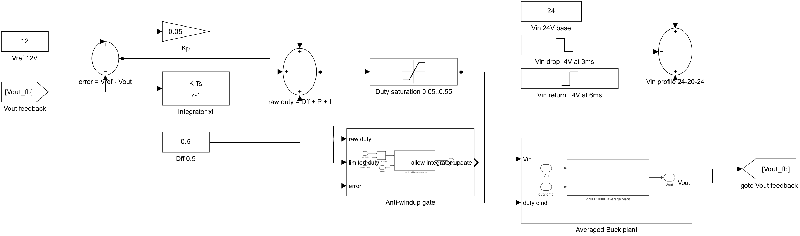
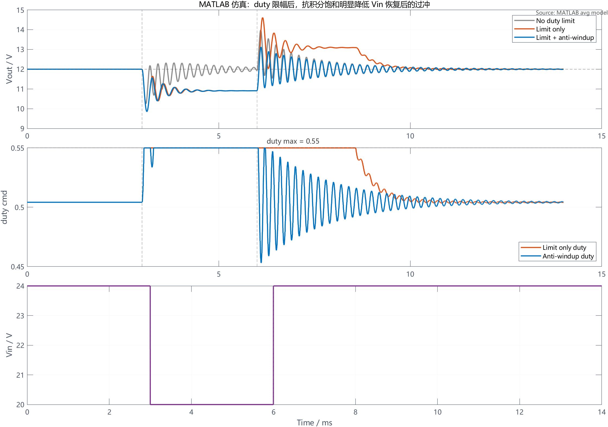
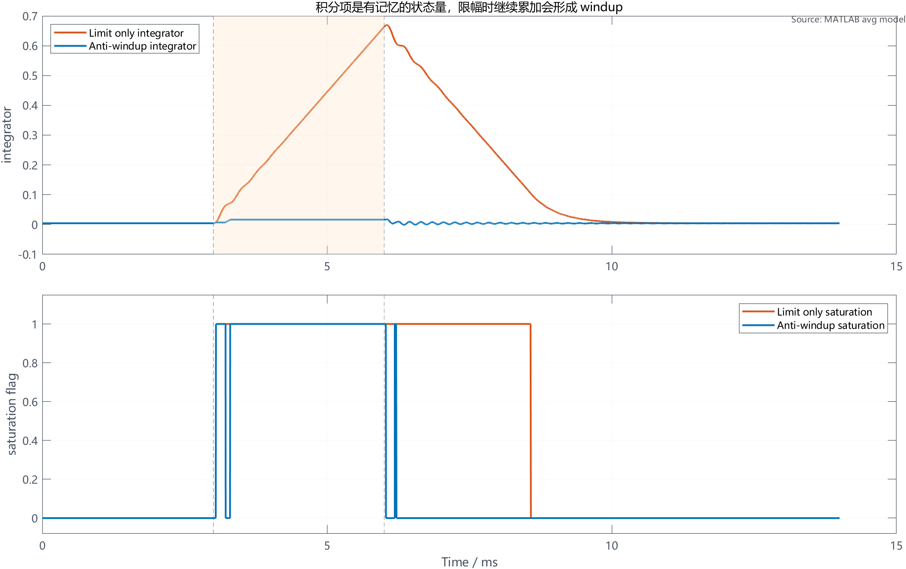
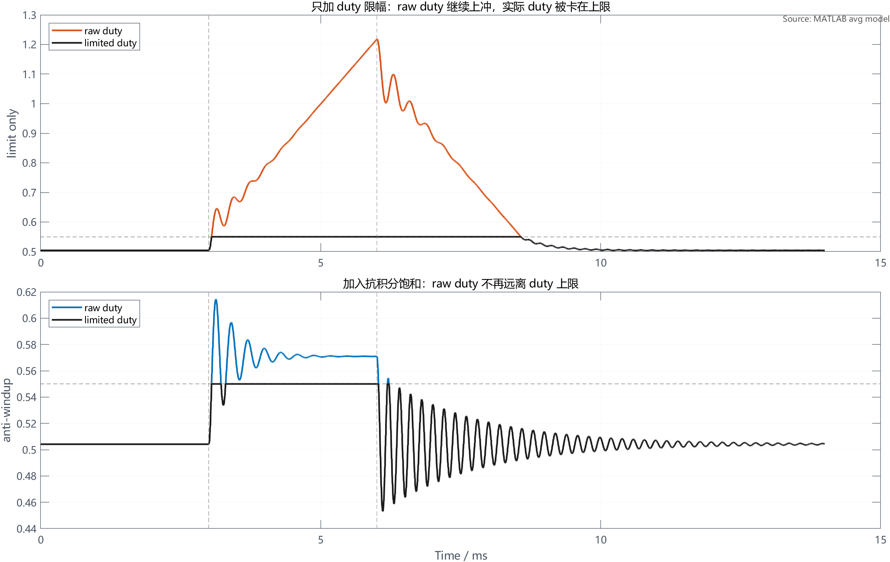
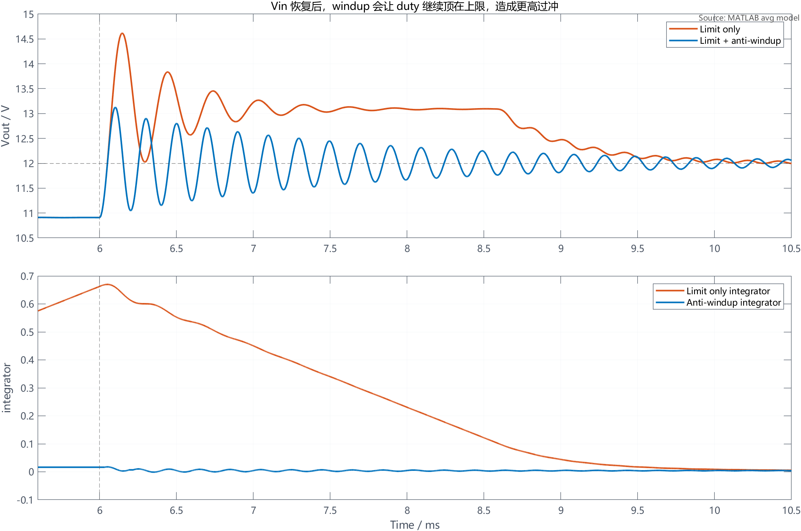

# 【数字电源/MATLAB+PLECS】如何进行 Buck 数字电源仿真（五）duty 限幅和抗积分饱和怎么处理

第四章已经把离散 PI 电压环跑通了：采样 Vout、计算误差、更新积分项、输出 duty，再让 Buck 平均功率级响应。

但是这个控制器还缺一个很关键的工程边界：duty 不能无限大，积分项也不能无限累加。

在真实数字电源里，PWM 占空比一定有上下限。比如驱动器需要留死区、Bootstrap 高边驱动需要刷新时间、硬件也可能规定最大导通比例。软件上如果只把 duty 输出夹住，但积分项还在背后继续累加，就会出现积分饱和，也就是常说的 windup。

这篇就专门处理这个问题。

配套 GitHub 仓库：[digital-power-buck-sim-lab](https://github.com/Old-Ding/digital-power-buck-sim-lab)

本章提供 MATLAB 离散平均模型仿真脚本、Simulink 控制逻辑截图、CSV 原始数据和正文波形图。正文主波形来自 MATLAB R2024b 运行脚本后的导出结果。

## 本章先回答什么问题

本文只做一件事：在离散 PI 电压环后面加入 duty 上下限，并比较“只限幅”和“限幅加抗积分饱和”的差异。

本章会讲清楚：

- `duty_raw` 和 `duty_cmd` 为什么要分开
- 为什么只加 Saturation 还不够
- 积分项 windup 是怎么在波形里出现的
- 条件积分 anti-windup 的判断逻辑怎么写
- Vin 恢复后，为什么无抗饱和会产生更高过冲
- 调试时应该同时观察 `Vout`、`duty_raw`、`duty_cmd`、`integrator` 和 `saturation flag`

本章暂时不处理：

- 软启动
- 过压、过流、欠压保护
- 保护状态机
- ADC 噪声和采样延迟
- C 代码工程化
- MOSFET Vds、二极管电流和开关损耗

这些内容放到后续章节。第五章只把 PI 输出的边界和积分器边界讲清楚。

## duty_raw 和 duty_cmd 要分开

第四章的 PI 输出可以写成：

```text
e[k] = Vref[k] - Vout[k]

xI[k] = xI[k-1] + Ki * Ts * e[k]

duty_raw[k] = Dff + Kp * e[k] + xI[k]
```

如果没有限幅，`duty_raw` 会直接送给 PWM。

加入 duty 限幅后，软件里应该分成两个量：

```text
duty_cmd[k] = clamp(duty_raw[k], duty_min, duty_max)
```

其中：

| 变量 | 含义 |
| --- | --- |
| duty_raw | PI 计算出来的原始占空比指令 |
| duty_cmd | 经过上下限限制后，真正送给 PWM 的占空比 |
| duty_min | 最小占空比限制 |
| duty_max | 最大占空比限制 |

这两个量必须同时观测。

如果只看 `duty_cmd`，你会看到 duty 被卡在上限，但看不到 PI 控制器内部其实还在继续把 `duty_raw` 往上推。真正容易造成恢复慢和过冲的，正是这个内部状态。

## 本章使用的控制结构

本章沿用第四章的 Buck 平均功率级思路，在控制器后面加入 Saturation 和 anti-windup gate：



这张图按下面顺序看：

| 位置 | 作用 |
| --- | --- |
| error = Vref - Vout | 计算电压误差 |
| Kp / Integrator xI | 生成比例项和积分项 |
| raw duty = Dff + P + I | PI 原始输出 |
| Duty saturation 0.05..0.55 | 把实际输出 duty 限制在 0.05 到 0.55 |
| Anti-windup gate | 判断积分项是否允许继续更新 |
| Averaged Buck plant | Buck 平均功率级 |
| Vin profile 24-20-24 | 输入电压先跌落再恢复，用来触发 duty 上限 |

这里要注意一点：Saturation 只限制输出给功率级的 `duty_cmd`，它不会自动处理积分项。积分项是否继续更新，是 anti-windup gate 的职责。

## 本章仿真工况

为了让 duty 限幅真正发生，本章故意设置一个会触发上限的输入电压跌落：

| 项目 | 数值 |
| --- | --- |
| Vin 初值 | 24V |
| Vin 跌落 | 3ms 时从 24V 降到 20V |
| Vin 恢复 | 6ms 时从 20V 回到 24V |
| Vref | 12V |
| 负载 | 2.4Ω，约 5A |
| L | 22uH |
| C | 100uF |
| fsw / 控制频率 | 200kHz |
| Ts | 5us |
| Kp | 0.05 |
| Ki | 200 |
| duty_min | 0.05 |
| duty_max | 0.55 |

为什么选 `duty_max = 0.55`？

20V 输入时，如果仍想维持 12V 输出，理想 Buck 至少需要：

```text
D = 12V / 20V = 0.6
```

考虑模型里的 0.02Ω 串联压降，本章脚本计算出的需求约为：

```text
required_duty_at_vin_sag ≈ 0.605
```

而本章把 duty 上限设为 0.55。也就是说，Vin 跌落期间，控制器就算把 duty 打满，也暂时无法维持 12V。

这个工况的作用，是让读者清楚看到：输出能力不够时，积分项如果继续累加，会在输入恢复后反过来制造问题。

## 只加 duty 限幅会发生什么

先看整体结果：



图里有三条曲线：

| 曲线 | 含义 |
| --- | --- |
| No duty limit | 没有限幅的参考情况，用来观察 PI 想要的 raw duty |
| Limit only | 只把 duty_cmd 限制到 0.55，不处理积分项 |
| Limit + anti-windup | duty 限幅，同时限制积分项继续向饱和方向累加 |

3ms 时 Vin 从 24V 掉到 20V。由于 `duty_max = 0.55` 小于维持 12V 所需的约 0.605，所以限幅后的两种控制器都会出现 Vout 下跌。

这时不要误解 anti-windup 的作用。

抗积分饱和不能突破硬件 duty 上限，也不能让一个本来供能不够的工况突然恢复到 12V。它真正解决的是另一个问题：当输出已经被硬件上限卡住时，不要让积分项继续向错误方向累加。

6ms 时 Vin 恢复到 24V。此时两种控制器的差异开始变得明显：

| 控制方式 | Vin 恢复后的最高 Vout | 读法 |
| --- | --- | --- |
| 只加 duty 限幅 | 约 14.62V | 积分项已经积得很高，duty 继续顶在上限，输出过冲更高 |
| 限幅 + 抗积分饱和 | 约 13.13V | 积分项没有明显 windup，Vin 恢复后更快退出饱和 |

这组参数的读法是：在同样的功率级、同样的 Kp/Ki、同样的 duty 上限下，anti-windup 明显减少了由积分项累加带来的额外过冲。

## windup 在积分项里怎么看

只看 Vout 还不够。真正能说明 windup 的，是 integrator。

下面这张图把积分项和饱和状态单独画出来：



3ms 到 6ms 是 Vin 跌落区间。此时 duty 已经被卡在上限，Vout 仍然低于 12V，误差 `e[k]` 为正。

如果只加 duty 限幅，积分项仍然按下面公式继续加：

```text
xI[k] = xI[k-1] + Ki * Ts * e[k]
```

因为误差一直为正，`xI` 会一路上升。本章仿真中，limit only 的积分项峰值约为：

```text
limit_no_aw_integrator_peak ≈ 0.670
```

而加入 anti-windup 后，积分项峰值约为：

```text
limit_aw_integrator_peak ≈ 0.0176
```

这就是第五章最关键的观察点：duty_cmd 看起来都被卡在 0.55，但控制器内部状态完全不同。

| 指标 | 只加限幅 | 限幅 + 抗积分饱和 |
| --- | --- | --- |
| integrator 峰值 | 约 0.670 | 约 0.0176 |
| raw duty 峰值 | 约 1.218 | 约 0.614 |
| 饱和总时长 | 约 5.53ms | 约 2.94ms |
| Vin 恢复后退出饱和 | 约 2.58ms | 约 0.22ms |

这个表格说明：anti-windup 不是让输出在 Vin 跌落时神奇恢复，而是让控制器在恢复条件到来时，不被历史积分项拖住。

## raw duty 和 limited duty 的差异

再单独看 duty：



上半图是只加限幅。

`duty_cmd` 被卡在 0.55，但 `duty_raw` 继续上冲，最高到了约 1.218。真实 PWM 不可能输出 121.8% duty，但 PI 内部已经把这个“想要更大 duty”的状态记住了。

下半图是加入 anti-windup。

`duty_raw` 仍然会短暂超过 0.55，因为误差确实要求控制器增加 duty。但当控制器判断自己已经处在高限幅，并且误差还在要求继续增大 duty 时，就暂停积分项继续累加。这样 `duty_raw` 不会远离 duty 上限。

这也是工程代码里要同时保留两个量的原因：

```text
duty_raw  用来判断控制器内部想输出多少
duty_cmd  用来实际驱动 PWM
```

如果二者差距越来越大，基本就说明控制器已经进入限幅区间，需要检查 anti-windup、限流、输入电压和功率级能力。

## 条件积分 anti-windup 怎么写

本章采用最容易讲清楚、也最容易落地到 MCU 的条件积分方法。

先计算当前原始 duty：

```text
duty_raw_pre = Dff + Kp * e[k] + xI[k-1]
```

然后判断是否允许积分项继续更新：

```text
if duty_raw_pre > duty_max and e[k] > 0:
    freeze integrator
elif duty_raw_pre < duty_min and e[k] < 0:
    freeze integrator
else:
    xI[k] = xI[k-1] + Ki * Ts * e[k]
```

这段逻辑的含义是：

| 状态 | 误差方向 | 积分动作 |
| --- | --- | --- |
| duty 已经顶到上限 | 误差还要求继续增大 duty | 暂停积分 |
| duty 已经顶到上限 | 误差开始要求减小 duty | 允许积分，把积分项拉回来 |
| duty 已经压到下限 | 误差还要求继续减小 duty | 暂停积分 |
| duty 已经压到下限 | 误差开始要求增大 duty | 允许积分，把积分项拉回来 |
| duty 未触及上下限 | 任意误差 | 正常积分 |

它不是“双保险式”重复限幅。

Saturation 的职责是限制实际 PWM 输出，anti-windup 的职责是限制积分状态继续向饱和方向累加。两个模块处理的是不同对象：一个处理输出命令，一个处理内部状态。

## Vin 恢复后为什么差异最大

很多人第一次看 anti-windup，会把注意力放在 Vin 跌落期间。其实真正应该看的，是 Vin 恢复之后。

下面把 6ms 附近放大：



6ms 时 Vin 从 20V 回到 24V。功率级供能能力恢复了，但只加限幅的控制器还保留着很高的积分项。

结果是：

- Vin 已经恢复
- Vout 已经开始升高
- duty 仍然被历史积分项顶在高位
- 输出继续冲高

这就是 windup 最典型的后果。

加入 anti-windup 后，积分项在限幅期间没有明显堆高。Vin 恢复后，duty 能更快退出上限，输出过冲也明显降低。

本章指标里，Vin 恢复后的最高输出电压从约 14.62V 降到约 13.13V，降低约 1.49V。

## 本章工程边界

这一章完成的是控制器边界处理，不是完整电源保护。

本章能证明：

| 检查项 | 本章证据 | 工程判断 |
| --- | --- | --- |
| duty 上限生效 | duty_cmd 被限制在 0.55 | PWM 输出边界可控 |
| 只加限幅会 windup | integrator 峰值约 0.670 | 只限制输出不够 |
| 抗饱和有效 | integrator 峰值降到约 0.0176 | 积分状态边界可控 |
| Vin 恢复后过冲降低 | Vout 峰值从约 14.62V 降到约 13.13V | 恢复过程更可控 |
| 饱和退出更快 | 约 2.58ms 降到约 0.22ms | 控制器不再被历史积分项拖住 |

本章不能证明：

| 不覆盖内容 | 原因 |
| --- | --- |
| 硬件可以直接上电 | 还没有软启动和保护状态机 |
| MOSFET 应力安全 | 平均模型不看开关节点和器件应力 |
| 过流一定安全 | 本章没有限流环和故障关断 |
| 最终 Kp/Ki 最优 | 本章重点是限幅和 anti-windup 机制 |

这就是分层的意义：第五章只把 duty 和积分项的边界补上；软启动和保护状态机继续放到后面。

## 本章常见误区

### 1. 加了 Saturation 就等于 anti-windup

不等于。

Saturation 只限制实际输出的 `duty_cmd`。如果积分项仍然继续累加，控制器内部的 `duty_raw` 可能已经远远超过上限。等输入恢复或负载变轻时，这个历史积分项会让 duty 继续偏高，造成额外过冲。

### 2. anti-windup 能让供能不足时也稳定 12V

不能。

如果 `Vin * duty_max` 本身不足以支撑输出电压，anti-windup 也不能突破物理上限。它能做的是在限幅期间保护积分状态，让工况恢复后控制器更快回到正常区域。

### 3. 只看 Vout 就能判断 anti-windup 是否正确

不够。

至少要同时看：

- `Vout`
- `duty_raw`
- `duty_cmd`
- `integrator`
- `saturation flag`

尤其是 `duty_raw - duty_cmd` 的差值。如果这个差值持续变大，就要怀疑积分项正在 windup。

### 4. duty_max 可以随便设

不能。

真实项目里的 duty 上限来自硬件和安全边界，包括死区、驱动能力、Bootstrap 刷新、最大导通时间、电感电流、输入电压范围和保护策略。本章使用 `duty_max = 0.55` 是为了形成清晰的限幅工况；真实项目需要按硬件约束重新计算。

## 本篇总结

第五章把第四章的离散 PI 电压环补上了两个关键边界：

- duty 输出边界
- 积分状态边界

本章最重要的工程结论是：

duty 限幅只管实际 PWM 输出，anti-windup 才管积分项是否继续向饱和方向累加。

本章仿真结果表明：

- 只加 duty 限幅时，`integrator` 峰值约 0.670，`raw duty` 峰值约 1.218
- 加入 anti-windup 后，`integrator` 峰值约 0.0176，`raw duty` 峰值约 0.614
- Vin 恢复后的 Vout 过冲从约 14.62V 降到约 13.13V
- Vin 恢复后退出饱和的时间从约 2.58ms 降到约 0.22ms

下一篇继续处理另一个上硬件前必须补上的模块：

软启动。

软启动解决的是“参考值不能从 0 瞬间跳到 12V”的问题；它和本章的 anti-windup 一样，都是让控制器从仿真闭环走向工程可用的必要步骤。

## 本章配套文件

仓库入口：[https://github.com/Old-Ding/digital-power-buck-sim-lab](https://github.com/Old-Ding/digital-power-buck-sim-lab)

| 类型 | 文件 | 作用 |
| --- | --- | --- |
| 教程文章 | `blog/05-duty-limit-anti-windup.md` | 本章正文 |
| 复现说明 | `docs/05-duty-limit-anti-windup-reproduce.md` | 运行步骤和结果说明 |
| MATLAB 主仿真脚本 | `scripts/export_matlab_duty_limit_anti_windup_waveforms.m` | 运行离散平均模型并导出正文波形 |
| Simulink 逻辑截图脚本 | `scripts/export_simulink_duty_limit_anti_windup_snapshot.m` | 生成控制逻辑模型和截图 |
| Simulink 逻辑模型 | `models/simulink/buck_duty_limit_anti_windup_logic.slx` | 展示 duty 限幅和 anti-windup 的结构关系 |
| Simulink 逻辑截图 | `assets/screenshots/05-simulink-duty-limit-anti-windup-logic.png` | 本章控制结构图 |
| 原始数据 | `waveforms/05-matlab-duty-limit-anti-windup-trace.csv` | 三种控制方式的完整时序数据 |
| 指标汇总 | `waveforms/05-matlab-duty-limit-anti-windup-summary.csv` | 本章表格中的关键指标 |
| 正文波形 | `waveforms/05-matlab-*.png` | 本章使用的 MATLAB 主波形 |

运行方式：

```powershell
matlab -batch "run('scripts/export_simulink_duty_limit_anti_windup_snapshot.m'); exit"
matlab -batch "run('scripts/export_matlab_duty_limit_anti_windup_waveforms.m'); exit"
```

如果 MATLAB 没有加入系统 PATH，可以把 `matlab` 替换成你本机 MATLAB 的完整路径。

## 技术交流

如果你在复现模型、运行脚本或判断 anti-windup 波形时遇到问题，可以加入技术交流群交流。

本仓库中的模型、脚本、数据和图表可以直接使用；交流群主要用于复现答疑和后续技术交流。

| 渠道 | 信息 |
| --- | --- |
| QQ 群 | 嵌入式交流群：1056095456 |
| 加群链接 | [https://qm.qq.com/q/rygrSD2Ddu](https://qm.qq.com/q/rygrSD2Ddu) |
| 微信交流 | 微信入口会不定期更新，可在 QQ 群内获取 |

提问时建议附上 Simulink 逻辑截图、summary CSV、Vout/duty_raw/duty_cmd/integrator 波形和你自己的判断过程。这样更容易定位问题，也更容易形成有效交流。
