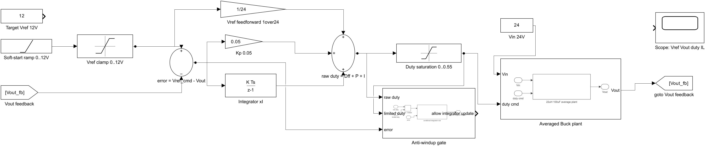
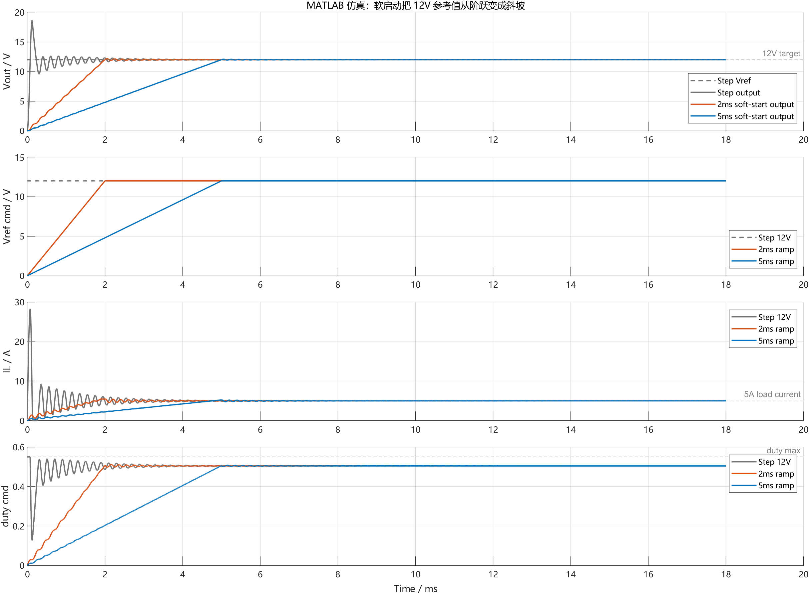
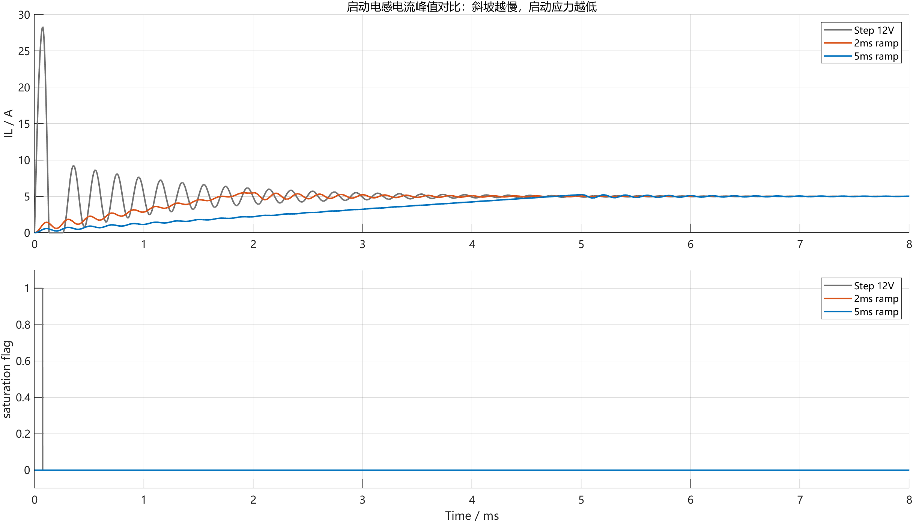
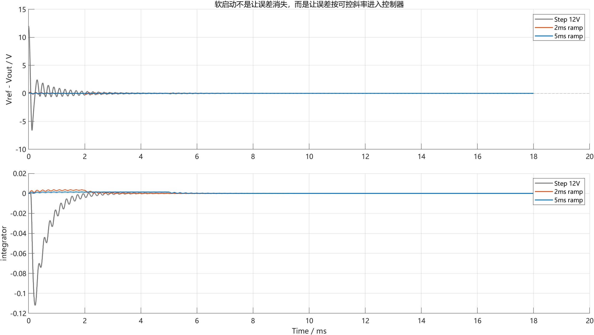
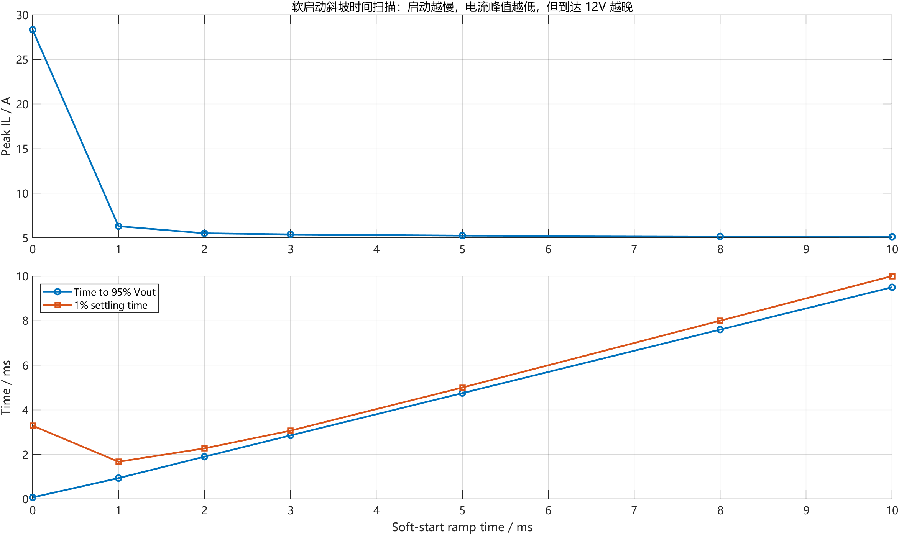

# 【数字电源/MATLAB+PLECS】如何进行 Buck 数字电源仿真（六）软启动为什么不能直接给 12V 参考值

第五章已经把 duty 限幅和抗积分饱和补上了：PWM 输出有边界，积分项也不能在限幅区间继续错误累加。

但是离真正能上硬件，还差一个启动阶段必须处理的问题：控制器刚启动时，参考电压不能从 0V 瞬间跳到 12V。

如果一上来就给 `Vref = 12V`，PI 控制器看到的是一个很大的误差：

```text
error = 12V - 0V
```

比例项会立刻把 duty 往上推，feedforward 也会直接跳到接近 0.5。哪怕第五章已经做了 duty 限幅和 anti-windup，功率级还是会被一个很硬的启动命令激励，电感电流和输出电压都可能冲得很高。

这篇就专门处理软启动。

配套 GitHub 仓库：[digital-power-buck-sim-lab](https://github.com/Old-Ding/digital-power-buck-sim-lab)

本章提供 MATLAB 离散平均模型仿真脚本、Simulink 软启动逻辑截图、CSV 原始数据、斜坡时间扫描结果和正文波形图。正文主波形来自 MATLAB R2024b 运行脚本后的导出结果。

## 本章先回答什么问题

本文只做一件事：把启动参考值从 12V 阶跃改成 0V 到 12V 的斜坡，并观察启动过冲、电感电流峰值、duty 饱和和启动时间之间的关系。

本章会讲清楚：

- 为什么软启动通常加在 `Vref` 路径，而不是简单粗暴地限制 duty
- 直接给 12V 参考值时，为什么电感电流峰值会很高
- 2ms 和 5ms 软启动斜坡有什么差异
- 斜坡时间越长，为什么启动应力越低，但到达 12V 越晚
- 调试软启动时应该同时看 `Vref_cmd`、`Vout`、`IL`、`duty_cmd` 和 `saturation flag`

本章暂时不处理：

- 过压、过流、欠压保护
- 保护状态机
- 限流环
- 预偏置输出启动
- ADC 噪声和采样延迟
- C 代码工程化
- MOSFET Vds、二极管电流和开关损耗

这些内容放到后续章节。第六章只把“启动参考值怎么进入控制器”讲清楚。

## 软启动到底软在哪里

第四章的电压环可以写成：

```text
e[k] = Vref[k] - Vout[k]

xI[k] = xI[k-1] + Ki * Ts * e[k]

duty_raw[k] = Dff[k] + Kp * e[k] + xI[k]

duty_cmd[k] = clamp(duty_raw[k], duty_min, duty_max)
```

如果启动时直接令：

```text
Vref[k] = 12V
```

那么控制器一开始就会看到接近 12V 的误差。这个误差不是小扰动，而是一个启动阶跃。

软启动的常见做法，是先生成一个受限斜率的参考命令：

```text
Vref_cmd[k] = min(Vtarget, Vref_cmd[k-1] + Vref_slew_rate * Ts)
```

然后电压环不再直接使用最终目标 `Vtarget`，而是使用 `Vref_cmd`：

```text
e[k] = Vref_cmd[k] - Vout[k]
```

这样做的关键点是：软启动没有改变最终目标，最终仍然是 12V；它改变的是目标值进入控制器的速度。

## 本章使用的控制结构

本章沿用第五章的 duty 限幅和 anti-windup 思路，在参考值路径前面加入软启动斜坡：



这张图按下面顺序看：

| 位置 | 作用 |
| --- | --- |
| Soft-start ramp 0..12V | 生成从 0V 到 12V 的参考斜坡 |
| Vref clamp 0..12V | 限制参考值不超过目标电压 |
| error = Vref_cmd - Vout | 用软启动后的参考值计算误差 |
| Vref feedforward 1/24 | feedforward 跟随参考值逐步上升 |
| Kp / Integrator xI | 离散 PI 控制器 |
| Duty saturation 0..0.55 | 限制实际 PWM duty |
| Anti-windup gate | duty 饱和时限制积分项继续错误累加 |
| Averaged Buck plant | Buck 平均功率级 |

这里要注意一点：软启动不是保护状态机，也不是过流保护。它只是让参考值以可控斜率进入电压环。

如果负载短路、输出过压、输入欠压，仍然需要保护状态机处理。第六章不提前解决这些问题。

## 本章仿真工况

本章使用和前几章一致的 24V 输入、12V/5A 输出目标：

| 项目 | 数值 |
| --- | --- |
| Vin | 24V |
| Vtarget | 12V |
| 负载 | 2.4Ω，约 5A |
| L | 22uH |
| C | 100uF |
| fsw / 控制频率 | 200kHz |
| Ts | 5us |
| Kp | 0.05 |
| Ki | 200 |
| duty_min | 0 |
| duty_max | 0.55 |
| 对比 1 | 直接给 12V 阶跃参考 |
| 对比 2 | 2ms 软启动斜坡 |
| 对比 3 | 5ms 软启动斜坡 |

本章的 MATLAB 平均模型在启动阶段加入了一个功率级边界：电感电流不允许反向。

原因是本系列前面使用的是非同步 Buck 语境，二极管续流时电感电流降到 0A 后不会继续反向。这个边界属于功率级模型，不是控制器里的重复保护。它只用于让启动阶段的平均模型更接近非同步 Buck 的基本物理边界。

## 直接给 12V 会发生什么

先看整体结果：



灰色曲线是直接给 12V 参考值。

启动瞬间，`Vref_cmd` 直接跳到 12V，`Vout` 还在 0V 附近，控制器看到的误差最大。PI 输出会立刻把 duty 推到上限附近，Buck 的 LC 输出级被一个很硬的命令激励。

这组参数下，直接 12V 阶跃启动的关键指标是：

| 指标 | 结果 |
| --- | --- |
| Vout 峰值 | 约 18.64V |
| 输出过冲 | 约 6.64V |
| 电感电流峰值 | 约 28.34A |
| duty_cmd 峰值 | 0.55 |
| duty_raw 峰值 | 约 1.104 |
| duty 饱和总时长 | 约 0.075ms |
| 进入 95% Vout 时间 | 约 0.0715ms |
| 1% 稳定时间 | 约 3.29ms |

这个结果说明：直接阶跃确实很快，但快的代价是启动应力很大。

尤其要看电感电流。目标负载电流只有约 5A，但硬启动峰值到了约 28.34A。这个数值不是一个可以忽略的小波动，而是会直接影响电感饱和、电流采样范围、MOSFET 电流应力和过流保护阈值的工程问题。

## 2ms 和 5ms 软启动有什么差异

再看启动电流和 duty 饱和：



2ms 斜坡和 5ms 斜坡都把启动应力降下来了：

| 启动方式 | Vout 峰值 | 输出过冲 | 电感电流峰值 | duty 饱和总时长 |
| --- | --- | --- | --- | --- |
| 直接 12V 阶跃 | 约 18.64V | 约 6.64V | 约 28.34A | 约 0.075ms |
| 2ms 软启动 | 约 12.17V | 约 0.17V | 约 5.51A | 0ms |
| 5ms 软启动 | 约 12.08V | 约 0.08V | 约 5.24A | 0ms |

这个表格是本章最重要的结论来源。

同样的功率级、同样的 PI 参数、同样的 duty 上限，只是把参考值从阶跃改成斜坡，启动峰值就明显下降。

5ms 软启动相比直接 12V 阶跃：

- 电感电流峰值降低约 23.10A
- Vout 过冲降低约 6.55V
- duty 没有进入上限饱和

软启动不是让电源“更强”，而是让控制器不要在启动第一拍就给功率级一个过大的命令。

## 软启动不是让误差消失

很多人第一次看软启动，会误以为软启动是为了让误差变小。这个说法不准确。

软启动真正做的是让误差按可控斜率进入控制器。

下面这张图把 `Vref_cmd - Vout` 和积分项单独画出来：



直接 12V 阶跃时，启动误差一开始接近 12V。这个误差太大，会把比例项和 duty 立刻推高。

2ms 和 5ms 软启动时，`Vref_cmd` 是逐渐上升的，`Vout` 可以跟着参考值爬升。误差不再以 12V 的阶跃形式砸进控制器，所以 duty 和电感电流都更可控。

这里还要和第五章联系起来看：

| 模块 | 解决的问题 |
| --- | --- |
| duty 限幅 | 实际 PWM duty 不能超过硬件边界 |
| anti-windup | duty 饱和时，积分项不能继续向错误方向累加 |
| 软启动 | 启动参考值不能瞬间跳到最终目标 |

这三个模块不是互相替代的关系。软启动负责启动输入，duty 限幅负责输出边界，anti-windup 负责积分状态边界。

## 斜坡时间怎么选

软启动不是越慢越好，也不是越快越好。斜坡时间本质上是在启动应力和启动速度之间做取舍。

本章额外扫了一组斜坡时间：



对应数据如下：

| 斜坡时间 | Vout 峰值 | 电感电流峰值 | 进入 95% Vout 时间 | 1% 稳定时间 |
| --- | --- | --- | --- | --- |
| 0ms | 约 18.64V | 约 28.34A | 约 0.0715ms | 约 3.29ms |
| 1ms | 约 12.25V | 约 6.30A | 约 0.94ms | 约 1.67ms |
| 2ms | 约 12.17V | 约 5.51A | 约 1.90ms | 约 2.27ms |
| 3ms | 约 12.13V | 约 5.38A | 约 2.85ms | 约 3.07ms |
| 5ms | 约 12.08V | 约 5.24A | 约 4.75ms | 约 5.00ms |
| 8ms | 约 12.05V | 约 5.15A | 约 7.60ms | 约 8.00ms |
| 10ms | 约 12.04V | 约 5.12A | 约 9.50ms | 约 10.00ms |

这张表可以这样读：

- 从 0ms 改到 1ms，电流峰值下降最明显
- 从 2ms 到 5ms，电流峰值继续下降，但收益变小
- 斜坡时间越长，进入 12V 附近的时间越晚
- 本章参数下，5ms 是一个比较干净的教学点：峰值低、不过度拖慢、波形也容易看懂

这不是量产参数结论。真实项目要结合输入电压范围、负载电容、最大负载、限流阈值、启动时间要求和保护策略重新选。

## 工程实现时放在哪里

在软件结构上，软启动通常不要写在 PI 内部。

更清晰的职责划分是：

```text
soft_start_state -> Vref_cmd

voltage_loop(Vref_cmd, Vout) -> duty_raw

duty_limit_and_anti_windup(duty_raw, error) -> duty_cmd

pwm_update(duty_cmd)
```

这样分层后，每个模块的职责很明确：

| 层级 | 职责 |
| --- | --- |
| soft-start | 决定参考值如何从 0V 到 12V |
| voltage loop | 根据 `Vref_cmd` 和 `Vout` 算 duty |
| duty limit | 限制实际 PWM 输出 |
| anti-windup | 限制积分项继续向饱和方向累加 |
| PWM update | 在合适时刻更新比较值 |

不要在 PI 里面到处写“如果启动中就特殊处理”的分支。启动阶段应该由状态机或软启动模块给出 `Vref_cmd`，电压环只负责跟踪这个命令。

## 本章工程边界

这一章完成的是启动参考值斜坡验证，不是完整电源启动保护。

本章能证明：

| 检查项 | 本章证据 | 工程判断 |
| --- | --- | --- |
| 直接 12V 阶跃启动应力很大 | Vout 峰值约 18.64V，IL 峰值约 28.34A | 不能直接用硬参考启动 |
| 软启动能降低启动峰值 | 5ms 斜坡 Vout 峰值约 12.08V，IL 峰值约 5.24A | 参考值斜坡有效 |
| 软启动能减少 duty 饱和 | 2ms/5ms 斜坡饱和总时长为 0ms | 控制器没有被启动大误差打满 |
| 斜坡时间存在取舍 | 扫描表显示峰值下降但启动时间变长 | 需要按项目约束选参数 |

本章不能证明：

| 不覆盖内容 | 原因 |
| --- | --- |
| 硬件可以直接上电 | 还没有保护状态机和故障关断 |
| MOSFET 应力安全 | 平均模型不看开关节点和器件应力 |
| 过流一定安全 | 本章没有限流环，也没有硬件比较器模型 |
| 预偏置输出启动安全 | 本章从 0V 输出开始，不覆盖 pre-bias |
| 最终软启动时间最优 | 本章只给出可复现参数扫描，不给量产定值 |

第六章的结论是：启动参考值必须可控，但软启动只是启动链路的一部分。下一章要继续把保护状态机补上。

## 本章常见误区

### 1. 有了 duty 限幅就不需要软启动

不对。

duty 限幅只能防止 PWM 超过硬件边界，不能防止控制器在启动瞬间把 duty 打到上限。硬参考启动仍然会激励 LC 输出级，造成电压和电流峰值。

### 2. 软启动就是慢慢增加 duty

不一定。

很多数字电源更常见的做法，是慢慢增加参考电压 `Vref_cmd`，让电压环自己计算 duty。这样电压环、duty 限幅和 anti-windup 仍然保持原来的职责。

直接 ramp duty 也能在某些开环启动策略里使用，但那是另一种启动策略。本文讲的是闭环软启动里的参考值斜坡。

### 3. 斜坡越慢越安全

不完整。

斜坡慢通常能降低启动峰值，但会增加启动时间。如果系统有上电时序要求、负载必须在某个时间内建立电压，软启动太慢也会造成问题。

### 4. 平均模型通过就等于硬件启动安全

不等于。

平均模型能说明控制器参考值、duty 和电感电流趋势，但不能证明开关节点尖峰、MOSFET SOA、二极管反向恢复、电流采样饱和和硬件保护阈值都安全。这些需要后续开关级仿真和硬件验证。

## 本篇总结

第六章把启动阶段的参考值路径补上了。

本章最重要的工程结论是：软启动不是把最终目标变小，而是让最终目标以可控斜率进入电压环。

本章仿真结果表明：

- 直接 12V 阶跃启动时，Vout 峰值约 18.64V，电感电流峰值约 28.34A
- 2ms 软启动时，Vout 峰值约 12.17V，电感电流峰值约 5.51A
- 5ms 软启动时，Vout 峰值约 12.08V，电感电流峰值约 5.24A
- 5ms 软启动相比直接阶跃，电感电流峰值降低约 23.10A，Vout 过冲降低约 6.55V

下一篇继续处理保护状态机。

保护状态机要解决的是“什么时候允许启动、什么时候关断 PWM、故障后怎么恢复”的问题。软启动只负责正常启动路径，异常路径不能靠软启动兜底。

## 本章配套文件

仓库入口：[https://github.com/Old-Ding/digital-power-buck-sim-lab](https://github.com/Old-Ding/digital-power-buck-sim-lab)

| 类型 | 文件 | 作用 |
| --- | --- | --- |
| 教程文章 | `blog/06-soft-start.md` | 本章正文 |
| 复现说明 | `docs/06-soft-start-reproduce.md` | 运行步骤和结果说明 |
| MATLAB 主仿真脚本 | `scripts/export_matlab_soft_start_waveforms.m` | 运行软启动平均模型并导出正文波形 |
| Simulink 逻辑截图脚本 | `scripts/export_simulink_soft_start_snapshot.m` | 生成软启动控制逻辑模型和截图 |
| Simulink 逻辑模型 | `models/simulink/buck_soft_start_logic.slx` | 展示软启动参考值路径和控制器结构 |
| Simulink 逻辑截图 | `assets/screenshots/06-simulink-soft-start-logic.png` | 本章控制结构图 |
| 原始数据 | `waveforms/06-matlab-soft-start-trace.csv` | 三种启动方式的控制采样点数据 |
| 指标汇总 | `waveforms/06-matlab-soft-start-summary.csv` | 本章表格中的关键指标 |
| 斜坡扫描 | `waveforms/06-matlab-soft-start-ramp-sweep.csv` | 不同软启动时间的扫描数据 |
| 正文波形 | `waveforms/06-matlab-soft-start-*.png` | 本章使用的 MATLAB 主波形 |

运行方式：

```powershell
matlab -batch "run('scripts/export_simulink_soft_start_snapshot.m'); exit"
matlab -batch "run('scripts/export_matlab_soft_start_waveforms.m'); exit"
```

如果 MATLAB 没有加入系统 PATH，可以把 `matlab` 替换成你本机 MATLAB 的完整路径。

## 技术交流

如果你在复现模型、运行脚本或判断软启动波形时遇到问题，可以加入技术交流群交流。

本仓库中的模型、脚本、数据和图表可以直接使用；交流群主要用于复现答疑和后续技术交流。

| 渠道 | 信息 |
| --- | --- |
| QQ 群 | 嵌入式交流群：1056095456 |
| 加群链接 | [https://qm.qq.com/q/rygrSD2Ddu](https://qm.qq.com/q/rygrSD2Ddu) |
| 微信交流 | 微信入口会不定期更新，可在 QQ 群内获取 |

提问时建议附上 Simulink 逻辑截图、summary CSV、Vref/Vout/IL/duty 波形和你自己的判断过程。这样更容易定位问题，也更容易形成有效交流。
