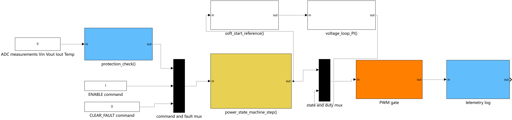
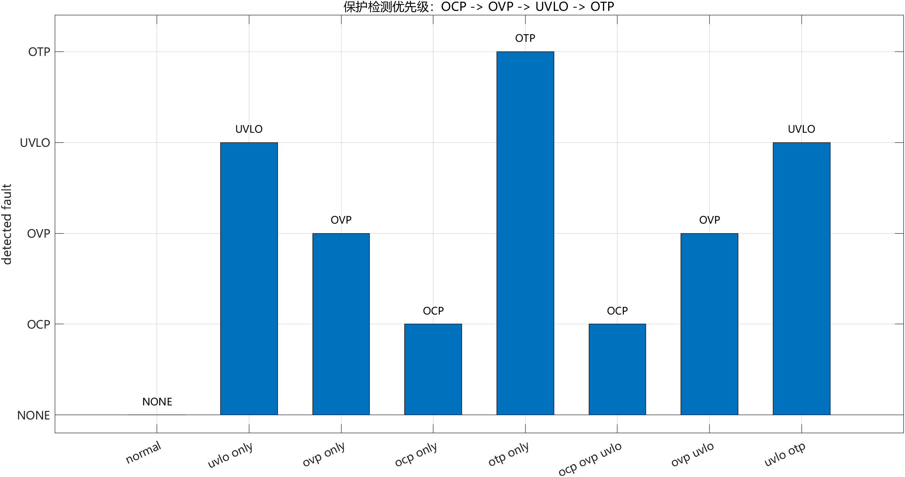
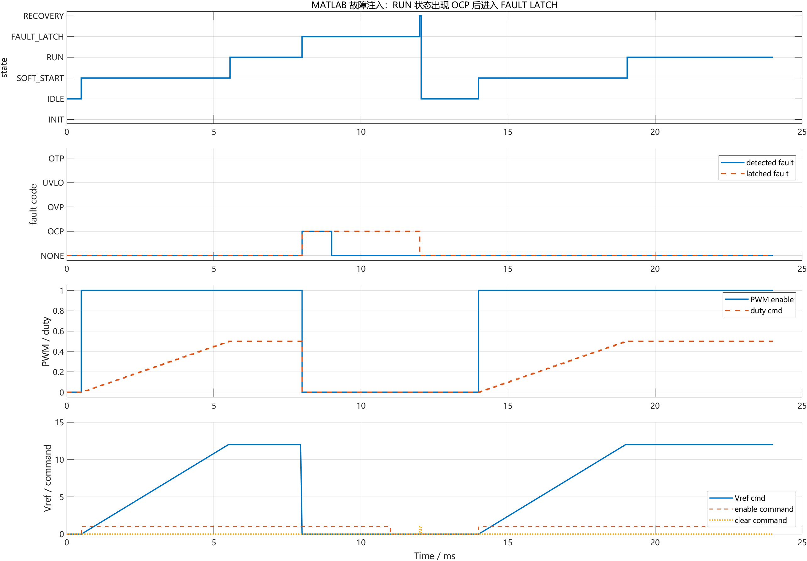
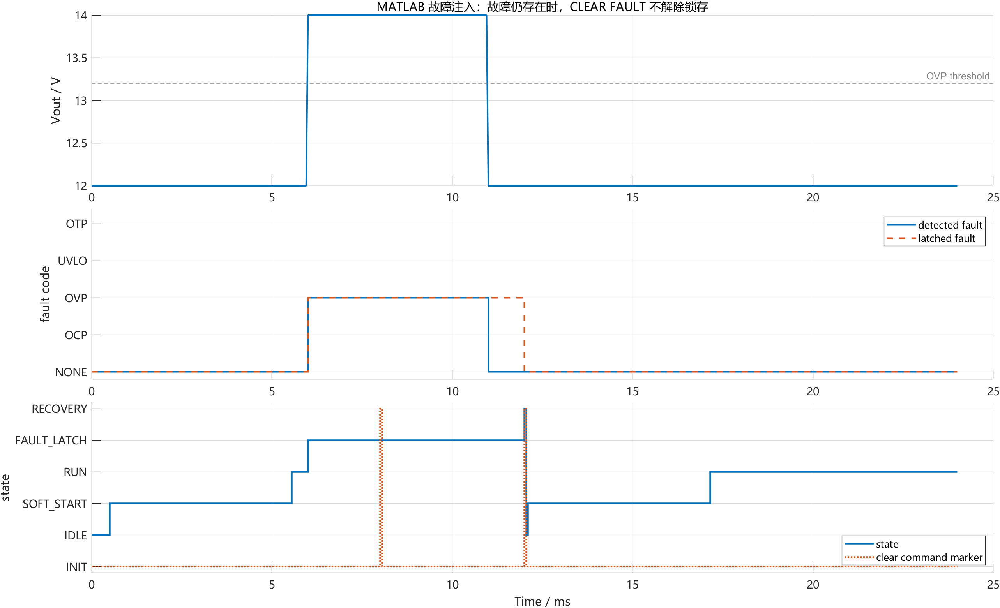

# 【数字电源/MATLAB+PLECS】如何进行 Buck 数字电源仿真（七）保护状态机怎么锁存故障并关断 PWM

前面几章已经把 Buck 数字电源里几条主控制链路补起来了。

第四章讲离散 PI 电压环，第五章讲 duty 限幅和 anti-windup，第六章讲软启动参考值怎么进入电压环。做到这里，正常启动和正常闭环已经能跑出比较干净的波形。

但是电源软件不能只关心“正常时怎么调”。真正上硬件前，还必须回答另一个问题：

```text
什么时候允许 PWM 输出？
什么时候必须立刻关断 PWM？
故障发生后，故障码由谁保存，什么时候允许清除？
```

这就是本章要讲的保护状态机。

配套 GitHub 仓库：[digital-power-buck-sim-lab](https://github.com/Old-Ding/digital-power-buck-sim-lab)

本章提供 Simulink 保护状态机结构截图、MATLAB 故障注入脚本、状态迁移 CSV、故障优先级 CSV 和正文波形图。正文波形来自 MATLAB R2024b 脚本导出结果。

## 本章先回答什么问题

本章只做一件事：把“保护检测、故障锁存、PWM 关断”拆成三个清晰职责，并用故障注入数据验证状态机行为。

本章会讲清楚：

- 为什么保护阈值判断不应该散落在 PI、PWM、软启动和状态分支里
- `protection_check()` 应该输出唯一故障码，而不是直接改 duty
- 状态机为什么要锁存故障，而不是故障信号消失后立刻恢复
- `FAULT_LATCH` 下为什么必须统一关断 PWM
- `CLEAR_FAULT` 为什么只有在故障检测已经消失后才有意义
- 多个故障同时出现时，为什么需要固定优先级

本章暂时不处理：

- 负载阶跃动态指标
- ADC 噪声、采样毛刺和去抖
- 硬件比较器、逐周期限流和驱动器故障脚
- 自动重启、打嗝保护和重试计数
- C 代码完整单元测试框架
- MOSFET SOA、二极管反向恢复和开关尖峰

这些内容放到后续章节。本章先把软件保护状态机的职责边界讲清楚。

## 为什么不能把保护判断写得到处都是

很多初学者写电源控制程序时，会很自然地在各处加判断：

```text
PI 里面看到电压过高，duty = 0
PWM 更新前看到过流，duty = 0
软启动时看到欠压，退出启动
主循环里看到故障，再设置 fault flag
```

这些判断单独看都像是在“更安全”，但调试时会出现一个严重问题：你很难判断到底是谁关掉了 PWM。

更好的分层方式是：

```text
protection_check()          只检测故障，输出一个 fault code
power_state_machine_step()  只消费命令和 fault code，决定状态和故障锁存
PWM gate                    只根据状态决定 duty 是否允许输出
telemetry                   只记录状态、故障码、PWM 使能和 duty
```

保护层负责“发生了什么故障”，状态机负责“系统处于什么状态”，执行层负责“PWM 是否输出”。这三个职责不要互相越界。

## 本章使用的状态机结构

本章生成了一个 Simulink 结构模型，用来展示数据流和职责边界：



这张图按从左到右的顺序看：

| 模块 | 输入 | 输出 | 职责 |
| --- | --- | --- | --- |
| `protection_check()` | Vin、Vout、Iout、Temp | `fault_code` | 比较阈值并输出唯一故障码 |
| `command and fault mux` | enable、clear、fault | 命令/故障输入 | 汇总状态机输入 |
| `power_state_machine_step()` | 命令和故障码 | 当前状态 | 锁存故障并决定状态迁移 |
| `soft_start_reference()` | 状态 | `Vref_cmd` | 只在软启动阶段生成参考斜坡 |
| `voltage_loop_PI()` | `Vref_cmd`、反馈量 | duty 候选值 | 正常闭环控制 |
| `PWM gate` | 状态和 duty | PWM 输出 | 非运行态统一关断 PWM |
| `telemetry log` | 状态、故障、PWM | 调试量 | 记录可观测变量 |

这个结构里最关键的一点是：保护检测层不直接改 duty，状态机不重复比较电压电流阈值，PWM gate 不判断 OCP/OVP/UVLO/OTP 的业务含义。

## 状态怎么定义

本章用 6 个状态表达第一版电源软件状态机：

| 状态 | 含义 | PWM |
| --- | --- | --- |
| `INIT` | 上电初始化 | 关闭 |
| `IDLE` | 等待 enable 命令 | 关闭 |
| `SOFT_START` | 软启动参考值爬坡 | 允许 |
| `RUN` | 正常闭环运行 | 允许 |
| `FAULT_LATCH` | 故障锁存 | 关闭 |
| `RECOVERY` | 清故障后的恢复过渡态 | 关闭 |

基本迁移关系是：

```text
INIT -> IDLE
IDLE + ENABLE -> SOFT_START
SOFT_START done -> RUN
SOFT_START/RUN + fault -> FAULT_LATCH
FAULT_LATCH + CLEAR_FAULT + no active fault -> RECOVERY -> IDLE
```

这里故意没有加自动恢复、重试次数和打嗝周期。第一版状态机先保证可观察、可解释、可复现。

## 保护检测只输出一个故障码

本章的保护检测优先级是：

```text
OCP -> OVP -> UVLO -> OTP
```

对应阈值如下：

| 保护项 | 条件 | 本章阈值 |
| --- | --- | --- |
| OCP | `Iout > Iout_limit` | 6.5A |
| OVP | `Vout > Vout_ovp` | 13.2V |
| UVLO | `Vin < Vin_uvlo` | 18V |
| OTP | `Temp > Temp_otp` | 95°C |

为什么要有优先级？因为实际系统可能同时出现多个异常。

比如短路时，输出电流过高，输入电压也可能被拉低。如果保护层同时把 OCP 和 UVLO 都往外抛，状态机和日志就会变得不确定。第一版更清晰的做法是让保护层集中决定优先级，只输出一个故障码。

本章用 MATLAB 对保护优先级做了静态故障注入：



从图里可以看到：

| 注入工况 | 触发条件 | 输出故障码 |
| --- | --- | --- |
| `normal` | 无异常 | NONE |
| `uvlo only` | Vin 低于 18V | UVLO |
| `ovp only` | Vout 高于 13.2V | OVP |
| `ocp only` | Iout 高于 6.5A | OCP |
| `otp only` | 温度高于 95°C | OTP |
| `ocp ovp uvlo` | OCP、OVP、UVLO 同时存在 | OCP |
| `ovp uvlo` | OVP、UVLO 同时存在 | OVP |
| `uvlo otp` | UVLO、OTP 同时存在 | UVLO |

这说明优先级没有散落在多个模块里，而是集中在保护检测层。

## RUN 状态发生 OCP 时会发生什么

下面是第一组动态故障注入。

工况设计如下：

| 时间 | 事件 |
| --- | --- |
| 0.5ms | enable 命令有效 |
| 0.5ms - 5.5ms | 进入软启动 |
| 5.55ms | 进入 RUN |
| 8ms - 9ms | 注入 OCP，Iout = 7.2A |
| 12ms | 清故障命令 |
| 14ms | 再次 enable |
| 19.05ms | 重新进入 RUN |

仿真波形如下：



这张图重点看三件事。

第一，8ms 出现 OCP 后，状态从 `RUN` 进入 `FAULT_LATCH`。检测到的故障只持续到 9ms，但锁存故障保持到 12ms 清故障命令到来。

第二，进入 `FAULT_LATCH` 的同一个采样周期，PWM enable 变成 0，duty cmd 也被压到 0。这个路径不是 PI 自己决定的，而是状态层统一关断。

第三，12ms 清故障后，系统没有直接跳回 RUN，而是走 `RECOVERY -> IDLE`。后续需要再次 enable，才会重新进入 `SOFT_START`，最后回到 `RUN`。

本章导出的关键指标：

| 指标 | 结果 |
| --- | --- |
| 首次 OCP 检测时间 | 8ms |
| PWM 关断延迟 | 0us |
| 锁存故障码 | OCP |
| 清故障进入恢复时间 | 12ms |
| 重新进入 RUN 时间 | 19.05ms |

这里的 `0us` 表示在本章离散状态机模型中，故障检测和 PWM gate 更新发生在同一次状态机采样里。真实 MCU 上还要继续分析 ADC 采样、任务调度、PWM 更新影子寄存器和硬件关断路径。

## 为什么故障消失后不能自动恢复

很多人第一次写保护逻辑，会把逻辑写成：

```text
if fault:
    pwm = 0
else:
    pwm = controller_output
```

这在仿真里看起来简单，但在硬件上很危险。

因为故障信号可能是间歇的。比如过流只持续几个采样点，或者过压刚好掉回阈值以下。如果故障一消失就自动恢复，电源可能在异常边界附近反复开关，现场也很难保留。

状态机锁存故障的目的不是“让系统更复杂”，而是为了保留事故现场：

| 变量 | 为什么要保留 |
| --- | --- |
| `latched_fault` | 知道最终触发的是 OCP、OVP、UVLO 还是 OTP |
| `state` | 知道故障发生在启动阶段还是运行阶段 |
| `Vout/Iout/Vin/Temp` | 定位是负载问题、输入问题还是控制问题 |
| `PWM enable/duty` | 确认执行层是否真的关断 |

## 故障还存在时，CLEAR FAULT 为什么不能解除锁存

第二组动态注入验证的是清故障边界。

工况设计如下：

| 时间 | 事件 |
| --- | --- |
| 6ms - 11ms | 注入 OVP，Vout = 14V |
| 8ms | 第一次 CLEAR FAULT |
| 11ms | OVP 注入结束 |
| 12ms | 第二次 CLEAR FAULT |

结果如下：



8ms 的清故障命令没有让系统退出 `FAULT_LATCH`，因为此时 `detected fault` 仍然是 OVP。12ms 再次清故障时，Vout 已经回到阈值以下，`detected fault` 为 NONE，状态机才进入 `RECOVERY`。

这个边界很重要。

`CLEAR_FAULT` 不是“强行恢复运行”的按钮，它只能表达“用户或上层系统请求清除已消失的故障锁存”。如果故障检测仍然有效，状态机应该继续留在故障锁存态。

## 软件实现时每层做什么

把本章逻辑整理成软件结构，可以写成：

```text
measurements = adc_sample()

detected_fault = protection_check(measurements)

power_state_machine_step(command, detected_fault)

if state in SOFT_START/RUN:
    duty = voltage_loop(...)
else:
    duty = 0

pwm_update(duty)

telemetry_log(state, detected_fault, latched_fault, duty)
```

职责边界如下：

| 层 | 可以做 | 不应该做 |
| --- | --- | --- |
| ADC/测量层 | 提供 Vin、Vout、Iout、Temp | 决定故障锁存 |
| 保护检测层 | 比较阈值，输出唯一故障码 | 直接改 duty |
| 状态机层 | 状态迁移、故障锁存、清故障边界 | 重复比较电压电流阈值 |
| 电压环 | 根据 `Vref_cmd` 和 `Vout` 算 duty | 判断 OCP/OVP/UVLO/OTP |
| PWM gate | 根据状态允许或关断 duty | 决定故障优先级 |
| telemetry | 记录关键变量 | 参与控制决策 |

这样写的好处是，调试时可以沿着唯一链路排查：

```text
测量值是否越阈值？
protection_check() 输出什么 fault code？
state machine 是否进入 FAULT_LATCH？
latched_fault 是否保存？
PWM gate 是否把 duty 关成 0？
telemetry 是否记录到了同一件事？
```

## 本章工程边界

本章完成的是软件状态机级别的保护行为验证，不是完整硬件保护验证。

本章能证明：

| 检查项 | 本章证据 | 工程判断 |
| --- | --- | --- |
| 故障检测有唯一输出 | 优先级注入图和 CSV | 多故障同时出现时行为确定 |
| RUN 状态 OCP 能进入锁存 | 8ms OCP 注入波形 | 状态机能从运行态进入故障锁存 |
| FAULT_LATCH 会关断 PWM | PWM enable 和 duty cmd 变为 0 | 执行层有统一关断出口 |
| 故障消失不会自动恢复 | OCP 消失后仍保持锁存到 12ms | 故障现场可以保留 |
| 故障仍存在时不能清除 | 8ms CLEAR FAULT 被忽略 | 清故障有边界条件 |

本章不能证明：

| 不覆盖内容 | 原因 |
| --- | --- |
| 硬件逐周期过流安全 | 本章没有建硬件比较器和驱动器关断链路 |
| MOSFET 应力安全 | 本章不是开关级器件应力仿真 |
| ADC 毛刺不会误触发 | 本章没有加入噪声、滤波和去抖 |
| 自动重启策略合理 | 本章采用手动 CLEAR FAULT，不做 hiccup |
| 可以直接上硬件 | 还需要硬件保护、采样链路、PWM 影子寄存器和实机联调 |

这个边界不是缺点，而是工程分层。第七章只证明“软件状态机的责任链是清楚的”，不把硬件保护和噪声处理提前混进来。

## 本章常见误区

### 1. 有了 OCP 判断就等于有了保护状态机

OCP 判断只说明检测层看到了过流，还没有覆盖故障锁存、恢复边界、故障码记录和 PWM 统一关断路径。状态机要解决的是这些后续动作由谁负责。

### 2. 故障信号消失后应该自动恢复

第一版不建议这样做。

电源故障经常不是稳定信号。自动恢复策略需要重试次数、冷却时间、输入条件、负载条件和安全策略支持。没有这些边界时，手动清故障更容易调试。

### 3. CLEAR FAULT 就是重新启动

`CLEAR_FAULT` 只清除已经不存在的故障锁存，不代表重新启动。清完故障后进入 `IDLE`，是否重新启动由 enable 命令决定。

### 4. 状态机里再判断一遍电压电流会更安全

不一定。

如果保护检测层已经负责阈值比较，状态机再判断一遍，会产生双重职责。后续改阈值、改优先级、加滤波时，容易出现两处逻辑不一致。第一版更清晰的做法是状态机只消费 `fault_code`。

## 本章总结

第七章把保护状态机补上了。

本章最重要的结论是：保护软件不要写成到处 `if fault then duty=0`，而要拆成检测、锁存、关断三层。

本章仿真结果表明：

- OCP 在 8ms 被检测后，状态机进入 `FAULT_LATCH`
- PWM 在同一状态机采样周期关断，模型中关断延迟为 0us
- OCP 注入结束后，锁存故障仍保持到 12ms 清故障命令
- OVP 仍然存在时，8ms 的 `CLEAR_FAULT` 不解除锁存
- OCP、OVP、UVLO、OTP 同时或组合出现时，保护层按固定优先级输出唯一故障码

下一篇继续做负载突变测试。

负载突变要回答的是另一个问题：电源在已经正常运行时，负载从轻载跳到重载，或者从重载跳回轻载，Vout 会下陷多少、过冲多少、多久能恢复。那是动态性能问题，不和本章的故障锁存职责混在一起。

## 本章配套文件

仓库入口：[https://github.com/Old-Ding/digital-power-buck-sim-lab](https://github.com/Old-Ding/digital-power-buck-sim-lab)

| 类型 | 文件 | 作用 |
| --- | --- | --- |
| 教程正文 | `blog/07-protection-state-machine.md` | 本章文章 |
| 复现说明 | `docs/07-protection-state-machine-reproduce.md` | 运行步骤和结果解释 |
| MATLAB 故障注入脚本 | `scripts/export_matlab_protection_state_machine_waveforms.m` | 生成状态机波形、故障优先级表和 summary |
| Simulink 结构截图脚本 | `scripts/export_simulink_protection_state_machine_snapshot.m` | 生成保护状态机结构模型和截图 |
| Simulink 结构模型 | `models/simulink/buck_protection_state_machine_logic.slx` | 展示保护状态机数据流 |
| Simulink 结构截图 | `assets/screenshots/07-simulink-protection-state-machine-logic.png` | 正文结构图 |
| 动态故障注入数据 | `waveforms/07-matlab-protection-state-machine-trace.csv` | RUN 状态 OCP 注入采样点 |
| 清故障边界数据 | `waveforms/07-matlab-protection-clear-while-fault-trace.csv` | OVP 仍存在时清故障采样点 |
| 故障优先级数据 | `waveforms/07-matlab-protection-priority-cases.csv` | 多故障组合的唯一故障码 |
| 指标汇总 | `waveforms/07-matlab-protection-state-machine-summary.csv` | 本章关键指标 |
| 正文波形 | `waveforms/07-matlab-protection-*.png` | 本章使用的 MATLAB 图表 |

运行方式：

```powershell
matlab -batch "run('scripts/export_simulink_protection_state_machine_snapshot.m'); exit"
matlab -batch "run('scripts/export_matlab_protection_state_machine_waveforms.m'); exit"
```

如果 MATLAB 没有加入系统 PATH，可以把 `matlab` 换成本机 MATLAB 的完整路径。

## 技术交流

如果你在复现模型、运行脚本或判断保护状态机波形时遇到问题，可以加入技术交流群交流。

仓库中的模型、脚本、数据和图表可以直接使用；交流群主要用于复现答疑和后续技术讨论。

| 渠道 | 信息 |
| --- | --- |
| QQ 群 | 嵌入式交流群 |
| 加群链接 | [https://qm.qq.com/q/rygrSD2Ddu](https://qm.qq.com/q/rygrSD2Ddu) |
| 微信交流 | 微信入口会不定期更新，可在 QQ 群内获取 |

提问时建议附上 Simulink 结构截图、summary CSV、状态机波形和你自己的故障注入工况。这样更容易定位问题，也更容易形成有效交流。
