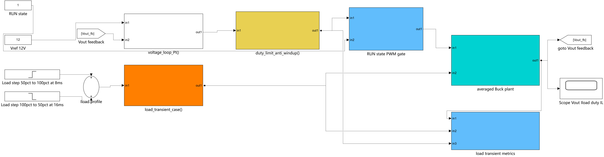
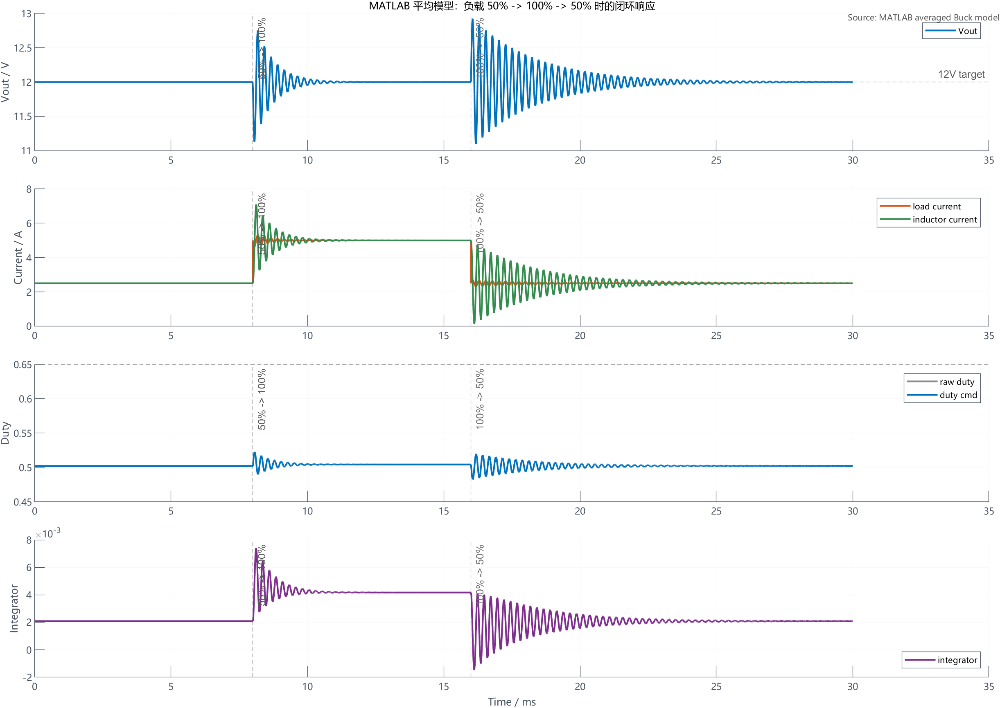
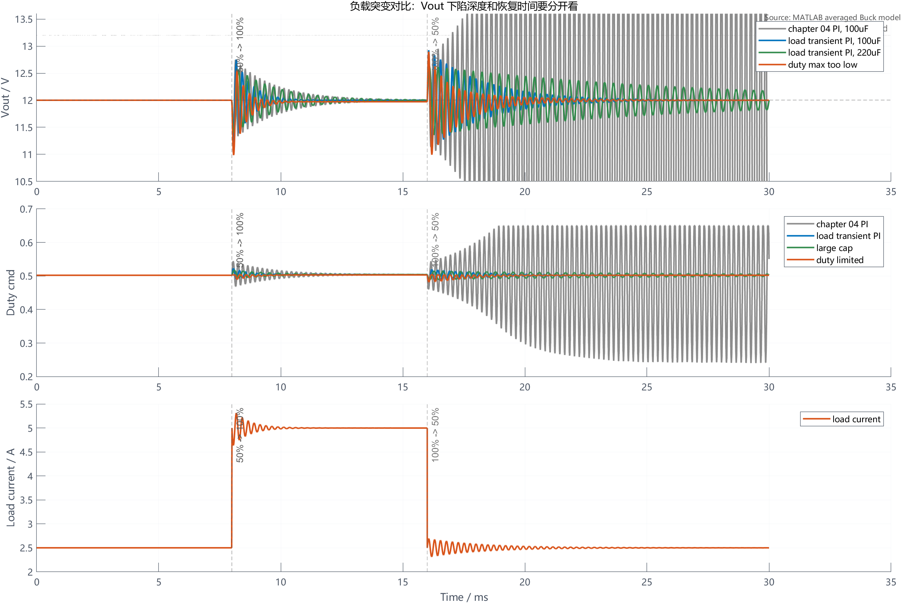
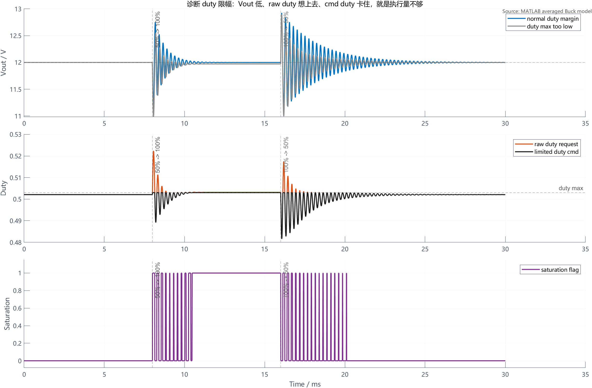

# 【数字电源/MATLAB+PLECS】如何进行 Buck 数字电源仿真（八）负载突变时输出下陷和过冲怎么测

前面几章已经把 Buck 数字电源的主链路逐步补起来了。

第四章讲离散 PI 电压环，第五章讲 duty 限幅和 anti-windup，第六章讲软启动，第七章讲保护状态机。做到这里，电源已经不是“只能开环跑 12V”的状态，而是有了闭环、启动、限幅和保护边界。

但电源是否真的“好用”，不能只看稳态 12V。

负载变化时，输出电压会下陷或过冲。工程上要回答的是：

```text
负载突然加重时，Vout 下陷多少？
负载突然变轻时，Vout 过冲多少？
多久能回到 12V 附近？
是输出电容不够，PI 参数不合适，还是 duty 限幅卡住了？
```

这就是本章要做的负载突变测试。

配套 GitHub 仓库：[digital-power-buck-sim-lab](https://github.com/Old-Ding/digital-power-buck-sim-lab)

本章提供 Simulink 负载突变测试台截图、MATLAB 平均模型脚本、负载阶跃 CSV、指标 summary 和正文波形图。正文波形来自 MATLAB R2024b 脚本导出结果。

## 本章先回答什么问题

本章只做一件事：用可复现的负载阶跃，把 Buck 闭环电源的动态性能测出来。

本章会讲清楚：

- 负载突变测试应该看哪些变量
- 为什么 `Vout 下陷深度` 和 `恢复时间` 要分开看
- 为什么负载加重和负载变轻是两个不同问题
- 如何通过 `raw duty`、`duty cmd`、`saturation flag` 判断是不是 duty 限幅导致
- 为什么输出电容变大不一定让恢复时间变短
- 为什么前面章节能稳态 12V，不代表负载突变指标已经合格

本章暂时不处理：

- ADC 噪声和采样抖动
- 保护阈值去抖和故障误触发
- 开关级电流纹波和器件应力
- 环路补偿的频域设计
- C 代码单元测试和自动化 HIL 测试

这些内容放到后续章节。本章先把负载突变的测试方法和诊断路径讲清楚。

## 为什么不能只看稳态 12V

稳态 12V 只能说明在一个固定负载点上，电压环最后能把误差拉回来。

负载突变测试看的不是这个。

负载从 50% 跳到 100% 时，输出电容要先给负载补能，电感电流再爬升，控制器再把 duty 拉高。这个过程中 Vout 会下陷。

负载从 100% 跳回 50% 时，电感电流不能瞬间变小，多出来的电流会继续给输出电容充电。这个过程中 Vout 会过冲。

所以负载突变至少要看四类指标：

| 指标 | 含义 |
| --- | --- |
| 下陷深度 | 负载加重后 Vout 最低掉到多少 |
| 上跳恢复时间 | 负载加重后多久回到 12V 的 1% 范围 |
| 过冲高度 | 负载变轻后 Vout 最高冲到多少 |
| 下跳恢复时间 | 负载变轻后多久回到 12V 的 1% 范围 |

只说“能恢复到 12V”是不够的。恢复太慢、过冲太高、duty 长时间饱和，都可能让硬件上出现问题。

## 本章使用的测试台

本章生成了一个 Simulink 负载突变测试台结构图：



这张图按从左到右看：

| 模块 | 输入 | 输出 | 职责 |
| --- | --- | --- | --- |
| `load_transient_case()` | 负载阶跃命令 | 负载电流/等效负载 | 生成 50% -> 100% -> 50% 工况 |
| `voltage_loop_PI()` | Vref、Vout | raw duty | 根据电压误差计算 duty 请求 |
| `duty_limit_anti_windup()` | raw duty | duty cmd、saturation | 限制实际输出并保留饱和状态 |
| `RUN state PWM gate` | RUN 状态、duty cmd | PWM duty | 本章固定在 RUN 状态，不重复做保护状态机 |
| `averaged Buck plant` | duty、负载 | Vout、IL | 计算 Buck 平均模型响应 |
| `load transient metrics` | Vout、负载、duty | 指标 | 导出下陷、过冲、恢复时间和饱和时间 |

这里的结构仍然遵守前面章节的分层：负载测试只改变负载；电压环只算 duty；限幅层只处理输出边界；保护状态机不在本章重复展开。

## 本章工况和参数

本章采用 24V 输入、12V 输出、60W 满载 Buck。负载阶跃如下：

| 时间 | 负载 | 等效电流 |
| --- | --- | --- |
| 0ms - 8ms | 50% 负载 | 2.5A |
| 8ms - 16ms | 100% 负载 | 5A |
| 16ms - 30ms | 50% 负载 | 2.5A |

核心参数如下：

| 参数 | 数值 |
| --- | --- |
| 输入电压 | 24V |
| 输出电压 | 12V |
| 电感 | 22uH |
| 输出电容 | 100uF / 220uF 对比 |
| 控制周期 | 5us |
| 1% 恢复带宽 | ±0.12V |
| duty 下限 | 0 |
| 常规 duty 上限 | 0.65 |

本章对比四组设置：

| 工况 | Kp | Ki | Co | duty 上限 | 用途 |
| --- | --- | --- | --- | --- | --- |
| `chapter04_pi` | 0.05 | 200 | 100uF | 0.65 | 沿用第 4 章 PI，观察它在负载释放时的问题 |
| `load_transient_pi` | 0.02 | 80 | 100uF | 0.65 | 本章负载瞬态对照参数 |
| `large_cap` | 0.02 | 80 | 220uF | 0.65 | 观察输出电容变大后的取舍 |
| `duty_limited` | 0.02 | 80 | 100uF | 0.503 | 观察 duty 上限不足时的诊断特征 |

这里的 `load_transient_pi` 是一组可复现实验参数，不是最终量产补偿参数。它用于说明负载突变测试应该怎么读波形、怎么判断原因。

## 先看一组正常负载突变波形

下面是 `load_transient_pi` 工况的完整波形：



这张图按顺序看四个量。

第一行是 Vout。8ms 负载从 50% 加到 100%，Vout 先下陷，然后回到 12V 附近。16ms 负载从 100% 降到 50%，Vout 先过冲，再逐步收敛。

第二行是负载电流和电感电流。负载电流是阶跃，电感电流不能阶跃，只能按电感电压斜率变化。Vout 的下陷和过冲，本质上就是电感电流和负载电流短时间不相等导致输出电容充放电。

第三行是 raw duty 和 duty cmd。这个工况里 duty 没有碰到 0.65 上限，说明恢复过程不是被 duty 上限卡住。

第四行是积分项。负载加重后，积分项抬高一点，帮助 5A 负载下的稳态 duty；负载变轻后，积分项再回落。

这组工况的关键指标是：

| 指标 | 结果 |
| --- | --- |
| 负载上跳 Vout 最低值 | 11.13V |
| 负载上跳下陷 | 0.87V |
| 负载上跳 1% 恢复时间 | 1.40ms |
| 负载下跳 Vout 最高值 | 12.93V |
| 负载下跳过冲 | 0.93V |
| 负载下跳 1% 恢复时间 | 4.79ms |
| 负载上跳峰值电感电流 | 7.10A |
| duty 是否饱和 | 否 |

这个结果说明，当前实验参数可以完成 50% -> 100% -> 50% 负载突变测试，但负载释放后的过冲和恢复时间仍然是需要继续优化的指标。

## 对比不同原因：PI、电容、duty 限幅

只看一条 Vout 波形，很容易误判原因。

下面把四组工况放在一起：



这张图重点看三个现象。

第一，沿用第 4 章 `chapter04_pi` 参数时，上跳下陷不算最差，但负载从 100% 回到 50% 后，Vout 过冲到 15.56V，并且在 30ms 仿真窗口内没有回到 1% 带内。也就是说，第 4 章参数能说明 PI 把稳态误差拉回 0，但不能直接当作负载突变最终参数。

第二，`large_cap` 把输出电容从 100uF 增加到 220uF 后，上跳下陷从 0.87V 降到 0.61V，下跳过冲从 0.93V 降到 0.63V。但是恢复时间变长，负载下跳后的 1% 恢复时间约 13.96ms。电容变大能减小电压摆幅，但也会改变动态响应。

第三，`duty_limited` 工况的 duty 上限设为 0.503。负载加重时 raw duty 想继续往上，但实际 duty cmd 被卡住。它的上跳下陷扩大到 1.01V，重载阶段 duty 饱和约 6.33ms。这类波形不是单纯“PI 慢”，而是执行量不够。

对比表如下：

| 工况 | 上跳下陷 | 上跳恢复 | 下跳过冲 | 下跳恢复 | 诊断 |
| --- | --- | --- | --- | --- | --- |
| `chapter04_pi` | 0.74V | 3.23ms | 3.56V | 未在 30ms 内恢复 | 负载释放响应不合格 |
| `load_transient_pi` | 0.87V | 1.40ms | 0.93V | 4.79ms | 可作为本章对照参数 |
| `large_cap` | 0.61V | 2.97ms | 0.63V | 13.96ms | 电压摆幅变小，恢复变慢 |
| `duty_limited` | 1.01V | 1.35ms | 0.90V | 3.38ms | 重载阶段 duty 被上限卡住 |

这里要注意一个工程判断：负载突变不是只追求某一个数字最小。下陷、过冲、恢复时间、峰值电流、duty 余量都要一起看。

## 怎么判断是不是 duty 限幅导致

很多时候，Vout 下陷变大后，第一反应是“PI 参数不够快”。但如果 duty 已经被上限卡住，再调 PI 也没有意义。

判断方法是同时看 `raw duty` 和 `duty cmd`：



这张图里蓝线是 duty 余量正常的工况，灰线是 duty 上限偏低的工况。

负载上跳后，灰色工况出现三个特征：

| 现象 | 含义 |
| --- | --- |
| Vout 下陷更深 | 输出能量补不上 |
| raw duty 高于 duty cmd | 控制器想加大 duty |
| saturation flag 变成 1 | 限幅层不允许继续加 duty |

这时根因不应该写成“PI 太慢”。更准确的结论是：控制器已经提出更高 duty 请求，但执行层受 duty 上限约束，实际输出没有跟上。

对应的软件排查链路是：

```text
Vout 是否低于目标？
error 是否为正？
raw duty 是否提高？
duty cmd 是否等于 duty_max？
saturation flag 是否为 1？
如果以上同时成立，优先检查 duty 上限、输入电压余量和功率级设计。
```

## 负载上跳和下跳为什么要分开评价

负载上跳时，系统从 2.5A 变成 5A。电感电流一开始只有 2.5A 左右，负载却立刻需要 5A，缺口由输出电容提供，所以 Vout 下陷。

负载下跳时，系统从 5A 变成 2.5A。电感电流一开始仍接近 5A，但负载只需要 2.5A，多出来的电流进入输出电容，所以 Vout 过冲。

这两个方向的难点不同：

| 方向 | 主要风险 | 常见观察量 |
| --- | --- | --- |
| 50% -> 100% | Vout 下陷、峰值电感电流、duty 上限 | Vout min、IL peak、duty saturation |
| 100% -> 50% | Vout 过冲、积分项回落、duty 下限 | Vout max、duty min、恢复时间 |

所以不能只做一种负载阶跃。一个环路可能负载加重表现还可以，但负载释放时过冲很高。

## 输出电容是不是越大越好

从本章数据看，输出电容变大确实能减小电压摆幅。

`large_cap` 工况把 Co 从 100uF 提高到 220uF 后：

| 指标 | 100uF | 220uF |
| --- | --- | --- |
| 上跳下陷 | 0.87V | 0.61V |
| 下跳过冲 | 0.93V | 0.63V |
| 上跳恢复时间 | 1.40ms | 2.97ms |
| 下跳恢复时间 | 4.79ms | 13.96ms |

这说明输出电容不是单纯“越大越好”。电容变大以后，输出电压变化变慢，瞬态摆幅会变小；但环路看到的对象也变了，恢复时间可能变长。最终要结合体积、成本、启动电流、环路稳定性和负载指标一起取舍。

## 本章工程边界

本章完成的是平均模型下的负载突变测试，不是最终硬件认证。

本章能证明：

| 检查项 | 本章证据 | 工程判断 |
| --- | --- | --- |
| 负载上跳会造成 Vout 下陷 | 8ms 50% -> 100% 波形 | 需要看下陷和恢复时间 |
| 负载下跳会造成 Vout 过冲 | 16ms 100% -> 50% 波形 | 需要单独评价过冲 |
| 第 4 章 PI 不等于负载瞬态最终参数 | `chapter04_pi` 对比波形 | 稳态闭环和动态指标要分开验证 |
| 输出电容会改变动态结果 | 100uF / 220uF 对比 | 电容变大降低摆幅但可能拉长恢复 |
| duty 限幅有可观察特征 | raw duty、duty cmd、saturation | 可以定位执行量不足 |

本章不能证明：

| 不覆盖内容 | 原因 |
| --- | --- |
| 开关纹波和尖峰安全 | 本章使用平均模型，不是开关级仿真 |
| 最终环路稳定裕度 | 本章没有做频域补偿设计 |
| ADC 噪声下不会误判 | 本章没有加入采样噪声和滤波 |
| 硬件一定不会触发保护 | 本章没有把 OVP/OCP 去抖和硬件保护路径加入动态测试 |
| 可以直接上硬件 | 还需要实机负载阶跃、示波器测量和保护联调 |

这个边界很重要。平均模型适合先看控制逻辑和趋势，但最终还要回到 PLECS 开关级模型和硬件测量。

## 本章常见误区

### 1. 稳态能回 12V，就说明负载突变也没问题

不成立。

稳态误差和动态指标不是同一个问题。本章里 `chapter04_pi` 能在稳态回到 12V，但负载释放后的过冲和恢复都不适合作为最终参数。

### 2. 下陷变大一定是 PI 太慢

不一定。

如果 raw duty 已经高于 duty cmd，且 saturation flag 为 1，说明控制器想加 duty，但限幅层不允许继续加。这时优先检查 duty 上限、输入电压余量和功率级设计。

### 3. 输出电容加大就能解决所有负载突变问题

电容变大能降低电压摆幅，但也可能让恢复变慢，并影响启动、体积和成本。负载突变指标要和系统约束一起看。

### 4. 只做 50% -> 100% 就够了

不够。

负载加重主要看下陷，负载变轻主要看过冲。很多问题只会在负载释放时暴露出来。

## 本章总结

第八章把负载突变测试补上了。

本章最重要的结论是：负载瞬态不要只看“最后能不能回到 12V”，而要同时看下陷、过冲、恢复时间、峰值电流和 duty 饱和状态。

本章仿真结果表明：

- `load_transient_pi` 在 50% -> 100% 时下陷约 0.87V，1% 恢复时间约 1.40ms
- `load_transient_pi` 在 100% -> 50% 时过冲约 0.93V，1% 恢复时间约 4.79ms
- 沿用第 4 章 PI 时，负载释放过冲约 3.56V，在 30ms 仿真窗口内未回到 1% 带内
- 220uF 输出电容能降低电压摆幅，但会拉长恢复时间
- duty 上限不足时，raw duty 和 duty cmd 会分离，saturation flag 会变成 1

下一篇继续做 ADC 噪声和 duty 抖动。

ADC 噪声要回答的是另一个问题：采样值抖动时，PI 输出 duty 会不会抖动，是否需要滤波、死区或采样同步。那是采样链路问题，不和本章的负载突变指标混在一起。

## 本章配套文件

仓库入口：[https://github.com/Old-Ding/digital-power-buck-sim-lab](https://github.com/Old-Ding/digital-power-buck-sim-lab)

| 类型 | 文件 | 作用 |
| --- | --- | --- |
| 教程正文 | `blog/08-load-transient.md` | 本章文章 |
| 复现说明 | `docs/08-load-transient-reproduce.md` | 运行步骤和结果解释 |
| MATLAB 负载阶跃脚本 | `scripts/export_matlab_load_transient_waveforms.m` | 生成负载突变数据、summary 和正文波形 |
| Simulink 测试台截图脚本 | `scripts/export_simulink_load_transient_snapshot.m` | 生成负载突变测试台模型和截图 |
| Simulink 测试台模型 | `models/simulink/buck_load_transient_testbench.slx` | 展示负载突变测试数据流 |
| Simulink 测试台截图 | `assets/screenshots/08-simulink-load-transient-testbench.png` | 正文测试台图 |
| MATLAB 原始数据 | `waveforms/08-matlab-load-transient-trace.csv` | 负载阶跃采样点 |
| MATLAB 指标汇总 | `waveforms/08-matlab-load-transient-summary.csv` | 本章关键指标 |
| 正文波形 | `waveforms/08-matlab-load-transient-*.png` | 本章使用的 MATLAB 图表 |

运行方式：

```powershell
matlab -batch "run('scripts/export_simulink_load_transient_snapshot.m'); exit"
matlab -batch "run('scripts/export_matlab_load_transient_waveforms.m'); exit"
```

如果 MATLAB 没有加入系统 PATH，可以把 `matlab` 换成本机 MATLAB 的完整路径。

## 技术交流

如果你在复现模型、运行脚本或判断负载突变波形时遇到问题，可以加入技术交流群交流。

仓库中的模型、脚本、数据和图表可以直接使用；交流群主要用于复现答疑和后续技术讨论。

| 渠道 | 信息 |
| --- | --- |
| QQ 群 | 嵌入式交流群 |
| 加群链接 | [https://qm.qq.com/q/rygrSD2Ddu](https://qm.qq.com/q/rygrSD2Ddu) |
| 微信交流 | 微信入口会不定期更新，可在 QQ 群内获取 |

提问时建议附上 Simulink 测试台截图、summary CSV、负载突变波形和你自己的负载阶跃工况。这样更容易定位问题，也更容易形成有效交流。
