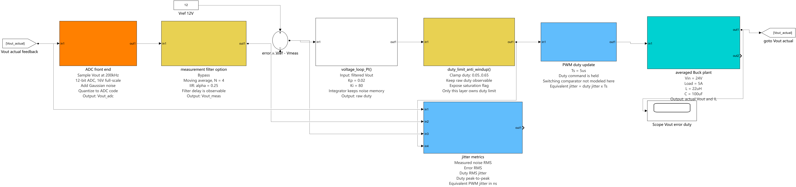
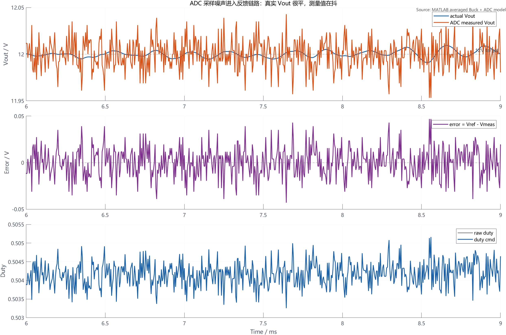
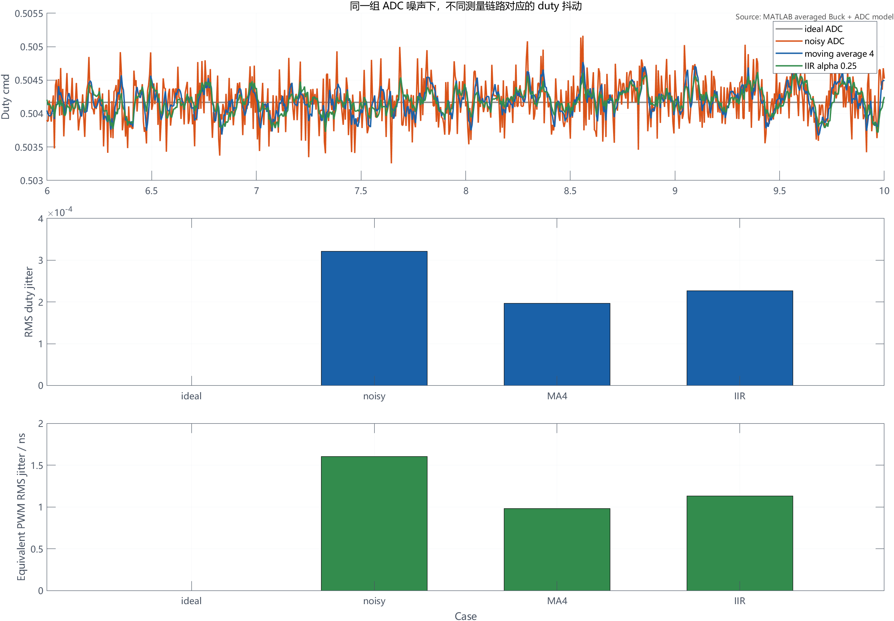
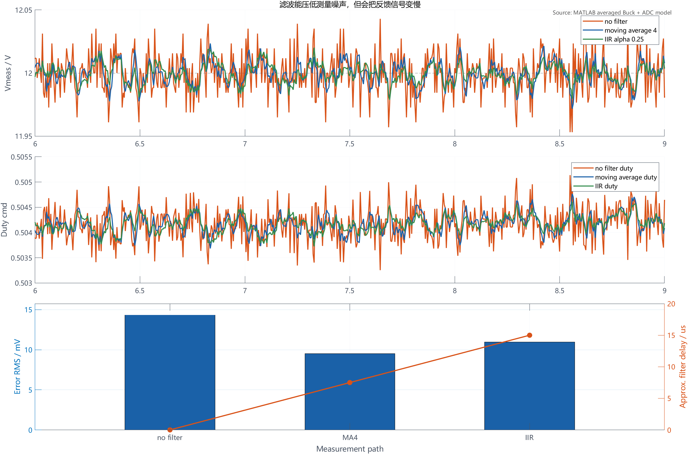

# 【数字电源/MATLAB+PLECS】如何进行 Buck 数字电源仿真（九）ADC 噪声怎么变成 duty 抖动

前面第八章做了负载突变测试，我们已经能观察输出下陷、过冲、恢复时间和 duty 饱和。

但数字电源还有一个很容易被忽略的问题：就算负载不变、输入不变、输出电压看起来也在 12V 附近，`duty` 仍然可能在抖。

原因通常不在 Buck 主功率级，而在采样链路。

ADC 采样值有量化误差和模拟噪声，控制器用这个采样值计算误差，PI 再把误差换成 `raw duty`，最后经过限幅变成 `duty_cmd`。所以采样噪声不是停留在 ADC 那一层，它会沿着反馈链路进入 PWM 输出。

本章就专门把这条链路拆开。

配套 GitHub 仓库：[digital-power-buck-sim-lab](https://github.com/Old-Ding/digital-power-buck-sim-lab)

本章提供 Simulink 采样链路截图、MATLAB 平均模型脚本、ADC 噪声 CSV、抖动指标 summary 和正文波形图。正文波形来自 MATLAB R2024b 脚本导出结果。

## 本章先回答什么问题

本章只做一件事：定位 ADC 采样噪声如何变成 duty 抖动，并用指标比较简单滤波的收益和代价。

本章会讲清楚：

- ADC 量化和模拟噪声如何进入 `Vout_meas`
- 为什么 `error = Vref - Vout_meas` 会跟着抖
- PI 输出的 `raw duty` 为什么会被采样噪声调制
- 怎么用 RMS、peak-to-peak 和等效 PWM 时间抖动描述 duty 抖动
- 4 点滑动平均和一阶 IIR 为什么能降低抖动
- 为什么滤波不是越重越好，因为它会让反馈信号变慢

本章暂时不处理：

- MCU ADC 驱动代码和 DMA 搬运
- PWM 计数器量化、死区和互补驱动
- 采样同步到开关周期的具体实现
- 硬件 RC 滤波、运放噪声和 PCB 布局
- EMI 认证和示波器实测纹波

这些内容属于硬件采样链路和软件工程化，后续再展开。本章先把仿真里最核心的数据流讲清楚。

## 为什么不要一看到 duty 抖动就先调 PI

很多调试会从结果倒推：看到 duty 在抖，就怀疑 PI 参数太激进。

这个判断不一定错，但顺序不完整。

数字电源的闭环数据流是：

```text
实际 Vout
-> ADC 采样和量化
-> 可选数字滤波
-> error = Vref - Vout_meas
-> PI 控制器
-> raw duty
-> duty 限幅
-> duty_cmd
-> PWM 输出
```

如果 `Vout_meas` 已经抖了，`error` 一定会抖；如果 PI 对误差有响应，`raw duty` 就会跟着抖。此时直接改 PI，可能只是把采样链路的问题藏起来。

更稳的排查顺序应该是：

| 观察量 | 如果它在抖 | 优先怀疑 |
| --- | --- | --- |
| `Vout_actual` | 真实输出有扰动 | 功率级、负载、输入源、环路稳定性 |
| `Vout_meas` | 测量值比真实输出更抖 | ADC 噪声、量化、采样点、前端滤波 |
| `error` | 跟着测量值抖 | 误差计算链路正常反映噪声 |
| `raw duty` | 随 error 抖 | PI 正在响应采样噪声 |
| `duty_cmd` | 最终输出抖 | 抖动已经进入 PWM 指令 |

本章的重点是第二行到第五行：真实输出变化不大时，采样噪声如何沿着软件链路传到 duty。

## 本章使用的仿真链路

本章生成了一个 Simulink 采样链路结构图：



这张图按从左到右看：

| 模块 | 输入 | 输出 | 职责 |
| --- | --- | --- | --- |
| `ADC front end` | 实际 Vout | `Vout_adc` | 加入 ADC 噪声并做 12 bit 量化 |
| `measurement filter option` | `Vout_adc` | `Vout_meas` | 对比无滤波、4 点滑动平均和一阶 IIR |
| `error = Vref - Vmeas` | Vref、`Vout_meas` | error | 把测量误差送入控制器 |
| `voltage_loop_PI()` | error | raw duty | 离散 PI 输出 duty 请求 |
| `duty_limit_anti_windup()` | raw duty | duty cmd | 限制最终 duty，并保留可观测变量 |
| `PWM duty update` | duty cmd | 等效 PWM duty | 用 duty 抖动换算等效脉宽抖动 |
| `averaged Buck plant` | duty | 实际 Vout、IL | 用平均模型观察闭环响应 |
| `jitter metrics` | Vout、error、duty | 指标 | 计算 RMS、峰峰值和等效时间抖动 |

这里仍然遵守前几章的分层：ADC 前端只负责采样，滤波只负责测量链路，PI 只负责控制计算，限幅层只负责 duty 边界。本章不把保护状态机和 C 代码混进来。

## 本章参数

Buck 主参数沿用前面章节：

| 参数 | 数值 |
| --- | --- |
| 输入电压 | 24V |
| 输出目标 | 12V |
| 满载电流 | 5A |
| 电感 | 22uH |
| 输出电容 | 100uF |
| 开关频率 | 200kHz |
| 控制周期 | 5us |
| PI 参数 | Kp = 0.02，Ki = 80 |
| duty 限幅 | 0.05 - 0.65 |

ADC 和滤波参数如下：

| 参数 | 数值 | 说明 |
| --- | --- | --- |
| ADC 位数 | 12 bit | 用输出电压等效量表示 |
| ADC 满量程 | 16V | 对应 Buck 输出采样范围 |
| ADC LSB | 3.906mV | `16V / 4096` |
| ADC 模拟噪声 | 15mV RMS | 量化前叠加高斯噪声 |
| 滑动平均 | 4 点 | 约 7.5us 群延迟 |
| 一阶 IIR | alpha = 0.25 | 约 15us 等效延迟 |

本章对比四组工况：

| 工况 | ADC 噪声 | 滤波 | 用途 |
| --- | --- | --- | --- |
| `ideal_adc` | 无 | 无 | 理想基准 |
| `noisy_adc` | 有 | 无 | 观察采样噪声直接进入 duty |
| `moving_average_4` | 有 | 4 点滑动平均 | 观察简单平均的降噪效果 |
| `iir_alpha_0p25` | 有 | 一阶 IIR | 观察更平滑但更慢的反馈链路 |

每个有噪声的工况使用同一个随机种子，因此三组噪声序列一致，比较的是测量链路，而不是随机运气。

## 先看噪声如何进入 duty

下面是 `noisy_adc` 工况的局部波形：



第一行同时画了实际 Vout 和 ADC 测量值。实际 Vout 在 12V 附近缓慢变化，但测量值有明显毛刺。这些毛刺来自 ADC 量化和 15mV RMS 模拟噪声。

第二行是 `error = Vref - Vout_meas`。因为误差直接使用测量值，所以测量值向上跳，error 就向下跳；测量值向下跳，error 就向上跳。

第三行是 `raw duty` 和 `duty_cmd`。本章这个工况没有触发 duty 限幅，所以两条线基本重合。也就是说，采样噪声已经穿过 PI，进入最终 duty 指令。

这组工况的关键指标是：

| 指标 | 结果 |
| --- | --- |
| ADC 测量噪声 RMS | 约 15.18mV |
| error RMS | 约 15.75mV |
| duty RMS 抖动 | 约 0.000321 |
| duty 峰峰值 | 约 0.00228 |
| 等效 PWM RMS 抖动 | 约 1.60ns |
| 等效 PWM 峰峰值 | 约 11.38ns |

这里的“等效 PWM 抖动”不是 MCU 定时器本身的时钟抖动，而是 duty 指令变化换算成脉宽变化：

```text
equivalent_pwm_jitter = duty_jitter * switching_period
```

本章开关周期是 5us，所以 `0.000321 * 5us` 约等于 `1.60ns`。

## 滤波能降低 duty 抖动

把四组工况放在一起看：



第一行是 duty 时间波形。橙色 `noisy ADC` 抖得最明显；蓝色 4 点滑动平均和绿色 IIR 都更平滑。

第二行是 duty RMS 抖动。无滤波时约 `3.21e-4`，4 点滑动平均降到约 `1.97e-4`，IIR 降到约 `2.27e-4`。

第三行把 duty 抖动换算成等效 PWM 时间。无滤波时约 `1.60ns RMS`，4 点滑动平均约 `0.98ns RMS`，IIR 约 `1.13ns RMS`。

指标表如下：

| 工况 | 测量噪声 RMS | error RMS | duty RMS 抖动 | duty 峰峰值 | 等效 PWM RMS 抖动 | 近似滤波延迟 |
| --- | --- | --- | --- | --- | --- | --- |
| `ideal_adc` | 0mV | 0mV | 接近 0 | 0 | 接近 0 | 0us |
| `noisy_adc` | 15.18mV | 15.75mV | 0.000321 | 0.00228 | 1.60ns | 0us |
| `moving_average_4` | 7.62mV | 9.51mV | 0.000197 | 0.00113 | 0.98ns | 7.5us |
| `iir_alpha_0p25` | 6.59mV | 10.95mV | 0.000227 | 0.00125 | 1.13ns | 15us |

从 duty RMS 抖动看，4 点滑动平均相对无滤波降低约 38.6%，一阶 IIR 降低约 29.3%。

这个结果说明，滤波确实能减少采样噪声对 duty 的调制。

## 滤波不是越重越好

只看“测量噪声 RMS”，IIR 看起来比 4 点滑动平均更平滑：`6.59mV` 小于 `7.62mV`。

但控制系统不能只看测量值平滑不平滑，还要看反馈信号变慢以后对控制器的影响。

下面这张图把测量值、duty 和延迟放在一起：



4 点滑动平均的近似延迟约 7.5us，一阶 IIR 的近似延迟约 15us。IIR 虽然把测量值压得更平，但反馈路径更慢，在本章这组参数下 duty RMS 抖动并没有比 4 点滑动平均更低。

这就是滤波的工程取舍：

| 方案 | 好处 | 代价 |
| --- | --- | --- |
| 不滤波 | 响应最快，链路最简单 | ADC 噪声直接进 error 和 duty |
| 滑动平均 | 实现简单，降噪明显 | 引入固定窗口延迟，占用少量存储 |
| 一阶 IIR | 计算量低，参数连续可调 | alpha 太小时反馈变慢，可能影响动态响应 |

所以滤波参数不应该只按“看起来更平”来选。它要和控制周期、环路带宽、负载突变指标、采样同步方式一起定。

## 怎么在实际项目里定位 duty 抖动

仿真里变量都能直接拿到，硬件上也应该按同样思路留观测量。

建议至少记录这些量：

| 变量 | 作用 |
| --- | --- |
| `vout_adc_raw` | 未滤波 ADC 换算电压 |
| `vout_meas` | 进入控制器的测量值 |
| `error` | PI 的真实输入 |
| `p_term` | 比例项是否在放大噪声 |
| `integrator` | 积分项是否出现慢漂移 |
| `duty_raw` | 控制器想输出的 duty |
| `duty_cmd` | 限幅后的实际 duty |
| `saturation_flag` | 是否被 duty 上下限卡住 |

排查顺序可以写成：

```text
先看 vout_adc_raw 是否比示波器 Vout 更抖
再看 vout_meas 是否被滤波压住
再看 error RMS 是否下降
再看 duty_raw / duty_cmd 的 RMS 和峰峰值
最后确认滤波后负载突变响应有没有变慢
```

如果只有 duty 波形，没有 ADC 原始值和滤波后测量值，就很难判断是采样链路、PI 参数，还是功率级本身的问题。

## 本章工程边界

本章完成的是平均模型下的采样噪声到 duty 抖动验证，不是硬件噪声认证。

本章能证明：

| 检查项 | 本章证据 | 工程判断 |
| --- | --- | --- |
| ADC 噪声会进入误差计算 | `Vout_meas` 和 error 波形 | 测量链路必须可观测 |
| PI 会把 error 抖动传到 duty | `raw duty` / `duty_cmd` 波形 | duty 抖动不一定是 PI 参数单独导致 |
| 滤波能降低 duty RMS 抖动 | summary 指标和对比图 | 简单滤波有明确收益 |
| 滤波会引入延迟 | 滤波延迟指标 | 不能只追求测量值更平 |
| duty 抖动可以换算成脉宽抖动 | `duty_jitter * Ts` | 便于和 PWM 分辨率、时序裕量沟通 |

本章不能证明：

| 不覆盖内容 | 原因 |
| --- | --- |
| 硬件 ADC 前端已经合格 | 本章没有建模采样电阻、电容、运放、PCB 噪声 |
| EMI 和开关纹波满足要求 | 本章使用平均模型，不是开关级或实测波形 |
| 某个滤波参数就是最终量产参数 | 本章没有做完整环路带宽和负载瞬态联合优化 |
| MCU PWM 没有量化问题 | 本章没有建模定时器计数、死区和更新时序 |
| 可以直接上硬件闭环 | 还需要采样同步、限幅、保护和实机示波器验证 |

这个边界很重要。第九章的目标是把问题定位方法讲清楚，而不是把硬件采样链路一次性做完。

## 本章常见误区

### 1. duty 抖动就是 PI 参数太大

不一定。

如果 `Vout_meas` 本身已经有明显噪声，PI 只是按控制逻辑响应这个误差。先确认采样链路，再决定是否改 PI。

### 2. ADC 位数越高就一定没问题

不一定。

ADC 位数只决定量化步进，模拟前端噪声、采样时刻、参考电压、地弹和开关噪声耦合都会影响测量值。本章 12 bit 对应 3.906mV LSB，但仍然叠加了 15mV RMS 模拟噪声。

### 3. 滤波越重越安全

不成立。

滤波会降低高频噪声，也会让反馈变慢。反馈变慢以后，负载突变、启动和保护阈值判断都可能受影响。

### 4. 平均模型看不到开关噪声，所以这一章没意义

平均模型确实不能证明开关尖峰和 EMI，但它能把软件链路先讲清楚：采样值、误差、PI、duty 的变量关系不会因为换成硬件就消失。

## 本章总结

第九章把 ADC 噪声到 duty 抖动这条链路补上了。

本章最重要的结论是：不要只盯最终 duty 波形。要把 `Vout_actual`、`Vout_adc`、`Vout_meas`、`error`、`raw duty` 和 `duty_cmd` 连起来看。

本章仿真结果表明：

- 12 bit、16V 满量程时，ADC LSB 约 3.906mV
- 加入 15mV RMS ADC 噪声后，`noisy_adc` 的 duty RMS 抖动约 0.000321
- 这个 duty 抖动等效为约 1.60ns PWM RMS 脉宽变化
- 4 点滑动平均把 duty RMS 抖动降到约 0.000197，降低约 38.6%
- 一阶 IIR 把 duty RMS 抖动降到约 0.000227，降低约 29.3%
- 滤波降低抖动的同时会引入延迟，本章 4 点滑动平均约 7.5us，一阶 IIR 约 15us

下一篇继续做从仿真控制器整理到 C 风格代码。

第十章会开始回答另一个问题：仿真里已经跑通的 PI、限幅、软启动、保护和采样处理，怎么整理成更接近嵌入式项目的 C 风格模块。

## 本章配套文件

仓库入口：[https://github.com/Old-Ding/digital-power-buck-sim-lab](https://github.com/Old-Ding/digital-power-buck-sim-lab)

| 类型 | 文件 | 作用 |
| --- | --- | --- |
| 教程正文 | `blog/09-adc-noise-duty-jitter.md` | 本章文章 |
| 复现说明 | `docs/09-adc-noise-duty-jitter-reproduce.md` | 运行步骤和结果解释 |
| MATLAB 主仿真脚本 | `scripts/export_matlab_adc_noise_duty_jitter_waveforms.m` | 生成 ADC 噪声、滤波和 duty 抖动数据 |
| Simulink 截图脚本 | `scripts/export_simulink_adc_noise_duty_jitter_snapshot.m` | 生成采样链路模型和截图 |
| Simulink 模型 | `models/simulink/buck_adc_noise_duty_jitter_logic.slx` | 展示 ADC 噪声到 duty 抖动的数据流 |
| Simulink 截图 | `assets/screenshots/09-simulink-adc-noise-duty-jitter-logic.png` | 正文结构图 |
| MATLAB 原始数据 | `waveforms/09-matlab-adc-noise-duty-jitter-trace.csv` | 采样点数据 |
| MATLAB 指标汇总 | `waveforms/09-matlab-adc-noise-duty-jitter-summary.csv` | 本章关键指标 |
| 正文波形 | `waveforms/09-matlab-adc-noise-*.png` | 本章使用的 MATLAB 图表 |

运行方式：

```powershell
matlab -batch "run('scripts/export_simulink_adc_noise_duty_jitter_snapshot.m'); exit"
matlab -batch "run('scripts/export_matlab_adc_noise_duty_jitter_waveforms.m'); exit"
```

如果 MATLAB 没有加入系统 PATH，可以把 `matlab` 换成本机 MATLAB 的完整路径。

## 技术交流

如果你在复现模型、运行脚本或判断采样噪声波形时遇到问题，可以加入技术交流群交流。

仓库中的模型、脚本、数据和图表可以直接使用；交流群主要用于复现答疑和后续技术讨论。

| 渠道 | 信息 |
| --- | --- |
| QQ 群 | 嵌入式交流群 |
| 加群链接 | [https://qm.qq.com/q/rygrSD2Ddu](https://qm.qq.com/q/rygrSD2Ddu) |
| 微信交流 | 微信入口会不定期更新，可在 QQ 群内获取 |

提问时建议附上 Simulink 采样链路截图、summary CSV、ADC 噪声波形和你自己的采样参数。这样更容易定位问题，也更容易形成有效交流。
