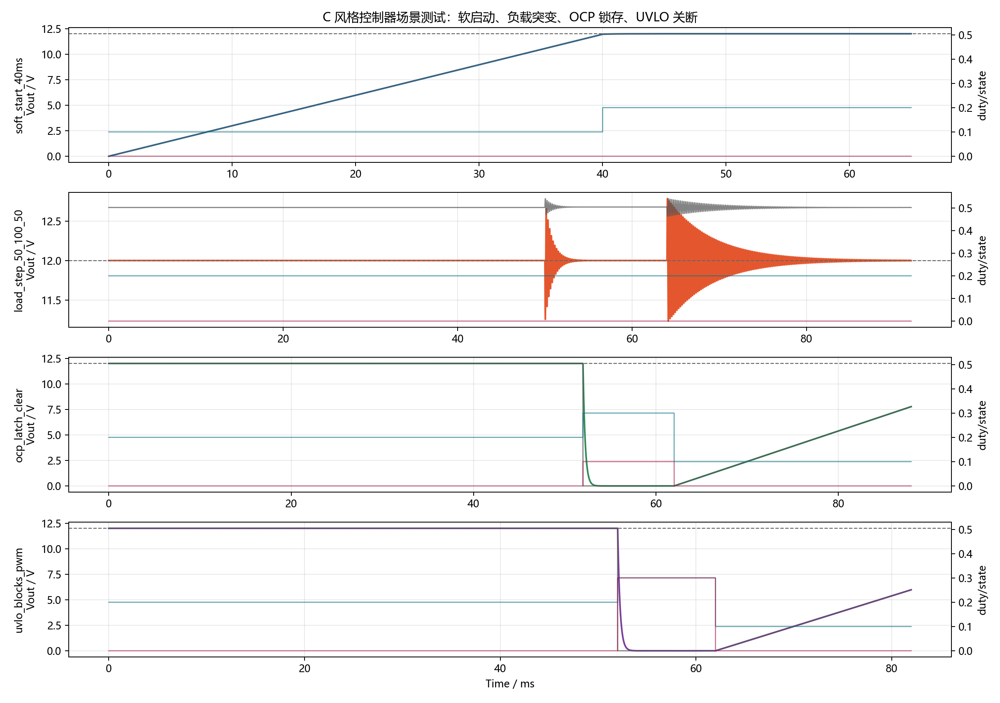
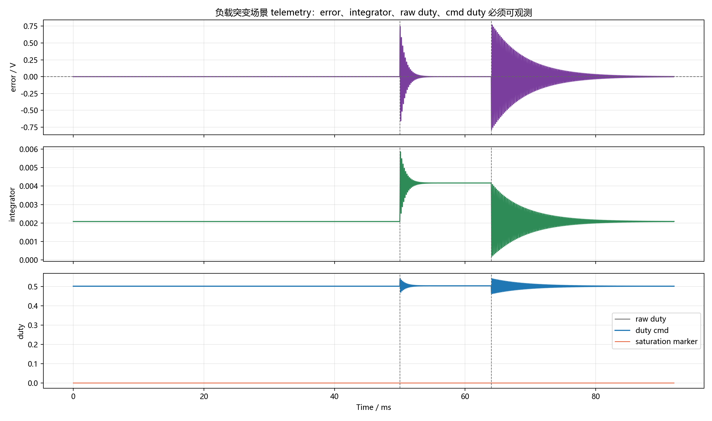
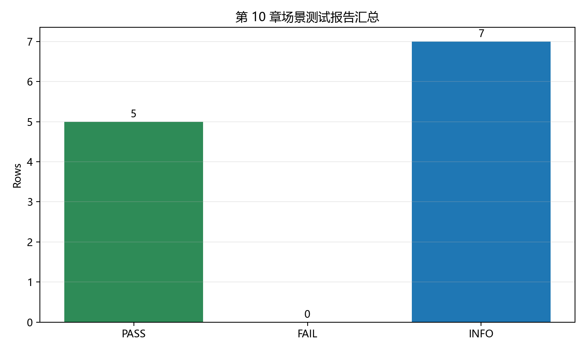

# 【数字电源/MATLAB+PLECS】如何进行 Buck 数字电源仿真（十）仿真控制器怎么整理成 C 风格代码

前面九章已经把 Buck 数字电源的主要控制问题拆开验证过了。

开环功率级、参数设计、离散 PI、duty 限幅、anti-windup、软启动、保护状态机、负载突变、ADC 噪声，这些内容在 MATLAB、PLECS 和 Simulink 里都能看得很清楚。

但真正做嵌入式电源软件时，还会遇到一个问题：

```text
仿真里是一堆模块、脚本和波形；
MCU 里只有一个固定周期中断入口。

这些逻辑到底怎么整理成 C 代码？
哪些变量要进配置？
哪些变量要进状态？
哪些量要作为 telemetry 暴露出来？
保护关 PWM 应该放在哪一层？
```

第十章就回答这个问题。

配套 GitHub 仓库：[digital-power-buck-sim-lab](https://github.com/Old-Ding/digital-power-buck-sim-lab)

本章提供 C 风格控制器源码、Python 场景测试脚本、测试 CSV、测试报告和正文图表。正文图表来自 `scripts/export_controller_c_style_tests.py` 生成结果。

## 本章先回答什么问题

本章只做一件事：把前面几章验证过的控制逻辑整理成一个 MCU 友好的固定周期 C 风格接口。

本章会讲清楚：

- 为什么控制器应该有固定周期 `Step()` 入口
- 哪些参数应该放到 `Config`
- 哪些变量必须放到 `Context`
- 为什么 `Input` 和 `Output/Telemetry` 要分开
- PI、限幅、软启动、保护状态机在一个周期内应该按什么顺序执行
- 为什么 PWM 关断应该有一个统一出口
- 如何用脚本做稳态、软启动、负载突变、OCP、UVLO 场景测试

本章暂时不处理：

- MCU 寄存器配置
- ADC DMA、PWM 定时器和中断优先级
- 定点化、Q 格式和溢出分析
- MISRA-C、静态分析和单元测试框架接入
- HIL、示波器实测和真实功率硬件闭环

这些是从“C 风格控制器”继续走向“可上板固件”的内容。本章先把软件接口和可观测变量整理清楚。

## 为什么不能直接把仿真脚本搬进 MCU

仿真脚本可以很自由。

你可以在 MATLAB 里直接访问所有变量，可以随手画图，可以在某一行临时改参数，也可以把多个模块写在一个脚本里。

MCU 里不是这样。

数字电源控制器通常被固定周期调用：

```text
ADC 采样完成
-> 进入控制 ISR 或高优先级任务
-> 读取 Vin / Vout / Iout / 温度
-> 更新控制器
-> 输出 duty_cmd 和 pwm_enable
-> 本周期结束
```

所以 C 代码最重要的不是“看起来像公式”，而是职责边界清楚。

本章把控制器整理成四类对象：

| 对象 | 作用 | 例子 |
| --- | --- | --- |
| `DpControlConfig` | 固定参数和阈值 | `kp`、`ki`、`duty_max`、`ocp_threshold_a` |
| `DpControlContext` | 跨周期状态 | `state`、`integrator`、`vref_cmd_v`、`latched_fault` |
| `DpControlInput` | 当前周期输入 | `vin_v`、`vout_adc_v`、`iout_a`、`clear_fault` |
| `DpControlOutput` | 当前周期输出和 telemetry | `duty_cmd`、`duty_raw`、`error_v`、`pwm_enable` |

这个拆法的好处是：参数、状态、输入、输出不会混在一起，后面迁移到 MCU 时也更容易接 ADC、PWM 和调试串口。

## 本章 C 风格接口

本章新增了两个源码文件：

| 文件 | 作用 |
| --- | --- |
| `src/digital_power_control.h` | 控制器类型定义和对外接口 |
| `src/digital_power_control.c` | 控制器默认参数、初始化和固定周期更新 |

对外接口只有三个函数：

```c
void DpControl_DefaultConfig(DpControlConfig *cfg);
void DpControl_Init(DpControlContext *ctx, const DpControlConfig *cfg);
DpControlOutput DpControl_Step(DpControlContext *ctx,
                               const DpControlConfig *cfg,
                               const DpControlInput *in);
```

`DefaultConfig()` 用来集中给参数默认值。

`Init()` 用来初始化状态变量。

`Step()` 对应 MCU 里的固定周期调用入口。本章控制周期仍然是 5us，也就是 200kHz。

## 一个周期内做什么

`DpControl_Step()` 内部按下面顺序执行：

| 顺序 | 步骤 | 职责 |
| --- | --- | --- |
| 1 | ADC 测量链路 | 更新 `vout_filter_v` |
| 2 | 故障检测 | 按 OCP -> OVP -> UVLO -> OTP 优先级生成 `active_fault` |
| 3 | 状态机 | 决定 IDLE / SOFT_START / RUN / FAULT |
| 4 | 软启动参考值 | 在 SOFT_START 里更新 `vref_cmd_v` |
| 5 | PI 计算 | 根据 `error_v` 计算 `duty_raw` |
| 6 | anti-windup | 只在 RUN 且允许退出饱和方向时更新积分器 |
| 7 | duty 限幅 | 生成 `duty_cmd` |
| 8 | PWM 统一出口 | 非运行态或故障锁存时统一关 PWM |
| 9 | telemetry | 输出 error、integrator、raw duty、state、fault 等变量 |

这里有两个关键工程点。

第一，保护检测和 PWM 关断不是到处写。状态机负责锁存故障，PWM 统一出口负责最终关断：

```c
out.pwm_enable = (ctx->state == DP_STATE_SOFT_START || ctx->state == DP_STATE_RUN) &&
                 (ctx->latched_fault == DP_FAULT_NONE);
if (!out.pwm_enable)
{
    out.duty_cmd = 0.0f;
}
```

这样后面排查时只需要看 `state`、`latched_fault` 和 `pwm_enable`，不会出现多个层级重复改 duty。

第二，积分器不在软启动阶段累加。本章默认策略是软启动阶段只让参考值爬坡，积分器在 RUN 状态再更新：

```c
if (ctx->state == DP_STATE_RUN && out.allow_integrate)
{
    ctx->integrator += cfg->ki * cfg->ts_ctrl_s * out.error_v;
}
```

原因是积分项是长期误差记忆。如果软启动参考值还在爬坡时就累加积分，很容易把启动阶段误差记进控制器，后面形成过冲。

## 本章默认参数

本章代码化测试使用下面这组默认参数：

| 参数 | 数值 | 说明 |
| --- | --- | --- |
| 控制周期 | 5us | 对应 200kHz 控制更新 |
| 目标输出 | 12V | Buck 输出目标 |
| 软启动斜率 | 300V/s | 约 40ms 到达 12V |
| Kp | 0.05 | 电压环比例参数 |
| Ki | 80 | 电压环积分参数 |
| duty 前馈 | 0.5 | 24V 到 12V 的基础 duty |
| duty 限幅 | 0 - 0.65 | 本章允许 duty 到 0，避免低参考值阶段注入能量 |
| ADC alpha | 1.0 | 默认动态测试不加 IIR 延迟 |
| OCP | 6.5A | 输出过流阈值 |
| OVP | 13.2V | 输出过压阈值 |
| UVLO | 18V | 输入欠压阈值 |

这里的 `ADC alpha = 1.0` 是一个有意选择。

第九章已经讲过滤波会降低噪声，但也会引入延迟。本章要先验证代码化控制器的动态基线，所以默认不加入 IIR 延迟。滤波仍然保留为配置项，后续可以在硬件采样链路里重新评估。

## 本章测试场景

本章用 Python 测试台跑同一套离散控制算法，生成 CSV、PNG 和报告。

运行脚本：

```powershell
python scripts\export_controller_c_style_tests.py
```

测试场景如下：

| 场景 | 初始条件 | 目标 |
| --- | --- | --- |
| `steady_12v` | RUN 稳态 | 验证固定周期控制器能维持 12V |
| `soft_start_40ms` | 0V 启动 | 验证软启动参考值、状态迁移和启动峰值 |
| `load_step_50_100_50` | RUN 稳态 | 验证负载突变下 telemetry 和恢复能力 |
| `ocp_latch_clear` | RUN 稳态 | 验证 OCP 锁存、PWM 关断和清故障路径 |
| `uvlo_blocks_pwm` | RUN 稳态 | 验证 Vin 欠压时 PWM 统一出口关断 |

注意，除了软启动场景，其余场景都从 RUN 稳态初值开始。这是有意设计的。

如果每个场景都从 0V 启动开始，软启动参数会污染负载突变、OCP 和 UVLO 的判断。分开初始条件后，每个场景只验证自己的职责。

## 场景测试总览

下面是四个主要场景的波形总览：



这张图每一行对应一个场景。

第一行是 `soft_start_40ms`。Vout 按软启动斜率爬升，约 40ms 进入 RUN，启动峰值没有超过 OVP。

第二行是 `load_step_50_100_50`。负载从 50% 加到 100%，再回到 50%。Vout 先下陷再恢复，下跳时有过冲。这和第八章负载突变结论一致。

第三行是 `ocp_latch_clear`。52ms 注入 OCP，状态机进入 FAULT，PWM 统一出口把 duty 拉到 0。故障仍存在时 clear 不解除锁存；故障消失后 clear 进入重启路径。

第四行是 `uvlo_blocks_pwm`。Vin 低于 UVLO 阈值后进入故障态，PWM 统一关断。输入恢复后，需要 clear 才能重新进入启动路径。

## telemetry 为什么要保留

只看 Vout 和 duty，不足以调试嵌入式电源。

下面是负载突变场景的 telemetry：



这张图重点看三组变量。

第一行是 `error_v`。负载上跳时 error 变正，说明 Vout 低于目标；负载下跳时 error 变负，说明 Vout 高于目标。

第二行是 `integrator`。负载上跳后积分项抬高，帮助重载稳态；负载下跳后积分项回落。

第三行是 `duty_raw` 和 `duty_cmd`。本场景没有出现 duty 饱和，所以 raw duty 和 cmd duty 基本一致。如果未来看到两者分离，就要优先检查 duty 限幅和 anti-windup。

这就是为什么 `DpControlOutput` 里不只放 `duty_cmd`，还要放：

| telemetry | 用途 |
| --- | --- |
| `vout_meas_v` | 判断采样链路是否正常 |
| `error_v` | 判断控制器看到的误差 |
| `p_term` | 判断比例项贡献 |
| `integrator` | 判断积分项是否 windup |
| `duty_raw` | 判断控制器请求 |
| `duty_cmd` | 判断最终 PWM 指令 |
| `saturation` | 判断 duty 是否被限幅 |
| `state` | 判断状态机是否在正确状态 |
| `latched_fault` | 判断故障是否锁存 |

这些变量本身就是可调试性的一部分。

## 测试报告

脚本会生成测试报告：

`reports/10-controller-c-style-test-report.md`

报告结果如下：



关键指标如下：

| 场景 | 指标 | 结果 | 状态 |
| --- | --- | --- | --- |
| `steady_12v` | 56ms 后 Vout 均值 | 12.00V | PASS |
| `soft_start_40ms` | Vout 峰值 | 12.00V | PASS |
| `soft_start_40ms` | 首次进入 RUN | 40.00ms | INFO |
| `load_step_50_100_50` | 上跳下陷 | 0.744V | PASS |
| `load_step_50_100_50` | 下跳过冲 | 0.783V | INFO |
| `load_step_50_100_50` | 上跳恢复时间 | 1.455ms | INFO |
| `load_step_50_100_50` | 下跳恢复时间 | 9.50ms | INFO |
| `ocp_latch_clear` | OCP 首次锁存时间 | 52.00ms | PASS |
| `uvlo_blocks_pwm` | UVLO 时 PWM 关断 | 1 | PASS |
| 全部 | FAIL 行数 | 0 | INFO |

这里的 PASS/FAIL 是脚本判据，不是硬件认证。

例如负载突变下跳恢复时间 9.50ms 只是记录为 INFO，因为第十章重点是代码化接口和 telemetry，不是重新优化负载瞬态补偿。负载瞬态优化已经在第八章单独讲过。

## 本章工程边界

本章完成的是 C 风格控制器接口和算法迁移验证，不是最终 MCU 固件。

本章能证明：

| 检查项 | 本章证据 | 工程判断 |
| --- | --- | --- |
| 固定周期入口清楚 | `DpControl_Step()` | 适合迁移到 ISR 或高优先级任务 |
| 参数和状态分离 | `Config` / `Context` | 不把可调参数和长期状态混在一起 |
| 软启动路径可复现 | `soft_start_40ms` PASS | 参考值爬坡和 RUN 迁移正常 |
| 负载突变 telemetry 可观测 | telemetry 图和 trace CSV | 后续可定位 PI、限幅和状态问题 |
| OCP 锁存路径可复现 | `ocp_latch_clear` PASS | 故障未消失时 clear 不解除锁存 |
| UVLO 会关 PWM | `uvlo_blocks_pwm` PASS | PWM 统一出口生效 |

本章不能证明：

| 不覆盖内容 | 原因 |
| --- | --- |
| C 代码已经在 MCU 上编译通过 | 第 10 章没有执行 C 编译；第 11 章只补充了 Windows 电脑端编译 |
| 定点化不会溢出 | 当前源码使用 `float`，没有做 Q 格式 |
| PWM/ADC 驱动时序正确 | 本章没有接 MCU 寄存器 |
| HIL 和硬件闭环合格 | 本章使用 Python 平均模型测试台 |
| 参数已经是量产补偿 | 本章测试代码结构和可观测性，不替代最终环路设计 |

这个边界要讲清楚。

第十章不是“已经可以直接上硬件”，而是把仿真控制器整理到更接近固件工程的形态：有入口、有配置、有状态、有输入输出、有测试报告。

## 本章常见误区

### 1. 把 MATLAB 变量名原样搬到 C 就算迁移

不够。

C 代码要考虑固定周期入口、跨周期状态、参数集中配置、故障锁存、输出边界和 telemetry。只搬变量名，调试时仍然会乱。

### 2. 保护逻辑到处都关一次 PWM 更安全

不推荐。

多个层级重复关 PWM 会让问题变得难查。本章只在 PWM 统一出口把非运行态和故障态 duty 置 0，状态机负责锁存故障。

### 3. telemetry 是后面再加的调试功能

对数字电源来说，telemetry 不应该被当成后期补丁，而是控制器接口的一部分。没有 `error`、`integrator`、`duty_raw`、`duty_cmd`、`state` 和 `fault`，很多问题只能猜。

### 4. Python 测试过就等于 MCU 可用

不成立。

Python 测试验证的是算法顺序和状态行为。MCU 还要继续做编译、定点化、寄存器驱动、ADC/PWM 同步、HIL 和实机测试。

## 本章总结

第十章把前面几章的仿真控制器整理成了 C 风格控制器包。

本章最重要的结论是：代码迁移不是把公式翻译成 C，而是先把职责边界固定下来。

本章完成了：

- `src/digital_power_control.h`
- `src/digital_power_control.c`
- 固定周期 `DpControl_Step()`
- `Config / Context / Input / Output` 四类数据结构
- 软启动、PI、duty 限幅、anti-windup、保护锁存和 PWM 统一出口
- 5 个场景测试
- trace CSV、summary CSV、PNG 图表和测试报告

本章测试结果表明：

- 稳态 12V 场景通过
- 40ms 软启动场景通过
- 50% -> 100% -> 50% 负载突变场景通过
- OCP 锁存和 clear 路径通过
- UVLO 关 PWM 路径通过
- 测试报告中 FAIL 行数为 0

后续如果继续扩展，可以进入真正的固件工程阶段：C 编译、定点化、单元测试、HAL 适配、PWM/ADC 同步和 HIL 测试。

## 本章配套文件

仓库入口：[https://github.com/Old-Ding/digital-power-buck-sim-lab](https://github.com/Old-Ding/digital-power-buck-sim-lab)

| 类型 | 文件 | 作用 |
| --- | --- | --- |
| 教程正文 | `blog/10-controller-to-c.md` | 本章文章 |
| 复现说明 | `docs/10-controller-to-c-reproduce.md` | 运行步骤和结果解释 |
| C 头文件 | `src/digital_power_control.h` | 控制器类型和接口 |
| C 实现文件 | `src/digital_power_control.c` | 默认参数、初始化和周期更新 |
| Python 测试脚本 | `scripts/export_controller_c_style_tests.py` | 生成场景测试数据、图表和报告 |
| 测试报告 | `reports/10-controller-c-style-test-report.md` | PASS/FAIL 和关键指标 |
| 原始数据 | `waveforms/10-controller-c-style-trace.csv` | 各场景采样点 |
| 指标汇总 | `waveforms/10-controller-c-style-summary.csv` | 场景指标和状态 |
| 正文图表 | `waveforms/10-controller-c-style-*.png` | 场景波形、telemetry 和报告汇总 |

运行方式：

```powershell
python scripts\export_controller_c_style_tests.py
```

## 技术交流

如果你在复现代码结构、理解状态机或判断测试报告时遇到问题，可以加入技术交流群交流。

仓库中的源码、脚本、数据和图表可以直接使用；交流群主要用于复现答疑和后续技术讨论。

| 渠道 | 信息 |
| --- | --- |
| QQ 群 | 嵌入式交流群 |
| 加群链接 | [https://qm.qq.com/q/rygrSD2Ddu](https://qm.qq.com/q/rygrSD2Ddu) |
| 微信交流 | 微信入口会不定期更新，可在 QQ 群内获取 |

提问时建议附上 `summary.csv`、测试报告、关键波形和你修改过的 `Config` 参数。这样更容易定位问题。
