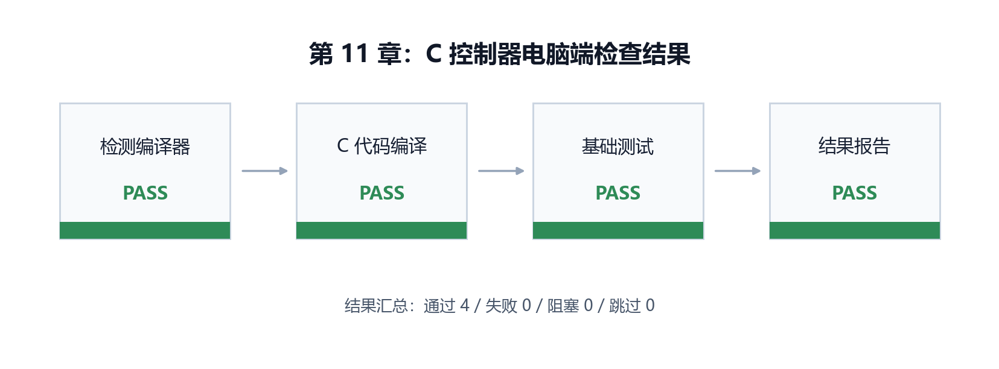

# 【数字电源/MATLAB+PLECS+C】Buck 数字电源开发（十一）为什么上板前要先做 C 语言单元测试

第十章已经把 Buck 控制器整理成了三个 C 函数：加载默认参数、初始化控制器、执行一个控制周期。

第十一章要回答的不是“怎么配置 MCU 外设”，而是一个更靠前的问题：

**这些 C 函数本身能不能被真实 C 编译器编译？给定明确输入以后，返回的状态、占空比和 PWM 使能是否符合预期？**

如果这两个问题还没有答案，就直接进入单片机（MCU）工程，后面看到“PWM 没出来”或“一启动就进故障”时，很难判断问题究竟在控制代码、ADC 换算、PWM 配置、中断周期还是硬件接线。

配套 GitHub 仓库：[digital-power-buck-sim-lab](https://github.com/Old-Ding/digital-power-buck-sim-lab)

本章最终会使用下面这条入口命令：

```powershell
python scripts\run_host_build_tests.py
```

这个 Python 脚本由本仓库为第十一章配套编写，用来自动执行“寻找 C 编译器 -> 编译两个 C 文件 -> 运行测试程序 -> 生成报告”。在依赖它给出的结果之前，下面先把每个角色、一个完整测试案例和对应的手工命令拆开讲清楚。

## 先看懂：谁在测试谁

这一章共有五个角色。先分清它们，后面的代码就不会显得莫名其妙。

| 角色 | 对应文件或工具 | 作用 |
| --- | --- | --- |
| 被测控制器 | `src/digital_power_control.c` | 接收输入，计算状态、故障、占空比和 PWM 使能 |
| C 测试程序 | `tests/test_digital_power_control_host.c` | 人为准备输入，调用控制器，再比较实际结果和预期结果 |
| C 编译器 | Zig、GCC、Clang 或 MSVC | 把控制器和测试程序一起编译成电脑可以运行的程序 |
| 电脑端测试程序 | `digital_power_control_host_tests.exe` | 真正执行测试并打印 PASS 或 FAIL |
| Python 辅助脚本 | `scripts/run_host_build_tests.py` | 寻找编译器、执行编译和测试、收集输出并生成报告 |

这里文件名中的 `host` 指电脑端：测试程序运行在 Windows 电脑上，不运行在 MCU 上。

完整过程可以压缩成一条数据流：

```text
C 测试程序准备输入
-> 调用被测控制器函数
-> 得到实际输出
-> 与预期输出比较
-> 打印 PASS / FAIL
```

C 控制器源码本身没有 `main()`，不能单独运行。测试文件提供 `main()`，C 编译器把两个文件组合成一个 Windows 测试程序。

Python 脚本不是控制器，也不是判断控制算法对错的主体。真正的判断条件写在 C 测试文件中，Python 只负责把编译、运行和报告生成串起来。

## 为什么不直接上板测试

直接上板时，软件和硬件问题会同时出现：

| 看到的现象 | 可能的原因 |
| --- | --- |
| C 文件编不过 | 头文件、类型、函数声明或编译选项错误 |
| PWM 没输出 | 控制状态错误、PWM 配置错误或引脚配置错误 |
| 一启动就进故障 | 默认参数、采样换算、保护逻辑或硬件信号错误 |
| 清除故障后仍无法启动 | 状态机、故障输入或恢复流程错误 |

电脑端测试暂时拿掉 ADC、PWM 寄存器、中断和硬件接线，只保留控制器 C 函数。

这样做的价值不是证明硬件已经正确，而是先回答：

```text
如果输入值已经明确，控制器 C 代码自身会不会给出正确结果？
```

电脑端测试失败，先修控制器代码；电脑端测试通过而上板失败，再重点排查采样、PWM、中断和硬件接口。排查范围会清楚很多。

## C 语言单元测试到底是什么

“单元测试”就是把一个较小、输入输出明确的软件单元单独拿出来验证。

本章中的“单元”不是完整 Buck 功率级，也不是整块控制板，而是这些 C 函数及其状态行为：

```c
void DpControl_DefaultConfig(DpControlConfig *cfg);
void DpControl_Init(DpControlContext *ctx, const DpControlConfig *cfg);
DpControlOutput DpControl_Step(DpControlContext *ctx,
                               const DpControlConfig *cfg,
                               const DpControlInput *in);
```

本章没有引入 Unity、CMock 等第三方 C 测试框架，而是使用一个最小自定义测试程序。它只需要理解三个动作：

| 测试动作 | 本章中的做法 |
| --- | --- |
| 准备 Arrange | 设置输入、参数和控制器初始状态 |
| 执行 Act | 调用一次 `DpControl_Step()` |
| 判断 Assert | 比较实际状态、故障、占空比和预期值 |

### 两个最小判断函数

`expect_true()` 检查一个条件是否成立：

```c
static void expect_true(const char *name, int condition)
{
    if (!condition)
    {
        printf("FAIL,%s\n", name);
        g_failures++;
    }
    else
    {
        printf("PASS,%s\n", name);
    }
}
```

`expect_close()` 用来比较浮点数。它不会要求两个浮点数绝对相等，而是允许一个很小的误差：

```c
const float error = fabsf(actual - expected);
if (error > tolerance)
{
    g_failures++;
}
```

每失败一项，`g_failures` 就加 1。全部测试执行完以后：

- `g_failures == 0`：打印 `SUMMARY,PASS,failures=0`，程序返回 0。
- `g_failures != 0`：打印 `SUMMARY,FAIL`，程序返回 1。

所以 PASS/FAIL 来自 C 测试程序中的判断条件，不是 Python 脚本随意生成的。

## 用过流保护走一遍完整测试

过流保护最适合说明单元测试是怎么工作的。代码中的 OCP 是过流保护（Over Current Protection）的缩写。

当前过流阈值是 6.5A。测试程序人为输入 7.2A，不需要真的接一个大电流负载。

### 1. 准备输入和状态

`nominal_input()` 先生成一组正常输入：24V 输入、12V 输出、5A 负载和 45°C 温度。测试再把其中的输出电流改成 7.2A。

```c
DpControlConfig cfg;
DpControlContext ctx;
DpControlInput in = nominal_input();
DpControlOutput out;

DpControl_DefaultConfig(&cfg);
DpControl_Init(&ctx, &cfg);

ctx.state = DP_STATE_RUN;
ctx.vref_cmd_v = cfg.vref_final_v;
ctx.integrator = 0.0f;
in.iout_a = 7.2f;
```

这一步把控制器放在正常运行状态，并人为制造 `7.2A > 6.5A` 的过流条件。

### 2. 调用一次控制器

```c
out = DpControl_Step(&ctx, &cfg, &in);
```

这相当于 MCU 中执行了一个控制周期，但这里是在电脑程序里直接调用函数。

### 3. 检查实际输出

```c
expect_true("ocp_enters_fault", out.state == DP_STATE_FAULT);
expect_true("ocp_latched", out.latched_fault == DP_FAULT_OCP);
expect_true("ocp_pwm_disabled", !out.pwm_enable);
expect_close("ocp_duty_zero", out.duty_cmd, 0.0f, 1.0e-6f);
```

预期结果很明确：

| 输出 | 预期值 | 原因 |
| --- | --- | --- |
| `state` | `DP_STATE_FAULT` | 过流后进入故障状态 |
| `latched_fault` | `DP_FAULT_OCP` | 锁存过流故障 |
| `pwm_enable` | `false` | 故障状态禁止 PWM |
| `duty_cmd` | 0 | PWM 关闭时占空比统一归零 |

如果其中任何一项不符合预期，测试就会输出 FAIL。这个例子已经包含完整的“准备输入 -> 调用函数 -> 比较结果”。

## 先不用 Python：手动编译和运行一次

理解脚本之前，先看它替代了哪些手工操作。

如果 Zig 已经加入 `PATH`，在仓库根目录运行：

```powershell
New-Item -ItemType Directory -Force artifacts\host-build\chapter11 | Out-Null

zig cc -std=c99 -Wall -Wextra -Werror `
  -I src `
  src\digital_power_control.c `
  tests\test_digital_power_control_host.c `
  -o artifacts\host-build\chapter11\digital_power_control_host_tests.exe
```

这条命令完成两件事：

1. 编译被测控制器 `digital_power_control.c`。
2. 编译并链接带有 `main()` 的测试程序 `test_digital_power_control_host.c`。

生成测试程序以后，直接运行：

```powershell
.\artifacts\host-build\chapter11\digital_power_control_host_tests.exe
```

关键输出如下：

```text
PASS,soft_start_vref_first_step,actual=0.0015,expected=0.0015,tolerance=1e-07
PASS,ocp_enters_fault
PASS,ocp_latched
PASS,ocp_pwm_disabled
PASS,ocp_clear_after_fault_removed
SUMMARY,PASS,failures=0
```

到这里还没有使用 Python。C 编译器负责生成程序，C 测试程序负责判断行为是否正确。

## Python 一键脚本是哪里来的

`scripts/run_host_build_tests.py` 是这个教程仓库为第十一章配套编写的辅助脚本。

它不是 Windows、Zig、MATLAB 或 PLECS 自带命令，也不是从 MCU 工程自动生成的文件。它存在的原因是：不同电脑上的 C 编译器名称和安装位置不同，手动拼接编译命令也容易漏掉源文件、头文件路径或警告选项。

脚本替代的手工工作如下：

| 脚本步骤 | 替代的手工操作 |
| --- | --- |
| `find_compiler()` | 查找 `zig`、`gcc`、`clang`、`cc` 或 `cl` |
| `build_command()` | 根据编译器类型生成正确的编译参数 |
| `run_command(compile_cmd)` | 启动 C 编译器并收集编译输出 |
| `run_command(test_exe)` | 启动测试程序并收集 PASS/FAIL |
| `write_summary()`、`write_report()` | 生成 CSV、PNG 和 Markdown 报告 |

脚本核心流程可以简化成：

```python
compiler, hint = find_compiler()
compile_cmd = build_command(compiler, hint, exe_path)
build_code, build_output = run_command(compile_cmd, BUILD_DIR)
test_code, test_output = run_command([str(exe_path)], BUILD_DIR)
```

测试程序返回 0，并且输出中包含 `SUMMARY,PASS` 时，Python 脚本才把 `unit_tests` 记录为 PASS。具体行为是否正确，仍由 C 测试程序中的判断条件决定。

这里要分清职责：

| 文件 | 负责什么 | 不负责什么 |
| --- | --- | --- |
| `test_digital_power_control_host.c` | 提供测试输入、写预期条件、决定控制行为 PASS/FAIL | 不查找编译器，不生成报告图片 |
| `run_host_build_tests.py` | 查找工具、编译、运行测试、收集结果、生成报告 | 不定义过流后应该进入什么状态 |

所以删除 Python 报告功能以后，C 测试程序仍然可以独立判断 PASS/FAIL；删除 C 测试条件以后，Python 脚本也无法知道控制器行为是否正确。

## 当前测试程序检查了什么

测试使用的关键控制参数来自 `DpControl_DefaultConfig()`：

| 参数 | 数值 | 用途 |
| --- | ---: | --- |
| 控制周期 `ts_ctrl_s` | 5 us | 每次调用 `DpControl_Step()` 的时间间隔 |
| 最终输出参考值 `vref_final_v` | 12 V | 软启动完成后的目标输出电压 |
| 软启动斜率 `soft_start_ramp_v_per_s` | 300 V/s | 决定首周期参考值增量 |
| 最大占空比 `duty_max` | 0.65 | 限制控制器最大输出 |
| 过流阈值 `ocp_threshold_a` | 6.5 A | 电流达到该值后锁存过流故障 |

当前 C 测试程序覆盖四类基础行为：

| 测试 | 输入或初始条件 | 预期结果 |
| --- | --- | --- |
| 默认参数 | 调用 `DpControl_DefaultConfig()` | 关键参数等于设计值 |
| 初始化 | 调用 `DpControl_Init()` | 状态为 IDLE、无锁存故障、积分器为 0 |
| 软启动首周期 | 输出采样为 0V，执行一次 `Step()` | 进入 SOFT_START，PWM 允许，参考值增加 0.0015V |
| 过流与清故障 | 电流先升到 7.2A，再恢复到 5A | 先锁存 OCP 并关 PWM，故障消失后才能清除 |

软启动首周期的 0.0015V 来自：

```text
300 V/s × 5 us = 0.0015 V
```

因此这个数不是测试代码随意填写的，而是由软启动斜率和控制周期共同决定。

## 运行一键脚本并读取结果

理解手工过程以后，再运行一键脚本：

```powershell
python scripts\run_host_build_tests.py
```

当前验证环境输出：

```text
已生成第 11 章电脑端编译测试检查报告。
summary,pass=4,blocked=0,skipped=0,fail=0
toolchain,zig,zig 0.16.0
```

脚本生成的检查结果图如下：



按照从左到右的顺序阅读：

| 检查项 | 当前状态 | 说明 |
| --- | --- | --- |
| `toolchain` | PASS | 找到了 Zig 0.16.0，可用于电脑端 C 编译 |
| `build` | PASS | 控制器和测试文件已经编译成 Windows 程序 |
| `unit_tests` | PASS | C 测试程序运行结束并输出 `SUMMARY,PASS` |
| `report` | PASS | CSV、PNG 和 Markdown 报告生成成功 |

`report PASS` 只表示报告成功生成。判断控制器已经编译并通过基础测试，需要同时查看 `build` 和 `unit_tests`。

## 如果运行结果不是 PASS

如果电脑上没有可用的 C 编译器，脚本会输出：

```text
toolchain BLOCKED
-> build SKIPPED
-> unit_tests SKIPPED
-> report PASS
```

`BLOCKED` 表示编译条件还不具备，不表示 C 源码已经编译失败。Windows 可以使用 WinGet 安装 Zig：

```powershell
winget install --id zig.zig -e --scope user --accept-source-agreements --accept-package-agreements
```

如果 `build FAIL`，优先检查 C 语法、头文件路径、函数声明和编译警告。

如果 `unit_tests FAIL`，查看 FAIL 行中的测试名称、实际值和预期值。例如：

```text
FAIL,ocp_pwm_disabled
```

它表示控制器已经成功编译，但过流后 `pwm_enable` 没有变成 `false`。此时应该检查控制器状态和 PWM 统一出口，而不是检查 Zig 安装路径。

## 不要误读本章结果

| 观察到的结果 | 能说明什么 | 不能说明什么 |
| --- | --- | --- |
| `toolchain PASS` | 电脑端找到了 C 编译器 | 用于目标 MCU 的编译环境已经验证 |
| `build PASS` | 这两个 C 文件可以编译成 Windows 程序 | MCU 工程已经编译通过 |
| `unit_tests PASS` | 默认参数、初始化、软启动首周期和 OCP 路径符合当前预期 | 完整闭环动态、定点化和实时中断已经验证 |
| `report PASS` | 证据文件生成成功 | 固件已经可以直接上板 |

本章完成以后，可以明确回答五个问题：

1. 被测试的是 `digital_power_control.c` 中的控制器函数。
2. 输入由 `test_digital_power_control_host.c` 人为准备。
3. PASS/FAIL 由 C 测试文件中的 `expect_true()` 和 `expect_close()` 决定。
4. Python 脚本替代了查找编译器、拼接命令、运行程序和生成报告等手工操作。
5. Python 脚本是本仓库为第十一章配套编写的，不是外部工具自动生成的。

## 本章配套文件

仓库入口：[https://github.com/Old-Ding/digital-power-buck-sim-lab](https://github.com/Old-Ding/digital-power-buck-sim-lab)

| 类型 | 文件 | 作用 |
| --- | --- | --- |
| 教程正文 | `blog/11-host-build-test-gate.md` | 本章文章 |
| 复现说明 | `docs/11-host-build-test-gate-reproduce.md` | 手工运行、一键运行和结果解释 |
| 被测控制器 | `src/digital_power_control.c` | 控制器实现 |
| C 测试程序 | `tests/test_digital_power_control_host.c` | 测试输入、预期条件和 PASS/FAIL 判断 |
| Python 辅助脚本 | `scripts/run_host_build_tests.py` | 编译、运行和报告自动化 |
| CSV 汇总 | `reports/11-host-build-summary.csv` | 四项检查状态 |
| 测试报告 | `reports/11-host-build-test-report.md` | 编译命令和完整测试输出 |
| 检查结果图 | `waveforms/11-host-build-gate.png` | 检查流程和状态 |

## 下一章：检查 C 控制器和第十章的仿真结果是否一致

本章已经确认 C 控制器能够编译，几条基础状态逻辑也能正常运行。下一章会使用第十章已经验证过的软启动、负载变化和保护场景，检查相同输入条件下的 C 控制器结果是否保持一致。

## 技术交流

如果你在理解测试结构、配置 C 编译器或判断测试输出时遇到问题，可以加入技术交流群交流。

仓库中的源码、脚本、数据和图表可以直接使用；交流群主要用于复现答疑和后续技术讨论。

| 渠道 | 信息 |
| --- | --- |
| QQ 群 | 嵌入式交流群 |
| 加群链接 | [https://qm.qq.com/q/rygrSD2Ddu](https://qm.qq.com/q/rygrSD2Ddu) |
| 微信交流 | 微信入口会不定期更新，可在 QQ 群内获取 |

提问时建议附上 `reports/11-host-build-test-report.md`、终端输出、编译器名称和 `PATH` 配置截图。
