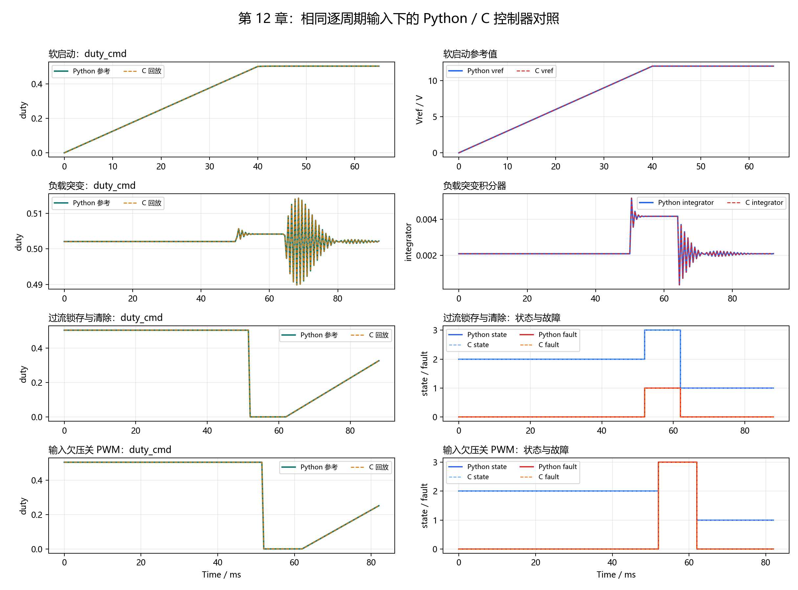
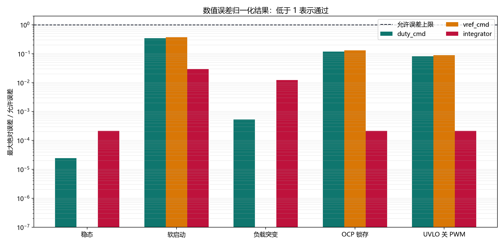

# 【数字电源/MATLAB+PLECS+C】Buck 数字电源开发（十二）C 控制器编译通过后，怎么确认结果没有改错

第十一章已经证明 `src/digital_power_control.c` 能被真实 C 编译器编译，几个基础测试也能通过。

但“编译通过”只能说明语法、类型和链接没有出错，不能证明 C 版仍然保持了第十章的控制行为。例如，把过流检测放到 duty 计算之后，代码照样可能编译成功，却会让 PWM 多输出一个控制周期；把软启动累加顺序写反，也可能只产生很小但持续累积的偏差。

这一章解决的就是这个问题：

**让第十章的 Python 参考实现和真实编译后的 C 控制器接收完全相同的逐周期输入，再比较两边的 duty、积分器、状态、故障和 PWM 使能是否一致。**

配套 GitHub 仓库：[digital-power-buck-sim-lab](https://github.com/Old-Ding/digital-power-buck-sim-lab)

完整检查只需要运行：

```powershell
python scripts\run_c_python_parity.py
```

当前实测结果为 5 个场景、80,400 个控制周期、55 项检查全部通过。下面先拆开这条命令内部的数据流，再用 52 ms 过流锁存案例走完一次对照过程。

## 先看懂：相同输入是怎么送到两套控制器的

这里使用的是“逐周期回放”：先记录每个控制周期的输入，再把这份记录交给另一个实现重新执行。

| 角色 | 文件或工具 | 职责 |
| --- | --- | --- |
| Python 参考实现 | `scripts/export_controller_c_style_tests.py` | 运行第十章的场景模型，产生每个控制周期的输入和参考输出 |
| 回放输入 | `artifacts/host-build/chapter12/12-controller-replay-input.csv` | 保存送给 C 控制器的初始状态、采样输入和控制命令 |
| 被测 C 控制器 | `src/digital_power_control.c` | 执行真实的 `DpControl_Step()` |
| C 回放程序 | `tests/replay_digital_power_control.c` | 读取 CSV、恢复场景初值、逐行调用 C 控制器并写出结果 |
| C 编译器 | Zig、GCC、Clang 或 MSVC | 把 C 控制器和回放程序编译成电脑端可执行文件 |
| 对照脚本 | `scripts/run_c_python_parity.py` | 生成输入、编译和运行 C 程序、计算误差、判断 PASS/FAIL、生成图表和报告 |

这两个 Python 脚本和 C 回放程序都是本仓库编写的配套文件，不是 MATLAB、PLECS、Windows 或 Zig 自带工具。

完整数据流如下：

```text
第十章 Python 场景模型
        |
        +-- 每 5 us 输入 --------------------+
        |                                    |
        +-- Python 参考输出                  v
                                   编译后的 C 控制器
                                            |
                                            +-- C 实际输出

Python 参考输出 + C 实际输出
        |
        +-- 数值量计算最大绝对误差
        +-- 状态、故障和 PWM 逐周期检查
        v
CSV 汇总 + 对照图 + Markdown 报告
```

关键点是：C 控制器接收的 `vin_v`、`vout_adc_v`、`iout_a`、`temperature_c`、`enable` 和 `clear_fault` 与 Python 参考实现完全相同。这样一旦结果不同，问题就被限定在两套控制器实现之间，不会混入两套功率级模型的动态差异。

## Python 参考结果从哪里来

Python 参考结果复用第十章的 `controller_step()` 和五个场景模型，不是临时手填的一组理想答案。

每隔一个 5 us 控制周期，第十章测试台完成三件事：

1. 从平均功率级取得当前 `Vout`、`Vin` 和负载信息。
2. 调用 Python `controller_step()`，记录 duty、状态、故障和遥测量。
3. 用 duty 推进一步平均功率级，产生后续控制周期的输入。

第十二章把第 2 步调用控制器之前的输入保存下来，再送给 C 版 `DpControl_Step()`。C 版的输出不会反过来改变 Python 功率级，因此这是一项控制算法实现对照，不是两套独立闭环仿真的性能比赛。

这里把 Python 版称为“参考实现”，含义是：它是第十章已经验证并冻结的浮点行为基准。它不是硬件测量真值，也不能替代后续 MCU 和功率板验证。

## 完整案例：52 ms 出现过流时，C 版是否同周期关 PWM

`ocp_latch_clear` 场景先让控制器稳定运行，然后在 52 ms 把检测电流注入为 7.2 A。默认过流阈值为 6.5 A，因此控制器应当在当前控制周期进入 `FAULT`、锁存 `OCP` 并把 `duty_cmd` 清零。

状态和故障枚举值如下：

| 数值 | 控制状态 | 故障码 |
| ---: | --- | --- |
| 0 | `IDLE` | `NONE` |
| 1 | `SOFT_START` | `OCP` |
| 2 | `RUN` | `OVP` |
| 3 | `FAULT` | `UVLO` |
| 4 | - | `OTP` |

下面是 C 回放程序的真实输出节选：

| 时间 | 注入电流 | clear | duty | PWM | state | active fault | latched fault |
| ---: | ---: | ---: | ---: | ---: | ---: | ---: | ---: |
| 51.995 ms | 5.0 A | 0 | 0.504166663 | 1 | 2 | 0 | 0 |
| 52.000 ms | 7.2 A | 0 | 0 | 0 | 3 | 1 | 1 |
| 56.000 ms | 7.2 A | 1 | 0 | 0 | 3 | 1 | 1 |
| 58.000 ms | 低于 6.5 A | 0 | 0 | 0 | 3 | 0 | 1 |
| 62.000 ms | 低于 6.5 A | 1 | 0.0001375 | 1 | 1 | 0 | 0 |

这五行分别说明：

1. 51.995 ms 时控制器仍处于 `RUN`，PWM 正常输出。
2. 52.000 ms 检测到 OCP 的同一周期，状态切到 `FAULT`，PWM 和 duty 同时归零。
3. 56.000 ms 虽然收到清故障命令，但过流仍存在，所以不允许清除锁存。
4. 58.000 ms 过流条件已经消失，但没有新的清故障命令，控制器仍保持锁存。
5. 62.000 ms 故障已消失且收到清除命令，控制器重新进入 `SOFT_START`。

Python 和 C 在这些周期的状态、故障、PWM 和 duty 全部一致。如果 C 代码把故障检测、状态更新或 PWM 统一关断的顺序改错，这组数据会在发生偏差的第一个周期直接报错。

## 第一步：只生成 C 回放输入

先运行：

```powershell
python scripts\run_c_python_parity.py --prepare-only
```

当前输出为：

```text
prepared,rows=80400,input=...\artifacts\host-build\chapter12\12-controller-replay-input.csv
```

这一步会运行第十章 Python 场景模型，并生成 80,400 行回放输入，但不会查找 C 编译器，也不会运行对照判断。

每个场景的第一行还会记录 Python 参考实现的初始 `state`、`latched_fault`、`vref_cmd_v` 和 `integrator`。C 回放程序在场景切换时恢复这些初值，避免“初始状态不同”污染算法实现对照。

五个场景的控制周期数量如下：

| 场景 | 检查重点 | 控制周期数 |
| --- | --- | ---: |
| `steady_12v` | 稳态 duty 和内部量 | 15,000 |
| `soft_start_40ms` | 参考值累加和状态切换 | 13,000 |
| `load_step_50_100_50` | duty 与积分器动态 | 18,400 |
| `ocp_latch_clear` | OCP 锁存、清除和重启 | 17,600 |
| `uvlo_blocks_pwm` | UVLO 检测和 PWM 关断 | 16,400 |

## 第二步：手动编译并运行 C 回放程序

自动化脚本最终执行的核心步骤并不复杂。以 Zig 为例，在仓库根目录运行：

```powershell
New-Item -ItemType Directory -Force artifacts\host-build\chapter12 | Out-Null

zig cc -std=c99 -Wall -Wextra -Werror `
  -I src `
  src\digital_power_control.c `
  tests\replay_digital_power_control.c `
  -o artifacts\host-build\chapter12\digital_power_control_replay.exe
```

这里编译的不是 Python 控制器，而是第十章的真实 C 源码和本章新增的 C 回放入口。`-Werror` 会把编译警告也作为失败处理。

然后把刚才生成的 CSV 交给可执行文件：

```powershell
.\artifacts\host-build\chapter12\digital_power_control_replay.exe `
  .\artifacts\host-build\chapter12\12-controller-replay-input.csv `
  .\artifacts\host-build\chapter12\12-controller-c-output.csv
```

成功时输出：

```text
SUMMARY,OK,rows=80400
```

C 回放程序核心只有“读一行输入、调用一次控制器、写一行输出”：

```c
in.enable = enable != 0;
in.clear_fault = clear_fault != 0;
in.vin_v = vin_v;
in.vout_adc_v = vout_adc_v;
in.iout_a = iout_a;
in.temperature_c = temperature_c;

out = DpControl_Step(&ctx, &cfg, &in);
```

这里的 `SUMMARY,OK` 只表示 80,400 行输入均被成功解析和执行。C 回放程序不掌握 Python 参考值，所以它不负责判断两套算法是否一致；一致性 PASS/FAIL 由下一步的 Python 对照脚本根据明确容差判断。

## 第三步：一键生成完整对照结果

实际复现时直接运行：

```powershell
python scripts\run_c_python_parity.py
```

这个仓库自带脚本按顺序完成：

1. 运行第十章 Python 参考场景。
2. 写出逐周期回放输入。
3. 查找 Zig、GCC、Clang 或 MSVC。
4. 编译 C 控制器和 C 回放程序。
5. 运行 80,400 个 C 控制周期。
6. 对齐 Python 与 C 的场景名和周期编号。
7. 计算数值误差，检查离散状态，生成 CSV、PNG 和 Markdown 报告。

当前控制器和对照参数为：

| 参数 | 数值 | 用途 |
| --- | ---: | --- |
| 控制周期 | 5 us | 每行回放数据对应一次 `DpControl_Step()` |
| 最终参考电压 | 12 V | 稳态和软启动目标 |
| 软启动斜率 | 300 V/s | 每周期增加 1.5 mV |
| `Kp` | 0.05 | 比例项 |
| `Ki` | 80 | 积分项 |
| duty 范围 | 0 - 0.65 | PWM 指令限幅 |
| OCP 阈值 | 6.5 A | 过流判断 |
| OVP 阈值 | 13.2 V | 过压判断 |
| UVLO 阈值 | 18 V | 输入欠压判断 |
| OTP 阈值 | 100 °C | 过温判断 |

## 数值量为什么需要容差，状态量为什么不允许容差

Python 使用双精度浮点数，当前 C 控制器使用 `float`。例如软启动每 5 us 累加一次 1.5 mV，连续累加数千次后，C `float` 与 Python 双精度结果出现微小末位差异是正常现象，不能用字符串完全相等判断。

本章使用的比较条件如下：

| 比较量 | 允许最大绝对误差 | 依据 |
| --- | ---: | --- |
| `vout_meas_v` | 1 uV | 相同输入、无长期累加，使用严格误差限 |
| `vref_cmd_v`、`error_v` | 1.5 mV | 不超过一个软启动周期的参考值增量 |
| `p_term` | 0.000075 | `Kp × 1.5 mV` |
| `integrator` | 0.000001 | 限制长期累加差异 |
| `duty_raw`、`duty_cmd` | 0.00015 | 覆盖参考值、比例项和前馈换算的组合舍入差异 |
| 状态、故障、PWM、逻辑标志 | 必须完全一致 | 离散决策不存在“差不多正确” |

这些容差只用于判断 Python 双精度与 C `float` 的实现一致性，不是输出电压精度、控制性能或硬件验收指标。

## 实测结果：80,400 个周期全部通过

当前本机使用 Zig 0.16.0 编译，控制台输出为：

```text
summary,pass=55,fail=0,scenarios=5,rows=80400
toolchain,zig,zig 0.16.0
max_error,duty_cmd=5.12136e-05,vref_cmd_v=0.0005587
```

55 项检查来自 5 个场景，每个场景包含 7 项连续数值误差和 4 组离散行为检查。

| 检查项 | 实测结果 |
| --- | ---: |
| 最大 `duty_cmd` 误差 | 0.0000512136 |
| 最大 `vref_cmd_v` 误差 | 0.0005587 V |
| 状态错位 | 0 个周期 |
| active/latched fault 错位 | 0 个周期 |
| PWM 使能错位 | 0 个周期 |
| 饱和/积分允许标志错位 | 0 个周期 |



上图展示软启动、负载突变、OCP 和 UVLO 四个动态场景。实线是 Python 参考结果，虚线是编译后 C 控制器的回放结果。多数位置只能看到一条线，是因为两条曲线几乎完全重合，不是 C 曲线没有生成。

图中为了可读性每 0.5 ms 抽取一个显示点，PASS/FAIL 判断仍使用全部 80,400 行数据。



第二张图把“实际最大误差 ÷ 允许误差”画在对数坐标中。虚线 1 是允许上限，柱子低于 1 表示通过。最接近上限的是软启动 `vref_cmd_v`，其归一化误差约为 0.372，仍保留约 2.7 倍余量。

## 不要误读这份结果

| 这份结果可以证明 | 这份结果不能证明 |
| --- | --- |
| C 源码经过真实电脑端 C 编译器编译并运行 | 目标 MCU 工具链已经编译通过 |
| 五个场景中 C 与 Python 的逐周期控制行为一致 | Python 参考算法覆盖了所有可能工况 |
| 当前浮点 C 版没有出现已观测到的顺序、参数和状态迁移偏差 | 定点化后仍然一致且不会溢出 |
| OCP、UVLO、软启动和负载突变路径在回放输入下保持一致 | ADC/PWM 寄存器、中断时序和硬件保护正确 |
| C `float` 与 Python 双精度误差低于本章容差 | 实机输出纹波、效率和器件应力满足要求 |

## 配套文件

| 类型 | 文件 |
| --- | --- |
| 教程文章 | `blog/12-c-python-parity.md` |
| 复现说明 | `docs/12-c-python-parity-reproduce.md` |
| 被测 C 控制器 | `src/digital_power_control.c`、`src/digital_power_control.h` |
| C 回放程序 | `tests/replay_digital_power_control.c` |
| 一键对照脚本 | `scripts/run_c_python_parity.py` |
| Python 参考实现 | `scripts/export_controller_c_style_tests.py` |
| 指标汇总 | `waveforms/12-c-python-parity-summary.csv` |
| 公开抽样数据 | `waveforms/12-c-python-parity-samples.csv` |
| 对照图 | `waveforms/12-c-python-parity-overlay.png` |
| 误差图 | `waveforms/12-c-python-parity-error.png` |
| 完整报告 | `reports/12-c-python-parity-report.md` |

完整回放输入、C 输出和可执行文件位于 `artifacts/host-build/chapter12/`。它们体积较大且可以重新生成，因此由 `.gitignore` 排除，不提交到仓库。

## 本章结论

编译通过回答的是“C 代码能不能变成可执行程序”，逐周期对照回答的是“变成 C 以后，控制行为有没有偏离参考实现”。这两个结论不能互相替代。

当前 5 个场景、80,400 个控制周期已经证明浮点 C 控制器与第十章 Python 参考实现保持一致，并为后续改动建立了可重复运行的浮点基准。

下一章将在这个基准上把关键计算改成整数定点表示，并继续送入相同输入，检查量化误差、饱和和溢出是否仍在可接受范围内。
