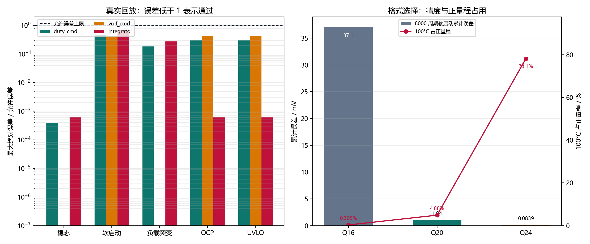
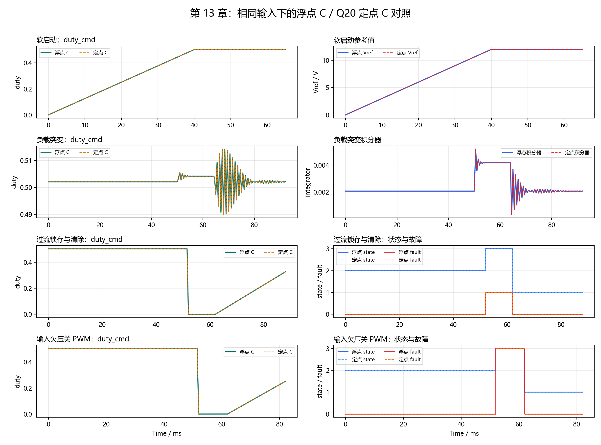

# 【数字电源/MATLAB+PLECS+C】Buck 数字电源开发（十三）浮点控制器怎么改成定点数并验证不会溢出

第十二章已经证明，浮点 C 控制器在 80,400 个控制周期中保持了 Python 参考实现的行为。

如果下一步只是把源码里的 `float` 全部替换成 `int32_t`，软启动每周期增加的 `0.0015 V` 会直接变成 0；如果随意乘一个比例系数，又可能出现积分器精度不足、保护阈值范围太小或乘法中间结果溢出。

这一章解决一个具体问题：

**如何用有符号 32 位整数表示控制器中的电压、电流、温度、duty 和积分器，同时保持浮点 C 的状态行为，并让量化误差和溢出都可以被测试。**

配套 GitHub 仓库：[digital-power-buck-sim-lab](https://github.com/Old-Ding/digital-power-buck-sim-lab)

完整检查命令为：

```powershell
python scripts\run_fixed_point_parity.py
```

当前实测结果为 5 个场景、80,400 个控制周期和 4 个定点单元测试，共 74 项检查全部通过；最大 duty 误差为 `7.06908e-05`，正常回放算术溢出为 0。

## 先看懂：定点数不是把小数删掉

定点数仍然使用整数保存数据，只是约定整数中有多少位表示小数。

本章不使用容易产生歧义的 `Qm.n` 总位数命名，而是明确约定：

```text
存储类型：有符号 int32_t
小数位数：20
缩放因子：S = 2^20 = 1,048,576
```

工程值与整数 raw 之间的关系为：

```text
raw = round(工程值 × S)
工程值 = raw ÷ S
```

例如 12 V 在控制器中保存为：

```text
raw = 12 × 1,048,576 = 12,582,912
```

需要输出波形或写入日志时，再把 `12,582,912` 除以 `1,048,576`，还原为 12 V。

本章有六个参与角色：

| 角色 | 文件或工具 | 作用 |
| --- | --- | --- |
| 浮点行为基准 | `src/digital_power_control.c` | 提供第十二章已经验证的控制行为 |
| Q20 定点控制器 | `src/digital_power_control_fixed.c` | 只用整数完成滤波、PI、限幅、状态机和保护计算 |
| 定点边界测试 | `tests/test_digital_power_control_fixed.c` | 主动构造正负溢出，验证饱和与溢出计数 |
| 双实现回放程序 | `tests/replay_digital_power_control_fixed.c` | 把同一行输入同时送给浮点 C 和定点 C |
| C 编译器 | Zig、GCC、Clang 或 MSVC | 编译两套真实 C 控制器和测试入口 |
| 自动化脚本 | `scripts/run_fixed_point_parity.py` | 生成输入、编译、运行、比较并输出 CSV、图表和报告 |

新增的 C 文件和 Python 脚本都是本仓库为第十三章编写的配套材料，不是 MATLAB、PLECS 或编译器自动生成的代码。

## 完整算例：软启动的 0.0015 V 怎么变成整数

控制周期为 5 us，软启动斜率为 300 V/s，所以每个控制周期应增加：

```text
300 V/s × 5 us = 0.0015 V
```

使用 20 个小数位后：

```text
raw = round(0.0015 × 1,048,576)
    = round(1572.864)
    = 1573

还原值 = 1573 ÷ 1,048,576
       = 0.0015001297 V
```

单周期量化误差只有：

```text
0.0015001297 - 0.0015
= 0.0000001297 V
= 0.1297 uV
```

第一周期的真实 C 输出为：

| 量 | 浮点 C | Q20 定点 C | 定点 raw |
| --- | ---: | ---: | ---: |
| `vref_cmd` | 0.00150000001 V | 0.00150012970 V | 1573 |
| `duty_cmd` | 0.0001375000 | 0.0001382828 | 145 |
| `state` | `SOFT_START` | `SOFT_START` | - |
| 算术溢出 | 0 | 0 | - |

这就是定点迁移的最小闭环：工程值先变成 raw，整数控制器只处理 raw，测试层再把 raw 还原成工程值与浮点基准比较。

## 为什么选择 20 个小数位

小数位越少，范围越大，但小信号分辨率越差；小数位越多，分辨率越高，但可表示范围越小。

本章用同一个软启动增量和 100°C 保护阈值比较了三种候选格式：

| 小数位 | 最小分辨率 | 正数范围上限 | 8000 周期软启动累计误差 | 100°C 占正量程 |
| ---: | ---: | ---: | ---: | ---: |
| 16 | 15.2588 u | 约 32768 | -37.1094 mV | 0.305% |
| 20 | 0.9537 u | 约 2048 | +1.0376 mV | 4.883% |
| 24 | 0.0596 u | 约 128 | +0.0839 mV | 78.125% |

16 个小数位虽然范围很大，但软启动增量被量化为 98，连续 8000 周期后会少约 37 mV，可能让状态切换推迟多个控制周期。

24 个小数位精度更高，但正数上限只有约 128。100°C 已经占掉 78.125%，对更高温度、异常输入和内部瞬态缺少足够余量。

20 个小数位把分辨率提高到约 `0.9537 u`，同时仍能表示约 `±2048` 的工程值。当前最大的配置值是 100°C，只占有符号 32 位正量程的约 4.88%，因此本章选择 20 个小数位。



右图来自 `waveforms/13-fixed-point-format.csv`。柱形表示 8000 个软启动周期后的累计误差，红线表示 100°C 对正量程的占用。读图时要同时看精度和范围，不能只追求更多小数位。

## 定点乘法为什么必须使用 64 位中间量

两个 Q20 整数相乘时，缩放因子也被乘了两次：

```text
(a × 2^20) × (b × 2^20)
= a × b × 2^40
```

结果需要除以一次 `2^20` 才能回到原来的 Q20 格式：

```text
result_raw = round((a_raw × b_raw) ÷ 2^20)
```

`a_raw × b_raw` 可能超过 32 位，因此乘法先进入 `int64_t`，舍入以后再检查是否能够放回 `int32_t`：

```c
static DpFixed dp_fixed_mul(DpFixed left, DpFixed right, bool *overflow)
{
    int64_t product = (int64_t)left * (int64_t)right;

    product += product >= 0 ? DP_FIXED_HALF : -DP_FIXED_HALF;
    return dp_fixed_saturate(product / DP_FIXED_ONE, overflow);
}
```

所有加、减、乘、除最终都经过同一个 `dp_fixed_saturate()`。如果结果超过 `INT32_MAX` 或低于 `INT32_MIN`，该函数负责饱和并设置溢出标志。这是定点算术的唯一职责层，状态机和脚本不再重复判断相同边界。

## 为什么把 Ki 和控制周期提前合并

浮点积分器每周期执行：

```text
integrator += Ki × Ts × error
```

这里 `Ki = 80`，`Ts = 5 us`，所以真正每周期使用的系数是：

```text
Ki_step = 80 × 0.000005 = 0.0004
```

定点配置直接保存：

```text
Ki_step_raw = round(0.0004 × 2^20) = 419
```

软启动也直接保存每周期增量 `1573`，不在每个控制周期重复计算“斜率 × 周期”。这样既减少运行时乘法，也避免把很小的时间量单独量化后再与大系数相乘。

主要 Q20 常量如下：

| 参数 | 工程值 | raw | 还原值 |
| --- | ---: | ---: | ---: |
| 最终参考值 | 12 V | 12,582,912 | 12 V |
| 软启动每周期增量 | 0.0015 V | 1,573 | 0.0015001297 V |
| `Kp` | 0.05 | 52,429 | 0.0500001907 |
| `Ki_step` | 0.0004 | 419 | 0.0003995895 |
| 前馈 duty | 0.5 | 524,288 | 0.5 |
| duty 上限 | 0.65 | 681,574 | 0.6499996185 |
| OCP 阈值 | 6.5 A | 6,815,744 | 6.5 A |
| OVP 阈值 | 13.2 V | 13,841,203 | 13.1999998093 V |
| UVLO 阈值 | 18 V | 18,874,368 | 18 V |
| OTP 阈值 | 100°C | 104,857,600 | 100°C |

## 先手动验证溢出检测确实有效

正常场景没有溢出，并不能证明溢出检测代码能工作。因此本章先编译一个专门的边界测试程序。

以 Zig 为例：

```powershell
New-Item -ItemType Directory -Force artifacts\host-build\chapter13 | Out-Null

zig cc -std=c99 -Wall -Wextra -Werror `
  -I src `
  src\digital_power_control_fixed.c `
  tests\test_digital_power_control_fixed.c `
  -o artifacts\host-build\chapter13\digital_power_control_fixed_tests.exe

.\artifacts\host-build\chapter13\digital_power_control_fixed_tests.exe
```

当前真实输出为：

```text
PASS,q20_scale_and_soft_start_constant
PASS,soft_start_first_step_without_overflow
PASS,positive_overflow_saturates_and_counts
PASS,negative_overflow_saturates_and_counts
SUMMARY,PASS,failures=0
```

前两个测试检查格式常量和正常软启动。后两个测试主动把内部状态推到正负边界，确认计算结果会饱和、`arithmetic_overflow` 会置位、溢出计数会增加。

## 再手动运行浮点与定点双实现回放

先生成与第十二章相同的 80,400 行输入：

```powershell
python scripts\run_fixed_point_parity.py --prepare-only
```

然后编译浮点控制器、定点控制器和双实现回放入口：

```powershell
zig cc -std=c99 -Wall -Wextra -Werror `
  -I src `
  src\digital_power_control.c `
  src\digital_power_control_fixed.c `
  tests\replay_digital_power_control_fixed.c `
  -lm `
  -o artifacts\host-build\chapter13\digital_power_control_fixed_replay.exe
```

运行：

```powershell
.\artifacts\host-build\chapter13\digital_power_control_fixed_replay.exe `
  .\artifacts\host-build\chapter13\13-controller-replay-input.csv `
  .\artifacts\host-build\chapter13\13-fixed-point-output.csv
```

成功时输出：

```text
SUMMARY,OK,rows=80400,input_overflow=0,fixed_overflow=0
```

双实现回放程序负责读取输入、调用两个 C 控制器和输出结果。它不判断误差是否合格；PASS/FAIL 仍由自动化脚本按照公开容差计算。

## 一键脚本内部做了什么

实际复现时直接运行：

```powershell
python scripts\run_fixed_point_parity.py
```

该脚本按顺序完成：

1. 生成 Q16、Q20、Q24 格式取舍数据和 Q20 常量表。
2. 复用第十二章五个场景，生成固定逐周期输入。
3. 编译并运行定点边界单元测试。
4. 编译浮点 C、定点 C 和双实现回放程序。
5. 对 80,400 个周期的数值量计算最大绝对误差。
6. 对状态、故障、PWM 和逻辑标志做逐周期完全一致检查。
7. 检查输入转换溢出、定点算术溢出和 raw 量程占用。
8. 生成 CSV、PNG 和 Markdown 报告。

本章连续量容差如下：

| 比较量 | 最大绝对误差上限 | 依据 |
| --- | ---: | --- |
| `vout_meas_v` | 1 uV | 约一个 Q20 最小分辨率 |
| `vref_cmd_v`、`error_v` | 1.1 mV | 覆盖 8000 次软启动增量的累计量化上界 |
| `p_term` | 0.00006 | `Kp` 与误差量化后的传播边界 |
| `integrator` | 0.0001 | 覆盖 `Ki_step` 和误差的逐周期累积差异 |
| `duty_raw`、`duty_cmd` | 0.00015 | 覆盖前馈、比例项与积分项的组合量化差异 |

状态、故障、PWM、饱和标志和积分允许标志不使用数值容差，必须逐周期完全一致。正常场景的输入转换和定点算术溢出都必须为 0。

## 80,400 周期实测结果

当前本机使用 Zig 0.16.0 编译，输出为：

```text
summary,pass=74,fail=0,scenarios=5,rows=80400
toolchain,zig,zig 0.16.0
fixed_format,frac_bits=20,scale=1048576,max_raw_use_pct=4.88281
max_error,duty_cmd=7.06908e-05,vref_cmd_v=0.000478795,integrator=7.06213e-05
```

| 检查项 | 实测结果 |
| --- | ---: |
| 最大 duty 误差 | `7.06908e-05` |
| 最大参考值误差 | `0.000478795 V` |
| 最大积分器误差 | `7.06213e-05` |
| 状态错位 | 0 个周期 |
| 故障错位 | 0 个周期 |
| PWM 错位 | 0 个周期 |
| 逻辑标志错位 | 0 个周期 |
| 正常回放算术溢出 | 0 个周期 |
| 输入转换溢出 | 0 个周期 |
| 最大 raw 正量程占用 | 4.88281% |



上图来自编译后的两套 C 控制器。软启动、负载突变、OCP 和 UVLO 场景中的 duty、参考值、积分器、状态和故障曲线均保持重合。图中每 0.5 ms 抽取一个显示点，全部 80,400 行仍参与 PASS/FAIL 判断。

误差图左侧把实际误差除以允许误差。所有柱形都低于 1，其中最接近限制的是软启动积分器误差，约占容差的 70.6%。这说明当前容差能够区分真实偏差，同时没有因为定点量化而误报。

## 不要误读本章结果

| 本章结果可以证明 | 本章结果不能证明 |
| --- | --- |
| Q20 定点 C 经过真实电脑端编译和执行 | 目标 MCU 工具链已经通过 |
| 五个场景中的定点误差低于公开容差 | 所有可能输入下误差都满足要求 |
| 状态、故障、PWM 和逻辑标志逐周期一致 | ADC 采样和 PWM 寄存器时序正确 |
| 正常回放没有溢出，正负溢出探针能够被检测和饱和 | 目标 MCU 上的 64 位运算耗时满足 200 kHz 中断预算 |
| 当前配置和运行 raw 最大占正量程约 4.88% | 已经完成实机功率闭环 |

当前回放 CSV 中的电压、电流和温度由测试适配层换算成 Q20 raw。真实 MCU 中的 ADC 码值如何变成这些 raw 值，属于下一章的采样链路，不应把本章的测试转换函数直接当作 ADC 驱动。

## 配套文件

| 类型 | 文件 |
| --- | --- |
| 教程文章 | `blog/13-fixed-point-controller.md` |
| 复现说明 | `docs/13-fixed-point-controller-reproduce.md` |
| 浮点控制器 | `src/digital_power_control.c`、`src/digital_power_control.h` |
| Q20 定点控制器 | `src/digital_power_control_fixed.c`、`src/digital_power_control_fixed.h` |
| 定点边界测试 | `tests/test_digital_power_control_fixed.c` |
| 双实现回放入口 | `tests/replay_digital_power_control_fixed.c` |
| 一键脚本 | `scripts/run_fixed_point_parity.py` |
| 格式取舍数据 | `waveforms/13-fixed-point-format.csv` |
| Q20 常量数据 | `waveforms/13-fixed-point-constants.csv` |
| 指标汇总 | `waveforms/13-fixed-point-summary.csv` |
| 公开抽样数据 | `waveforms/13-fixed-point-samples.csv` |
| 对照图 | `waveforms/13-fixed-point-overlay.png` |
| 格式与误差图 | `waveforms/13-fixed-point-error-format.png` |
| 完整报告 | `reports/13-fixed-point-parity-report.md` |

完整输入、双实现 C 输出和可执行文件位于 `artifacts/host-build/chapter13/`。这些本机生成文件可以由脚本重新创建，因此不提交到 GitHub。

## 本章结论

定点迁移不是机械地把 `float` 改成 `int32_t`，而是同时确定缩放、分辨率、范围、舍入、饱和、溢出观测和基准对照。

当前 Q20 控制器已经在五个场景中保持浮点 C 的离散行为，最大 duty 误差约 `7.07e-05`，正常运行没有算术溢出，正负边界探针也证明溢出检测路径能够工作。

下一章将把 ADC 码值、分压比、电流采样增益和零点偏置连接起来，验证原始采样值如何转换成这里使用的 Q20 电压、电流和温度输入。
