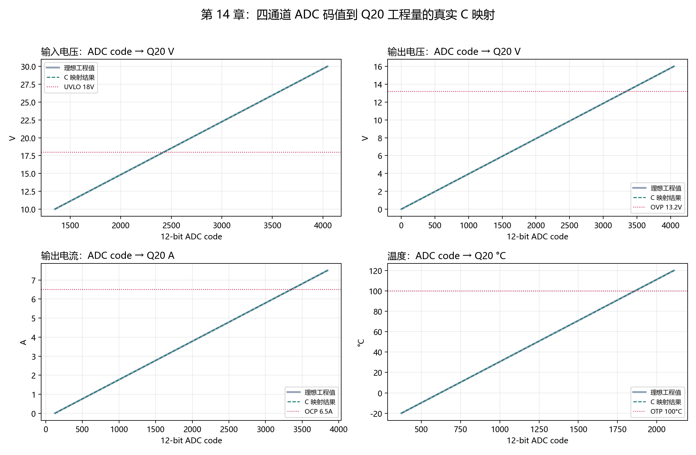
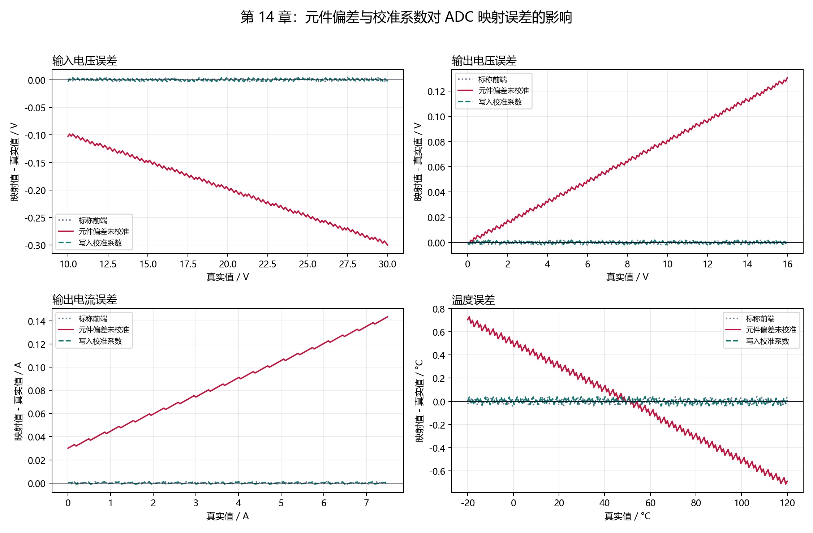

# 【数字电源/MATLAB+PLECS+C】Buck 数字电源开发（十四）ADC 原始码怎么变成 Q20 电压、电流和温度

第十三章的定点控制器需要 `Vin`、`Vout`、`Iout` 和温度四个 Q20 工程量，但 MCU 的 ADC 寄存器只会给出 `0～4095` 的原始码值。

如果直接把 ADC code 填进控制器，`3039` 不会自动变成 `12 V`；分压比、采样放大器增益和零点偏置只要写错一个，12 V 可能被解释成 12.13 V，6.5 A 保护点也可能提前或延后触发。

这一章完成下面这条输入链路：

```text
12-bit ADC code
→ ADC 引脚电压
→ 分压比 / 增益 / 零点偏置
→ 电压、电流、温度工程值
→ Q20 raw
→ 第十三章定点控制器输入
```

配套 GitHub 仓库：[digital-power-buck-sim-lab](https://github.com/Old-Ding/digital-power-buck-sim-lab)

运行入口：

```powershell
python scripts\run_adc_mapping_tests.py
```

当前真实 C 测试共执行 607 行输入，得到 `PASS 22 / FAIL 0 / INFO 4`。标称与校准后的误差均低于约一个通道 ADC LSB。

## 谁负责读取，谁负责换算

本章把 ADC 链路拆成三个职责层：

| 层 | 输入 | 输出 | 不负责 |
| --- | --- | --- | --- |
| ADC 驱动 | MCU ADC 寄存器 | `vin_code`、`vout_code`、`iout_code`、`temperature_code` | 分压、增益和控制算法 |
| ADC 映射层 | 原始码值和校准参数 | Q20 `Vin/Vout/Iout/Temperature` | PI、保护状态机和 PWM |
| 定点控制器 | Q20 工程量 | duty、状态和故障 | ADC 寄存器与模拟前端参数 |

对应文件：

| 角色 | 文件 |
| --- | --- |
| ADC 映射实现 | `src/digital_power_adc_map.c` |
| ADC 映射接口 | `src/digital_power_adc_map.h` |
| C 单元测试 | `tests/test_digital_power_adc_map.c` |
| CSV 回放入口 | `tests/replay_digital_power_adc_map.c` |
| 场景、编译和报告脚本 | `scripts/run_adc_mapping_tests.py` |

这些文件由本仓库编写。脚本中的元件偏差是可重复的合成参数，用于演示校准效果，不是实物测量数据。

## 本章使用的模拟前端

ADC 假设为 12 bit、参考电压 3.3 V：

| 通道 | 模拟前端 | 标称换算关系 | 满量程约值 |
| --- | --- | --- | ---: |
| `Vin` | 82kΩ / 10kΩ 分压 | `Vin = Vadc × 9.2` | 30.36 V |
| `Vout` | 39kΩ / 10kΩ 分压 | `Vout = Vadc × 4.9` | 16.17 V |
| `Iout` | 0.1 V 零点，0.4 V/A 增益 | `Iout = (Vadc - 0.1) / 0.4` | 8 A |
| 温度 | 0.5 V 零点，10 mV/°C | `Temp = (Vadc - 0.5) / 0.01` | 软件限制 -40～150°C |

每个 ADC LSB 对应的工程量为：

| 通道 | 一个 ADC LSB |
| --- | ---: |
| `Vin` | 约 7.414 mV |
| `Vout` | 约 3.949 mV |
| `Iout` | 约 2.015 mA |
| 温度 | 约 0.0806°C |

这些值决定了映射误差的物理下限。Q20 分辨率再高，也不能恢复 ADC 量化时已经丢失的信息。

## 完整算例：3039 为什么代表约 12 V

12-bit ADC 满量程为 4095。`Vout` 通道读到 3039 时，ADC 引脚电压约为：

```text
Vadc = 3039 × 3.3 / 4095
     ≈ 2.449 V
```

经过 39kΩ / 10kΩ 分压还原：

```text
Vout = Vadc × (39k + 10k) / 10k
     = Vadc × 4.9
     ≈ 12.000 V
```

再转成 Q20：

```text
Vout_raw = round(Vout × 1,048,576)
```

真实 C 映射结果如下：

| 工程量 | ADC code | 真实值 | C 映射值 | Q20 raw | 误差 |
| --- | ---: | ---: | ---: | ---: | ---: |
| `Vin` | 3237 | 24 V | 23.9988527 V | 25,164,621 | -1.1473 mV |
| `Vout` | 3039 | 12 V | 12.0001535 V | 12,583,073 | +0.1535 mV |
| `Iout` | 2606 | 5 A | 5.0001822 A | 5,243,071 | +0.1822 mA |
| 温度 | 1179 | 45°C | 45.0110°C | 47,197,454 | +0.0110°C |

这些误差都小于对应通道的一个 ADC LSB。

## 映射为什么使用整数微伏

MCU 固件中没有必要先计算浮点 `Vadc`。映射层把参考电压保存为 `3,300,000 uV`，先用整数把 ADC code 换成微伏，再进行分压或传感器换算。

电压通道的核心关系为：

```text
adc_uv = round(code × 3,300,000 / 4095)

voltage_q20 = round(
    adc_uv × divider_num × 2^20
    / (divider_den × 1,000,000)
)
```

这里先算 `adc_uv` 不是形式上的拆分。若把校准分压比 `9292/1000` 与 ADC code、参考电压、Q20 缩放因子直接连乘，中间值会超过 `int64_t`。先转换成不超过 3,300,000 的微伏值后，64 位中间量保持在安全范围内。

电流和温度使用同一结构：

```text
sensor_q20 = round(
    (adc_uv - offset_uv) × 2^20
    / slope_uv_per_unit
)
```

零点偏置只在 ADC 映射层扣除，控制器不会再次减零点。

## 码值和物理量在哪里钳位

映射层负责两种边界：

1. ADC code 大于 4095 时，钳位到 4095，并设置 `input_code_clamped`。
2. 电流低于 0 A、高于 8 A，或温度超出 -40～150°C 时，钳位到配置范围，并设置 `physical_value_clamped`。

保护状态机不重复处理这些 ADC 前端范围。它只判断映射完成后的 Q20 工程量是否超过 OCP、OVP、UVLO 或 OTP 阈值。

## 真实 C 映射曲线



四个子图分别展示 `Vin`、`Vout`、`Iout` 和温度。灰线是输入场景的理想工程值，绿色虚线是编译后的 C 映射结果，红色虚线标出 UVLO、OVP、OCP 和 OTP 阈值。

两条主曲线几乎重合，但仍存在 ADC 阶梯量化。该图证明换算斜率和偏置正确，不代表模拟前端没有噪声。

## 为什么标称电阻值不能替代校准

脚本构造了一组固定元件偏差：

| 参数 | 标称 | 偏差后的实际值 |
| --- | ---: | ---: |
| `Vin` 分压比 | 9.2 | 9.292 |
| `Vout` 分压比 | 4.9 | 4.8608 |
| 电流零点 | 0.100 V | 0.112 V |
| 电流增益 | 0.400 V/A | 0.406 V/A |
| 温度零点 | 0.500 V | 0.505 V |
| 温度斜率 | 10.0 mV/°C | 9.9 mV/°C |

如果硬件已经发生这些偏差，固件仍使用标称参数，最大误差为：

| 通道 | 未校准最大误差 | 写入校准系数后 |
| --- | ---: | ---: |
| `Vin` | 0.299843 V | 0.003742 V |
| `Vout` | 0.130511 V | 0.001956 V |
| `Iout` | 0.143408 A | 0.000963 A |
| 温度 | 0.728600°C | 0.040606°C |



红线表示元件偏差存在但固件仍使用标称参数，绿色虚线表示写入实际校准系数。校准后四个通道的最大误差降到未校准误差的约 0.67%～5.57%，剩余误差主要来自 ADC 量化。

真实硬件的校准系数必须来自万用表、电子负载、标准电源或温度基准测量，不能直接照抄本章的合成偏差。

## 手动编译 C 单元测试

以 Zig 为例：

```powershell
New-Item -ItemType Directory -Force artifacts\host-build\chapter14 | Out-Null

zig cc -std=c99 -Wall -Wextra -Werror `
  -I src `
  src\digital_power_adc_map.c `
  tests\test_digital_power_adc_map.c `
  -o artifacts\host-build\chapter14\digital_power_adc_map_tests.exe

.\artifacts\host-build\chapter14\digital_power_adc_map_tests.exe
```

输出：

```text
PASS,nominal_24v_12v_5a_45c
PASS,adc_code_above_full_scale_is_clamped
PASS,sensor_values_respect_physical_limits
SUMMARY,PASS,failures=0
```

三个测试分别检查典型工作点、超过 12-bit 的码值钳位，以及电流和温度物理范围钳位。

## 一键生成全部证据

只生成 607 行输入和前端参数表：

```powershell
python scripts\run_adc_mapping_tests.py --prepare-only
```

完整编译、运行、比较和绘图：

```powershell
python scripts\run_adc_mapping_tests.py
```

当前输出：

```text
summary,pass=22,fail=0,info=4,rows=607
toolchain,zig,zig 0.16.0
calibration,max_uncalibrated_error=0.7286,max_calibrated_ratio=0.0557319
```

`INFO 4` 是四个未校准误差，用来展示元件偏差后果，不作为失败；标称映射、校准映射、校准改善比例、边界和单元测试均参与 PASS/FAIL。

## 不要误读本章结果

| 本章证明 | 本章没有证明 |
| --- | --- |
| 四通道整数映射公式和 Q20 输出经过真实 C 编译执行 | 真实 PCB 上的分压比和增益就是标称值 |
| 标称和校准场景误差低于约一个通道 ADC LSB | ADC 噪声、采样保持时间和开关尖峰已经解决 |
| 超量程 code 和物理量边界有统一钳位与标志 | MCU ADC DMA、触发源和采样时序已经配置 |
| 合成元件偏差可通过校准系数显著降低 | 本章合成系数可以作为实物校准数据 |

## 配套文件

| 类型 | 文件 |
| --- | --- |
| 教程 | `blog/14-adc-to-q20-mapping.md` |
| 复现说明 | `docs/14-adc-to-q20-mapping-reproduce.md` |
| ADC 映射源码 | `src/digital_power_adc_map.c`、`src/digital_power_adc_map.h` |
| C 单元测试 | `tests/test_digital_power_adc_map.c` |
| C 回放入口 | `tests/replay_digital_power_adc_map.c` |
| 自动化脚本 | `scripts/run_adc_mapping_tests.py` |
| 前端参数 | `waveforms/14-adc-front-end-config.csv` |
| 汇总指标 | `waveforms/14-adc-mapping-summary.csv` |
| C 输出样本 | `waveforms/14-adc-mapping-samples.csv` |
| 映射曲线 | `waveforms/14-adc-code-to-q20.png` |
| 校准误差图 | `waveforms/14-adc-calibration-error.png` |
| 报告 | `reports/14-adc-mapping-report.md` |

## 本章结论

ADC 输入链路的核心不是一条乘法公式，而是把码值范围、参考电压、分压比、增益、零点、物理范围、Q20 舍入和校准参数放在唯一映射层中统一管理。

当前四通道 C 映射在标称与校准场景中均达到约一个 ADC LSB 的误差水平，并能明确报告码值和物理量钳位。

下一章将沿输出方向完成相反的映射：把第十三章的 Q20 duty 转成 PWM 定时器比较值，并验证 0%、65%、100%、死区和影子寄存器更新时间。
