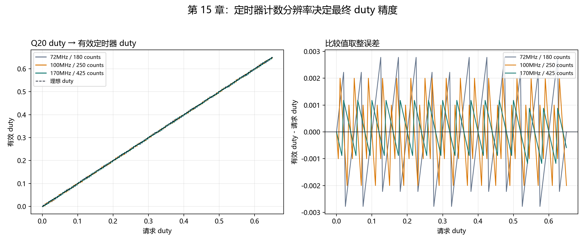
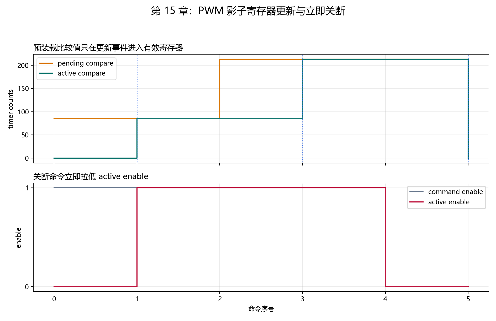

# 【数字电源/MATLAB+PLECS+C】Buck 数字电源开发（十五）Q20 duty 怎么变成中心对齐 PWM 比较值

第十三章的定点控制器输出 Q20 `duty_cmd`，但定时器寄存器需要的是整数比较值。把 `0.5` 直接写进寄存器没有意义；在 170 MHz 定时器、200 kHz 中心对齐 PWM 下，50% duty 最终要写成 `213 counts`。

这一步若把中心对齐公式、取整方式或更新时间写错，常见现象是 PWM 频率偏差、占空比越限，或者比较值在周期中间突变。保护关断若也等待影子寄存器更新，还会额外延迟一个更新事件。

本章完成下面这条输出链路：

```text
Q20 duty_cmd
→ 0%～65% 软件限幅
→ 整数舍入为 compare counts
→ 写入预装载比较值
→ 定时器更新事件后生效
→ 保护命令可立即关闭 PWM 使能
```

配套 GitHub 仓库：[digital-power-buck-sim-lab](https://github.com/Old-Ding/digital-power-buck-sim-lab)

运行入口：

```powershell
python scripts\run_pwm_mapping_tests.py
```

当前真实 C 回放处理 640 行输入，得到 `PASS 15 / FAIL 0`。

## 四个角色各自负责什么

| 角色 | 输入 | 输出 | 决策边界 |
| --- | --- | --- | --- |
| Q20 控制器 | ADC 映射后的工程量 | `duty_cmd`、`pwm_enable` | 决定控制量和运行状态 |
| PWM 映射层 | Q20 duty、定时器参数 | `pending_compare` | 限幅、舍入和整数边界 |
| 定时器更新事件 | 预装载比较值 | `active_compare` | 只在确定的周期边界更新 |
| 保护关断路径 | 故障或关闭命令 | `active_enable=false` | 立即关闭输出，不等待周期边界 |

对应实现由本仓库编写：`src/digital_power_pwm_map.c` 保存映射规则，`tests/test_digital_power_pwm_map.c` 判断关键行为，`scripts/run_pwm_mapping_tests.py` 负责编译、运行、汇总和绘图。

## 先算出中心对齐定时器周期

本章使用的目标参数为：

| 参数 | 数值 |
| --- | ---: |
| 定时器时钟 `fTIM` | 170 MHz |
| PWM 频率 `fPWM` | 200 kHz |
| 计数模式 | 中心对齐 |
| 预分频 | 1 |
| 自动重装值 `ARR` | 425 |
| duty 上限 | 65% |
| 目标死区 | 100 ns |
| 死区计数 | 17 counts |

中心对齐计数器先向上计数，再向下计数。一个 PWM 周期包含两段 `ARR` 计数，因此：

```text
fPWM = fTIM / (2 × ARR)

ARR = 170,000,000 / (2 × 200,000)
    = 425
```

这里不能沿用边沿对齐模式中常见的 `ARR + 1` 写法。若写成 `ARR=424`，中心对齐频率将不再是精确的 200 kHz。

100 ns 死区对应：

```text
deadtime_counts = round(170 MHz × 100 ns)
                = 17
```

本章先用线性计数关系验证 17 counts。具体 MCU 的死区寄存器可能采用分段编码，写入 BDTR 等寄存器前还要根据参考手册做一次编码转换。

## 完整算例：50% duty 为什么得到 213

Q20 使用 `2^20 = 1,048,576` 作为缩放因子，因此 50% duty 为：

```text
duty_q20 = 0.5 × 1,048,576
          = 524,288
```

映射层采用四舍五入：

```text
compare = round(duty_q20 × ARR / 2^20)
        = round(524,288 × 425 / 1,048,576)
        = round(212.5)
        = 213
```

213 counts 对应的有效 duty 为：

```text
effective_duty = 213 / 425
               ≈ 50.1176%
```

误差来自整数定时器计数，不是 Q20 控制器算错。170 MHz 配置下，一个比较计数对应约 `0.2353%` duty，四舍五入的理论最大误差约为半个计数，即 `0.1176%`。

65% 上限的计算过程相同：

```text
duty_max_q20 = round(0.65 × 1,048,576)
             = 681,574

compare_max = round(681,574 × 425 / 1,048,576)
            = 276

effective_duty_max = 276 / 425
                   ≈ 64.9412%
```

请求 duty 大于 65% 时，映射层先钳位到 `681,574`，所以比较值不会超过 276。负 duty 统一钳位到 0。

## 为什么比较值不能立即进入有效寄存器

若控制中断在一个 PWM 周期中间改写有效比较值，同一周期的前半段和后半段可能使用不同阈值。预装载寄存器把“计算完成”和“硬件生效”拆成两个动作：

1. `DpPwmMap_Queue()` 计算并保存 `pending_compare`。
2. 当前周期继续使用 `active_compare`。
3. `DpPwmMap_ApplyUpdateEvent()` 在更新事件中把 pending 值转为 active 值。

50% duty 的单元测试先调用 Queue，检查 active 仍为 0；再触发更新事件，检查 active 变成 213。这验证的是更新顺序，不依赖具体 MCU 寄存器名称。

保护关断采用不同语义。`pwm_enable=false` 时，`active_enable` 立即变成 false；比较值仍可等待更新事件归零。这样既避免重新使能发生在周期中间，也不让故障关断多等一个 PWM 周期。

## 三种定时器时钟的量化误差

脚本分别使用 72 MHz、100 MHz 和 170 MHz，保持 200 kHz 中心对齐 PWM：

| 定时器时钟 | ARR | 一个计数的 duty | 最大实测绝对误差 |
| ---: | ---: | ---: | ---: |
| 72 MHz | 180 | 0.5556% | 0.277824% |
| 100 MHz | 250 | 0.4000% | 0.200031% |
| 170 MHz | 425 | 0.2353% | 0.117691% |



左图的阶梯来自整数比较值。右图显示误差围绕 0 周期变化；定时器时钟越高，同一 PWM 频率下可用计数越多，duty 分辨率越细。

这张图应按“计数分辨率决定最小 duty 步距”来读，不要把 170 MHz 曲线仍有误差解释成定点算法失效。

## 预装载更新和立即关断结果

测试序列依次写入 20%、更新生效、写入 50%、更新生效、发出关闭命令、更新归零。



上图中橙色 pending 值先变化，绿色 active 值只在蓝色更新事件处跟随。下图中关闭命令到达时，红色 `active enable` 立即拉低，没有等待最后一次更新事件。

## 手动编译最小 C 测试

以 Zig 为例：

```powershell
New-Item -ItemType Directory -Force artifacts\host-build\chapter15 | Out-Null

zig cc -std=c99 -Wall -Wextra -Werror `
  -I src `
  src\digital_power_pwm_map.c `
  tests\test_digital_power_pwm_map.c `
  -o artifacts\host-build\chapter15\digital_power_pwm_map_tests.exe

.\artifacts\host-build\chapter15\digital_power_pwm_map_tests.exe
```

预期输出：

```text
PASS,center_aligned_170mhz_200khz_contract
PASS,half_duty_waits_for_update_event
PASS,half_duty_applies_at_update_event
PASS,duty_above_limit_is_clamped
PASS,disable_is_immediate
SUMMARY,PASS,failures=0
```

这些 PASS/FAIL 由 C 测试中的断言决定。Python 脚本只负责查找编译器、启动程序、读取 CSV、计算批量指标并生成报告。

## 一键生成全部证据

只生成 640 行输入和定时器参数表：

```powershell
python scripts\run_pwm_mapping_tests.py --prepare-only
```

完整编译、运行、比较和绘图：

```powershell
python scripts\run_pwm_mapping_tests.py
```

当前输出：

```text
summary,pass=15,fail=0,rows=640
toolchain,zig,zig 0.16.0
pwm,period_counts=425,arr=425,deadtime_counts=17,max_duty_error=0.00277824
```

最后一项最大误差来自 72 MHz 对照组；170 MHz 目标配置的最大误差为 `0.00117691`。

## 不要误读本章结果

| 本章证据说明 | 不要误读成 |
| --- | --- |
| Q20 duty 到整数 compare 的限幅、舍入和边界经过真实 C 执行 | 某一款 MCU 的寄存器已经完成初始化 |
| 170 MHz/200 kHz 中心对齐参数得到 `ARR=425` | 所有定时器系列都采用相同频率公式 |
| 预装载更新和立即关断的软件语义通过测试 | 真实门极波形已测得 100 ns 死区 |
| 65% 请求被限制为不超过 276 counts | 功率器件在 65% duty 下必然安全 |

## 配套文件

| 类型 | 文件 |
| --- | --- |
| 教程 | `blog/15-pwm-timer-mapping.md` |
| 复现说明 | `docs/15-pwm-timer-mapping-reproduce.md` |
| PWM 映射源码 | `src/digital_power_pwm_map.c`、`src/digital_power_pwm_map.h` |
| C 单元测试 | `tests/test_digital_power_pwm_map.c` |
| C 回放入口 | `tests/replay_digital_power_pwm_map.c` |
| 自动化脚本 | `scripts/run_pwm_mapping_tests.py` |
| 定时器参数 | `waveforms/15-pwm-timer-config.csv` |
| 汇总指标 | `waveforms/15-pwm-mapping-summary.csv` |
| C 输出样本 | `waveforms/15-pwm-mapping-samples.csv` |
| 分辨率图 | `waveforms/15-pwm-resolution.png` |
| 更新时序图 | `waveforms/15-pwm-shadow-update.png` |
| 报告 | `reports/15-pwm-mapping-report.md` |

## 本章结论

PWM 映射层把控制算法的 Q20 duty 变成定时器可以执行的整数比较值，并统一管理 0%～65% 限幅、四舍五入、预装载更新和立即关断语义。

在 170 MHz、200 kHz 中心对齐配置下，`ARR=425`，50% duty 映射为 213 counts，65% 上限映射为 276 counts；全部 15 项指标通过，整数运算溢出为 0。

下一章将把 ADC 读取、定点控制和 PWM 更新放进同一个 5 us 控制周期，检查每一步的执行顺序，并计算中断代码必须在多长时间内完成。
