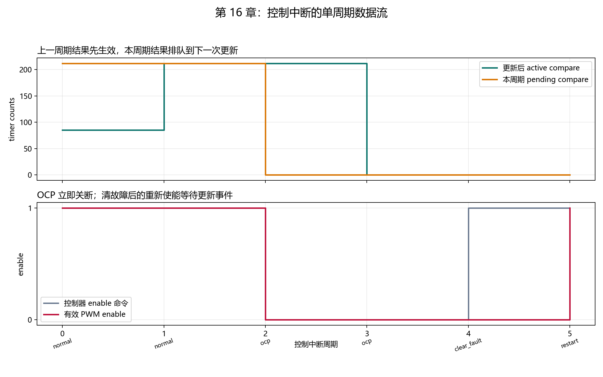
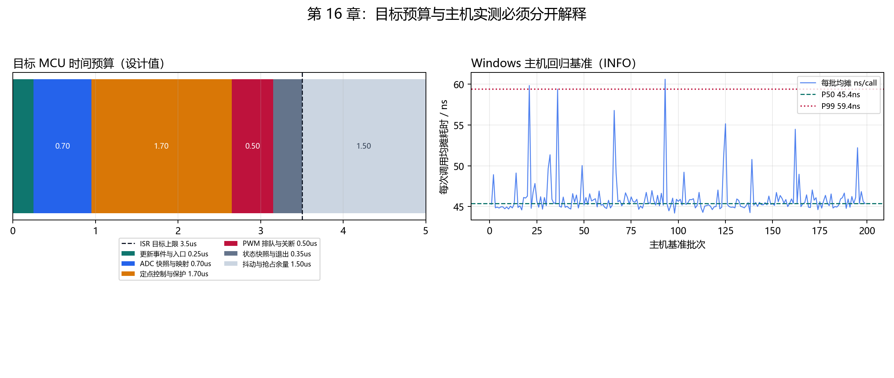

# 【数字电源/MATLAB+PLECS+C】Buck 数字电源开发（十六）5 us 控制中断里 ADC、控制器和 PWM 应该按什么顺序执行

200 kHz PWM 每 `5 us` 进入一个新周期。第十四章已经能把 ADC code 转成 Q20 工程量，第十五章也能把 Q20 duty 转成 PWM compare；但把三个函数随意放进中断，仍可能出现“新 duty 在错误周期生效”或“发生 OCP 后还多输出一个周期”的问题。

本章固定一条可验证的单周期数据流：

```text
PWM 更新事件到达
→ 应用上一周期排队的 compare
→ 读取本周期 ADC 快照并映射为 Q20
→ 执行一次定点控制与保护判断
→ 把新 compare 排队给下一更新事件
→ 若发生故障，立即关闭 active PWM enable
```

这里的“控制中断”或 ISR，是 PWM 更新事件触发后，CPU 必须立即执行的一小段函数。它的任务不是完成所有软件工作，而是在固定截止时间内完成采样、控制和执行器更新。

配套 GitHub 仓库：[digital-power-buck-sim-lab](https://github.com/Old-Ding/digital-power-buck-sim-lab)

运行入口：

```powershell
python scripts\run_isr_timing_tests.py
```

当前真实 C 测试得到 `PASS 13 / FAIL 0 / INFO 4`。PASS 判断执行顺序、故障行为和预算分配；INFO 保存 Windows 主机回归耗时，不参与 MCU 截止时间结论。

## 先分清“当前正在输出”和“本周期刚算出来”

中断入口处同时存在两份 PWM compare：

| 名称 | 含义 | 何时生效 |
| --- | --- | --- |
| `active_compare` | 定时器当前实际使用的比较值 | 已经生效 |
| `pending_compare` | 控制器本周期刚算出的下一比较值 | 下一次更新事件 |

若中断第 N 次调用算出 `pending_compare=212`，第 N 次调用结束时 active 仍是入口处的值；到第 N+1 次 PWM 更新事件，212 才进入 active。

这形成确定的一周期执行延迟：

```text
第 N 周期采样
→ 第 N 周期计算 duty
→ 第 N+1 周期应用 compare
```

控制器设计和仿真必须知道这一个周期的延迟。它不是程序运行慢，而是预装载寄存器为避免周期中间突变而引入的确定时序。

## 四层代码只在编排层相遇一次

| 层 | 本章调用 | 唯一职责 |
| --- | --- | --- |
| 更新事件模型 | `DpPwmMap_ApplyUpdateEvent()` | 让上一周期 pending 进入 active |
| ADC 映射 | `DpAdcMap_Convert()` | raw code 转 Q20 电压、电流、温度 |
| 定点控制 | `DpFixedControl_Step()` | 状态、保护、PI 和 duty 命令 |
| PWM 映射 | `DpPwmMap_Queue()` | duty 限幅、取整并排队 compare |

`src/digital_power_control_isr.c` 只固定调用顺序，不重新实现 ADC 公式、控制算法或 PWM 舍入。这样修改某一层时，不会在中断函数里出现第二套判断。

核心顺序只有下面四步：

```c
DpPwmMap_ApplyUpdateEvent(&ctx->pwm);

adc_result = DpAdcMap_Convert(&cfg->adc, sample);
control_result = DpFixedControl_Step(
    &ctx->control,
    &cfg->control,
    &adc_result.controller_input);
pwm_result = DpPwmMap_Queue(
    &ctx->pwm,
    &cfg->pwm,
    control_result.duty_cmd,
    control_result.pwm_enable);
```

## 完整算例：两个正常周期如何传递 compare

测试开始前，先把 20% duty 对应的 `85 counts` 放入 pending。控制器处于 RUN，ADC 输入约为 24 V、12 V、5 A、45°C。

第 0 个控制周期：

| 时刻 | active compare | pending compare | 说明 |
| --- | ---: | ---: | --- |
| 更新事件前 | 0 | 85 | 20% 已排队但尚未生效 |
| 更新事件后 | 85 | 85 | 上一周期结果进入 active |
| 本周期控制后 | 85 | 212 | 约 50% duty 排队给下一周期 |

真实 ADC 映射与控制输出为：

```text
Vin  = 23.9988527 V
Vout = 12.0001535 V
Iout = 5.0001822 A
Temp = 45.0110 °C
duty = 0.499992371
```

第 1 个周期入口触发更新事件后，`active_compare` 从 85 变成上一周期排队的 212。单元测试直接比较“本周期 active”与“上一周期 pending”，而不是只检查最终数值是否看起来接近 50%。

## OCP 为什么不等待下一周期

第 2 个周期把电流 ADC code 改为 3598，映射后约为 `6.9987 A`，超过 `6.5 A` OCP 阈值。控制器在同一次调用中进入 FAULT 并输出：

```text
pwm_enable_command = false
pending_compare = 0
active_pwm_enable = false
```

compare 清零仍会在后续更新事件进入 active，但 active enable 在本次 Queue 调用内立即清除。保护路径因此不必等待一个完整的 5 us 周期。

清故障采用相反策略。第 4 周期控制器重新给出 enable 命令，但 active enable 仍保持关闭；到第 5 周期更新事件后才重新使能，避免在 PWM 周期中间开通。



上图展示 active compare 与本周期 pending compare 的一周期关系；下图展示 OCP 立即关断和清故障后同步重启。图中数据来自编译后的 C 编排层，不是手工时序图。

## 5 us 周期不能全部分给控制算法

控制周期为：

```text
Tcontrol = 1 / 200 kHz = 5 us
```

若把 ISR 允许执行时间也设为 5 us，一次中断延迟、总线等待或更高优先级抢占就会越过下一周期。本章先分配 3.5 us ISR 目标预算，保留 1.5 us 余量：

| 阶段 | 目标预算 |
| --- | ---: |
| 更新事件与入口 | 0.25 us |
| ADC 快照与映射 | 0.70 us |
| 定点控制与保护 | 1.70 us |
| PWM 排队与关断 | 0.50 us |
| 状态快照与退出 | 0.35 us |
| ISR 合计 | 3.50 us |
| 抖动与抢占余量 | 1.50 us |

这些数值是目标分配，不是对 170 MHz MCU 的实测。它们的作用是提前建立验收线：目标构建完成后，应测量最坏执行时间并确认不超过 3.5 us，而不是看到平均值小于 5 us 就结束。

## 主机基准为什么只能标为 INFO

基准程序在 Windows 上运行 200 批，每批连续调用 C 编排层 10,000 次，以批次总时间除以调用次数：

| 指标 | 当前主机结果 |
| --- | ---: |
| 批次均摊 P50 | 45.40 ns/call |
| 批次均摊 P95 | 50.06 ns/call |
| 批次均摊 P99 | 59.36 ns/call |
| 批次均摊最大值 | 60.57 ns/call |



左图是目标 MCU 的设计预算，右图是当前电脑的批次均摊耗时。两者使用不同 CPU、时钟、缓存、编译目标和外设路径，不能直接比较。

主机基准的用途是回归：以后代码改动后若 P99 从约 59 ns 明显增加到数百 ns，应检查是否在中断链路加入了不必要的计算。它不能替代目标 MCU 周期计数器、GPIO 翻转或示波器测量。

## 手动编译并运行顺序测试

以 Zig 为例：

```powershell
New-Item -ItemType Directory -Force artifacts\host-build\chapter16 | Out-Null

zig cc -std=c99 -O2 -Wall -Wextra -Werror `
  -I src `
  src\digital_power_adc_map.c `
  src\digital_power_control_fixed.c `
  src\digital_power_pwm_map.c `
  src\digital_power_control_isr.c `
  tests\test_digital_power_control_isr.c `
  -o artifacts\host-build\chapter16\digital_power_control_isr_tests.exe

.\artifacts\host-build\chapter16\digital_power_control_isr_tests.exe
```

预期输出：

```text
PASS,previous_compare_applies_at_isr_entry
PASS,new_compare_waits_for_next_update
PASS,queued_compare_has_one_cycle_latency
PASS,nominal_adc_and_arithmetic_are_clean
PASS,ocp_latches_fault_and_commands_disable
PASS,ocp_disable_is_immediate
SUMMARY,PASS,failures=0
```

C 测试中的断言判断顺序和故障行为。Python 脚本只负责编译三个程序、启动回放和基准、汇总 CSV、生成图表与报告。

## 一键生成全部证据

```powershell
python scripts\run_isr_timing_tests.py
```

当前摘要：

```text
summary,pass=13,fail=0,info=4,cycles=6,batches=200
toolchain,zig,zig 0.16.0
target,period_ns=5000,isr_budget_ns=3500,reserve_ns=1500
host,p50_ns=45.395,p99_ns=59.364,max_ns=60.570
```

## 不要误读本章结果

| 本章证据说明 | 不要误读成 |
| --- | --- |
| ADC→控制→PWM 的调用顺序经过真实 C 集成测试 | 目标 MCU 中断向量和外设寄存器已连接 |
| compare 具有确定的一周期生效延迟 | 控制算法不存在相位裕度问题 |
| OCP 软件路径在同一次调用中关闭 active enable | 功率级短路保护延迟已经实测 |
| 3.5 us ISR + 1.5 us 余量完成预算分配 | 170 MHz MCU 最坏执行时间已经小于 3.5 us |
| Windows 主机基准可用于代码回归 | 主机的 59 ns P99 可以换算为 MCU 时间 |

## 配套文件

| 类型 | 文件 |
| --- | --- |
| 教程 | `blog/16-control-isr-timing.md` |
| 复现说明 | `docs/16-control-isr-timing-reproduce.md` |
| ISR 编排源码 | `src/digital_power_control_isr.c`、`src/digital_power_control_isr.h` |
| 顺序单元测试 | `tests/test_digital_power_control_isr.c` |
| 六周期回放 | `tests/replay_digital_power_control_isr.c` |
| 主机基准 | `tests/benchmark_digital_power_control_isr.c` |
| 自动化脚本 | `scripts/run_isr_timing_tests.py` |
| 预算与回放数据 | `waveforms/16-isr-budget.csv`、`waveforms/16-isr-sequence.csv` |
| 主机计时数据 | `waveforms/16-isr-host-timing.csv` |
| 汇总指标 | `waveforms/16-isr-summary.csv` |
| 图表 | `waveforms/16-isr-*.png` |
| 报告 | `reports/16-isr-timing-report.md` |

## 本章结论

控制 ISR 的关键不是把所有函数塞进 5 us，而是固定数据所有权和生效时刻：入口应用上一周期 compare，本周期完成 ADC 映射与控制计算，新 compare 排队到下一周期，故障关断则立即执行。

当前 13 项顺序、边界和预算指标全部通过，3.5 us/1.5 us 的目标预算已经建立；主机计时只作为 INFO 回归基线。

下一章将把 5 us 中断内必须完成的工作与通信、日志、参数保存等后台任务分开，并用一个硬件适配接口连接 ADC、PWM 和故障输入。
