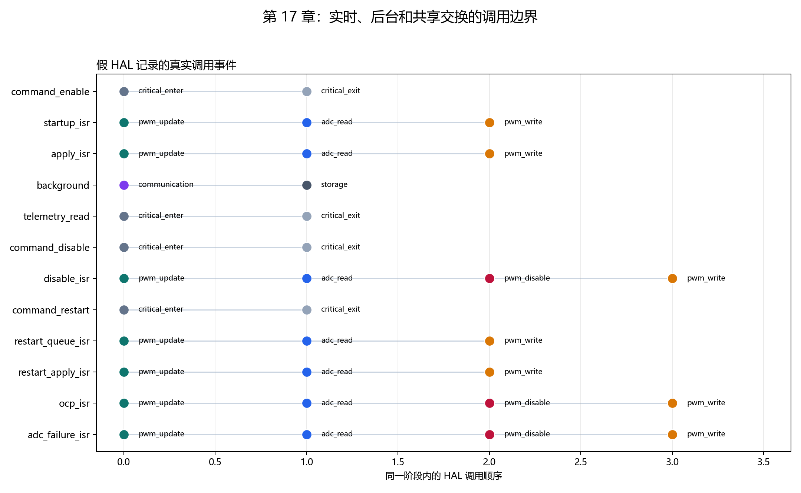
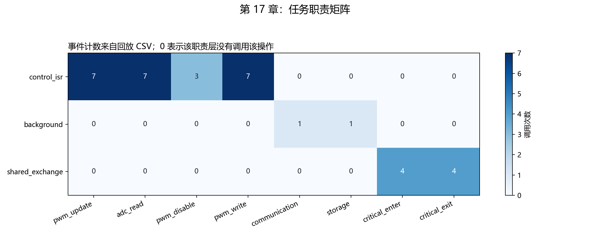

# 【数字电源/MATLAB+PLECS+C】Buck 数字电源开发（十七）哪些代码放 5 us 中断，哪些放后台，HAL 接口怎么拆

第十六章已经把 ADC、定点控制和 PWM 更新放进 5 us 控制中断。下一步若直接把串口打印、协议解析或 Flash 保存也塞进去，一次慢操作就可能占满整个 PWM 周期；反过来，后台代码若随时改控制参数，中断可能读到一半新、一半旧的数据。

本章把固件拆成三条职责明确的路径：

```text
实时 ISR：PWM 更新 → ADC 读取 → 控制计算 → PWM 写入 / 紧急关断
后台循环：通信服务 → 参数存储
共享交换：后台发布完整命令；ISR 在下一周期边界提交；后台复制遥测快照
```

HAL 是 Hardware Abstraction Layer 的缩写，可以理解为“硬件动作接口”。控制代码只提出“读 ADC”“写 PWM 预装载”“立即关闭 PWM”等动作，具体 STM32、C2000 或其他 MCU 的寄存器操作由 HAL 实现。

配套 GitHub 仓库：[digital-power-buck-sim-lab](https://github.com/Old-Ding/digital-power-buck-sim-lab)

运行入口：

```powershell
python scripts\run_firmware_layering_tests.py
```

当前真实 C 测试覆盖 12 个阶段、34 次 HAL 调用，得到 `PASS 21 / FAIL 0`。

## 先用截止时间决定代码归属

| 工作 | 放置位置 | 原因 |
| --- | --- | --- |
| 确认 PWM 更新事件 | 控制 ISR | 决定 compare 生效边界 |
| 读取本周期 ADC 快照 | 控制 ISR | 必须与控制周期同步 |
| Q20 映射、保护、PI | 控制 ISR | 必须在下一 PWM 更新前完成 |
| 写 compare 预装载 | 控制 ISR | 准备下一周期输出 |
| OCP/ADC 失败关断 | 控制 ISR | 需要立即关闭有效输出 |
| 串口/CAN/协议解析 | 后台 | 延迟和执行时间不固定 |
| Flash 参数保存 | 后台 | 擦写时间远大于 5 us |
| 命令与遥测复制 | 短临界区 | 防止 ISR 与后台同时访问多字段结构 |

判断标准不是“这段代码重要不重要”，而是“它是否必须在固定的 5 us 截止时间内完成”。日志很重要，但不需要每个 PWM 周期同步完成，因此属于后台。

## HAL 只翻译硬件动作，不做控制判断

本章定义的 `DpFirmwareHalOps` 包含八类动作：

| HAL 动作 | 调用者 | 具体平台应实现什么 |
| --- | --- | --- |
| `pwm_update_event` | ISR | 确认/清除更新事件，模型中应用 pending |
| `read_adc_sample` | ISR | 读取同一采样时刻的 ADC 原始码 |
| `write_pwm_preload` | ISR | 写 compare 与下一周期 enable |
| `disable_pwm_immediate` | ISR | 立即关闭门极或定时器主输出 |
| `enter_critical` / `exit_critical` | 后台共享交换 | 短时间屏蔽控制 ISR，复制完整结构 |
| `service_communication` | 后台 | 协议收发和命令解析 |
| `service_storage` | 后台 | 参数保存和非易失存储维护 |

HAL 不决定 OCP 阈值、不计算 duty，也不判断状态机优先级。这些规则仍只存在于控制层。更换 MCU 时应替换 HAL 实现，而不是复制控制算法。

## 完整算例一：正常 ISR 只调用三次 HAL

后台先发布 `enable=true` 命令。命令写入 pending 区，并在短临界区内一次性完成；此时控制器仍使用旧命令。

下一次控制 ISR 到达后，调用顺序为：

```text
0  pwm_update
1  adc_read
2  pwm_write
```

ISR 在 ADC 读取后提交 pending 命令，运行第十六章的控制编排层，最后只写下一周期 PWM 预装载。正常路径中没有通信、存储或后台临界区。

第一个启动周期写入 pending enable，但假硬件的 active enable 仍为 0；第二次更新事件到达后，active enable 才变为 1。这与第十五、十六章的同步启用规则一致。

## 完整算例二：OCP 关断必须先于预装载写入

回放把电流 ADC code 改成 3598，映射结果约为 7 A。控制器检测到 OCP 后，HAL 事件变成：

```text
0  pwm_update
1  adc_read
2  pwm_disable
3  pwm_write
```

`pwm_disable` 在 `pwm_write` 之前执行，因为前者关闭当前有效输出，后者只准备下一次更新事件。如果只写 `compare=0` 而不立即关闭，硬件仍可能使用当前 active compare 输出到周期结束。

ADC 读取失败使用相同的失效安全顺序。遥测同时记录 `adc_sample_valid=false`，让后台能够区分“控制器主动关闭”和“采样不可用导致关闭”。



这张图由假 HAL 的 34 条真实事件记录生成。每一行是一个操作阶段，横向位置表示同一阶段内的调用顺序。可以直接看到 ISR、后台和共享交换使用不同的 HAL 动作。

## 后台命令为什么要等到下一 ISR 边界

`DpFirmwareCommand` 当前包含 `enable` 和一次性的 `clear_fault`。后台发布 disable 命令时：

```text
active_command.enable  = true
pending_command.enable = false
command_pending        = true
```

在下一次 ISR 入口，完整 pending 命令一次性复制到 active：

```text
active_command.enable = false
command_pending       = false
```

这样中断不会在一次控制计算中先读到新 `enable`，后读到旧 `clear_fault`。当前两字段结构很小，但同一规则可以扩展到参考值、限流值或控制参数组。

disable 命令在下一 ISR 边界执行；OCP 等硬件安全事件不能走这条后台命令路径，仍必须在 ISR 或硬件比较器中立即关断。

## 遥测快照为什么也需要临界区

ISR 每周期更新一组遥测：电压、电流、温度、duty、状态、故障和 compare。后台若逐字段读取，可能把第 N 周期的电压和第 N+1 周期的故障拼成一条不存在的记录。

本章用短临界区复制完整 `DpFirmwareTelemetry`：

```text
enter_critical
→ copy telemetry snapshot
→ exit_critical
```

临界区只覆盖内存复制，不包含串口发送、格式化或文件保存。后台离开临界区后再处理快照，因此不会把慢操作带进实时路径。

## 事件矩阵如何证明职责没有越界



矩阵中的数字直接统计 `waveforms/17-hal-events.csv`：

| 职责层 | 实际出现的操作 |
| --- | --- |
| `control_isr` | 7 次更新、7 次 ADC、3 次立即关断、7 次 PWM 写入 |
| `background` | 1 次通信、1 次存储 |
| `shared_exchange` | 4 次进入、4 次退出临界区 |

所有不属于该职责层的格子为 0。这个结果比只画架构箭头更有约束力，因为它来自编译后程序的调用记录。

## 假 HAL 从哪里来，能证明什么

`tests/fake_digital_power_hal.c` 是本仓库编写的测试适配器。它不访问寄存器，而是保存 active/pending compare、ADC 样本和 enable 状态，并按顺序记录每次调用。

假 HAL 让电脑端测试能够回答：

- 正常 ISR 是否只调用实时动作；
- OCP 是否先立即关断再写预装载；
- 后台是否推进了控制周期；
- 命令是否在周期边界提交；
- 遥测是否通过短临界区复制。

具体 MCU 的寄存器地址、DMA 完成标志、定时器主输出位和 NVIC 配置仍需要目标 HAL 实现。

## 手动编译最小单元测试

以 Zig 为例：

```powershell
New-Item -ItemType Directory -Force artifacts\host-build\chapter17 | Out-Null

zig cc -std=c99 -O2 -Wall -Wextra -Werror `
  -I src -I tests `
  src\digital_power_adc_map.c `
  src\digital_power_control_fixed.c `
  src\digital_power_pwm_map.c `
  src\digital_power_control_isr.c `
  src\digital_power_firmware.c `
  tests\fake_digital_power_hal.c `
  tests\test_digital_power_firmware.c `
  -o artifacts\host-build\chapter17\digital_power_firmware_tests.exe

.\artifacts\host-build\chapter17\digital_power_firmware_tests.exe
```

预期输出包含：

```text
PASS,isr_calls_only_realtime_hal_operations
PASS,background_calls_only_communication_and_storage
PASS,ocp_disable_precedes_preload_write
PASS,command_is_atomic_at_isr_boundary
PASS,adc_failure_uses_fail_safe_hal_order
PASS,telemetry_copy_uses_critical_section
SUMMARY,PASS,failures=0
```

C 断言判断技术行为。Python 脚本负责编译、运行、读取事件 CSV、统计职责矩阵并生成报告。

## 一键生成全部证据

```powershell
python scripts\run_firmware_layering_tests.py
```

当前摘要：

```text
summary,pass=21,fail=0,phases=12,events=34
toolchain,zig,zig 0.16.0
ownership,isr=update+adc+pwm,background=communication+storage,shared=critical_sections
```

## 不要误读本章结果

| 本章证据说明 | 不要误读成 |
| --- | --- |
| ISR、后台与共享交换的调用边界通过真实 C 测试 | RTOS 任务、优先级和调度器已经配置 |
| OCP 与 ADC 失败先关断再写预装载 | 实物短路关断延迟已经测量 |
| 假 HAL 记录了 34 次正确调用 | 目标 MCU ADC、PWM、DMA 和 NVIC 已经工作 |
| 后台命令在 ISR 边界原子提交 | 任意大小参数结构都可以长期屏蔽中断复制 |
| 遥测快照在短临界区内一致复制 | 串口格式化和发送也应该放在临界区 |

## 配套文件

| 类型 | 文件 |
| --- | --- |
| 教程 | `blog/17-firmware-layering-hal.md` |
| 复现说明 | `docs/17-firmware-layering-hal-reproduce.md` |
| 固件分层源码 | `src/digital_power_firmware.c`、`src/digital_power_firmware.h` |
| 假 HAL | `tests/fake_digital_power_hal.c`、`tests/fake_digital_power_hal.h` |
| C 单元测试 | `tests/test_digital_power_firmware.c` |
| 事件回放 | `tests/replay_digital_power_firmware.c` |
| 自动化脚本 | `scripts/run_firmware_layering_tests.py` |
| HAL 事件 | `waveforms/17-hal-events.csv` |
| 状态回放 | `waveforms/17-firmware-states.csv` |
| 职责计数 | `waveforms/17-task-ownership.csv` |
| 汇总指标 | `waveforms/17-layering-summary.csv` |
| 图表 | `waveforms/17-hal-call-order.png`、`waveforms/17-task-ownership.png` |
| 报告 | `reports/17-firmware-layering-report.md` |

## 本章结论

5 us 控制 ISR 只保留周期同步和安全关断动作；通信与存储留在后台；多字段命令和遥测通过短临界区完整交换。HAL 只翻译硬件动作，不接管控制判断。

当前 21 项分层与调用指标全部通过，12 个阶段的 34 条事件可以独立复查职责边界。

下一章将选择一个明确的 MCU 指令集目标，用交叉编译器生成 ELF、BIN 和反汇编文件，并检查固件映像大小、入口符号和浮点指令依赖。
