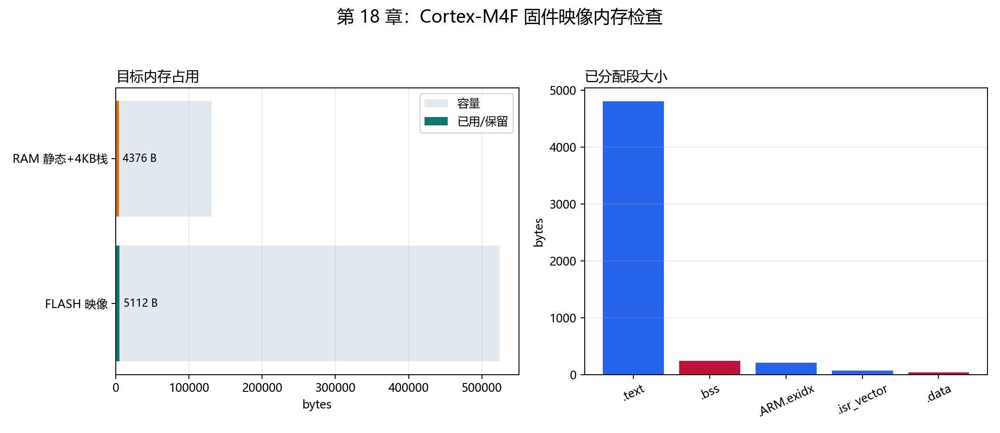
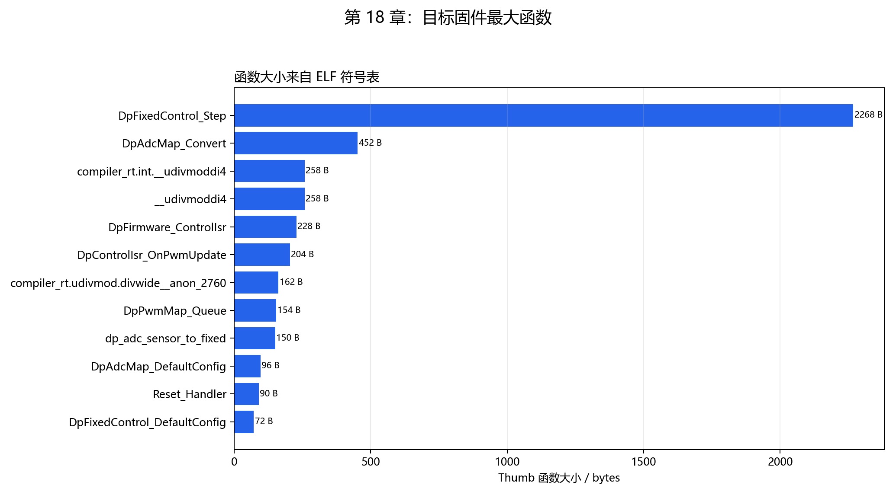

# 【数字电源/MATLAB+PLECS+C】Buck 数字电源开发（十八）如何把控制固件交叉编译成 Cortex-M4F 的 ELF 和 BIN

第十一到十七章的 C 程序都能在 Windows 上编译和运行，但 Windows EXE 使用 x86-64 指令、操作系统入口和主机内存布局，不能烧进 Cortex-M4F。

目标固件必须重新回答四个问题：

```text
CPU 执行什么指令集？
上电后从哪个地址取复位入口？
代码、常量、全局变量分别放进 Flash 还是 RAM？
最终映像是否还有未解析符号、浮点依赖或超出容量？
```

本章使用 Zig 0.16.0 的真实交叉编译能力，生成 `thumb-freestanding-eabihf / cortex_m4` 目标 ELF、BIN、map、符号 CSV 和 Thumb 反汇编。

配套 GitHub 仓库：[digital-power-buck-sim-lab](https://github.com/Old-Ding/digital-power-buck-sim-lab)

运行入口：

```powershell
python scripts\build_cortex_m4f_firmware.py
```

当前结果为 `PASS 13 / FAIL 0 / INFO 1`：发布 ELF 与带符号审计 ELF 的 `.text` 完全一致，BIN 为 5112 B；唯一 INFO 是 64 位整数除法助手需要目标板计时。

## 五个产物各自回答什么

| 产物 | 本章文件 | 用途 |
| --- | --- | --- |
| ELF | `firmware/cortex-m4f/digital_power_cortex_m4f.elf` | 保存段地址、入口和可执行映像 |
| BIN | `firmware/cortex-m4f/digital_power_cortex_m4f.bin` | 从 Flash 起始地址连续写入的纯二进制 |
| map | `firmware/cortex-m4f/digital_power_cortex_m4f.map` | 查看段、地址、函数大小和链接符号 |
| 反汇编 | `firmware/cortex-m4f/digital_power_cortex_m4f.lst` | 检查 CPU 实际执行的 Thumb 指令 |
| CSV/报告 | `waveforms/18-*`、`reports/18-*` | 自动判断入口、容量、符号和指令依赖 |

ELF 是主要审计对象，BIN 是烧录数据。只有 BIN 大小正常，不足以证明复位入口、向量表和 RAM 布局正确。

## 目标配置为什么选 Cortex-M4F

第十五章使用 170 MHz 定时器参数，常见于 STM32G4 类 Cortex-M4F MCU。本章先固定 CPU 和内存模型：

| 参数 | 配置 |
| --- | --- |
| 架构 | ARM Thumb-2 |
| CPU | Cortex-M4 |
| ABI | EABI hard-float |
| FPU 参数 | FPv4-SP-D16 |
| Flash 起始地址 | `0x08000000` |
| Flash 容量 | 512 KB |
| RAM 起始地址 | `0x20000000` |
| RAM 容量 | 128 KB |
| 栈保留 | 4 KB |
| 优化 | `-Os` |

hard-float ABI 描述函数调用约定，并不表示控制算法必须使用浮点。后面的 ELF 检查仍要求控制映像中没有 VFP 浮点指令和浮点运行库助手。

## 启动文件怎样把 CPU 带到 main

Cortex-M 上电后先读取向量表：第一个 32 位值是初始栈顶，第二个值是复位处理函数地址。本章的 `target/cortex-m4f/startup_cortex_m4f.c` 在 `.isr_vector` 中放入：

```text
0x08000000  初始栈顶 _estack
0x08000004  Reset_Handler
...
             Control_IRQHandler
```

`Reset_Handler` 完成两个 C 运行时动作：

1. 把 Flash 中的 `.data` 初值复制到 RAM；
2. 把 `.bss` 清零；
3. 调用 `main()`。

当前 ELF 入口为 `0x08000F85`。最低位 1 表示 Thumb 状态；去掉最低位后，与 `Reset_Handler` 符号地址一致。自动检查同时确认 `.isr_vector` 位于 `0x08000000`，大小为 68 B。

## 链接脚本怎样决定 Flash 和 RAM

`target/cortex-m4f/linker.ld` 定义两块内存：

```text
FLASH  0x08000000  512 KB
RAM    0x20000000  128 KB
```

各段放置关系为：

| 段 | 地址 | 大小 | 作用 |
| --- | --- | ---: | --- |
| `.isr_vector` | `0x08000000` | 68 B | 栈顶、复位和中断入口 |
| `.text` | `0x08000044` | 4800 B | 代码和只读常量 |
| `.ARM.exidx` | `0x08001304` | 208 B | ARM 展开索引 |
| `.data` | `0x20000000` | 36 B | 有初值的 RAM 变量 |
| `.bss` | `0x20000024` | 244 B | 启动时清零的 RAM 变量 |

链接脚本还执行断言：`.data + .bss` 之后必须至少留下 4 KB 栈空间。若静态数据增长到挤占栈保留，链接直接失败，不等上板后随机崩溃。

## 完整构建命令

核心命令为：

```powershell
zig cc `
  -target thumb-freestanding-eabihf `
  -mcpu=cortex_m4 -mthumb `
  -mfloat-abi=hard -mfpu=fpv4-sp-d16 `
  -ffreestanding -fno-builtin `
  -fdata-sections -ffunction-sections `
  -std=c99 -Os -Wall -Wextra -Werror `
  -I src `
  src\digital_power_adc_map.c `
  src\digital_power_control_fixed.c `
  src\digital_power_pwm_map.c `
  src\digital_power_control_isr.c `
  src\digital_power_firmware.c `
  target\cortex-m4f\startup_cortex_m4f.c `
  target\cortex-m4f\firmware_entry.c `
  -Wl,-T,target\cortex-m4f\linker.ld `
  -Wl,--gc-sections `
  -Wl,--entry=Reset_Handler `
  -o firmware\cortex-m4f\digital_power_cortex_m4f.elf
```

`-ffreestanding` 表示没有操作系统和默认 C 运行环境。第十七章固件层原先使用了 `string.h/memset`；裸机构建暴露出这项隐含依赖后，清零逻辑已收回固件层内部，因此最终没有未解析 libc 符号。

## 为什么脚本要构建两份 ELF

发布 ELF 不带 DWARF 调试信息，大小为 131652 B；同参数审计 ELF 在被 Git 忽略的 `artifacts/` 中保留符号信息，用来生成 map、符号 CSV 和反汇编。

脚本逐字节比较两份 ELF 的 `.text`，并检查入口地址一致。当前 `release_text_matches_audit=PASS`，说明公开反汇编对应发布映像的真实机器码，而不是另一套构建参数产生的代码。

BIN 由发布 ELF 直接提取：

```powershell
zig objcopy -O binary `
  firmware\cortex-m4f\digital_power_cortex_m4f.elf `
  firmware\cortex-m4f\digital_power_cortex_m4f.bin
```

## 映像大小如何读



当前 Flash 映像为 5112 B，占 512 KB 的约 0.98%；`.data + .bss + 4 KB 栈保留` 为 4376 B，占 128 KB 的约 3.34%。

左图使用容量与已用值对照，右图拆分已分配段。ELF 文件自身的 131652 B 不能当作 Flash 占用，因为 ELF 还包含文件头、段表和地址空洞；烧录占用应读 BIN 和分配段。

## 符号和反汇编发现了什么

自动检查确认四个关键符号存在：

```text
Reset_Handler
main
Control_IRQHandler
DpFirmware_ControlIsr
```

`Control_IRQHandler` 的反汇编末尾跳转到 `DpFirmware_ControlIsr`，说明目标中断入口已连接到第十七章固件编排层，而不是只把算法源文件编译进映像却从未调用。



最大的函数为 `DpFixedControl_Step`，大小 2268 B；ADC 映射为 452 B，固件 ISR 编排为 228 B。符号图同时显示了 64 位除法运行库函数，它们来自 ADC 比例换算和 Q20 除法。

当前指令检查结果：

| 检查 | 结果 |
| --- | ---: |
| 未解析符号 | 0 |
| 浮点运行库助手 | 0 |
| VFP 浮点指令 | 0 |
| 64 位整数除法助手 | 2，INFO |
| 反汇编指令数 | 1695 |

两个整数除法助手不是错误；但 Cortex-M4 没有单条 64 位除法指令，它们可能占用较多周期。第十六章设定的 3.5 us ISR 预算最终需要 DWT 周期计数或 GPIO 示波器测量，不能用代码体积推断。

## 目标 HAL 中的寄存器模型是什么

`target/cortex-m4f/firmware_entry.c` 实现了第十七章 HAL 接口和真实 Cortex-M4 临界区指令 `mrs primask`、`cpsid i`、`cpsie i`，但 ADC/PWM 使用的是 volatile 可编译寄存器模型。

这使目标映像能够验证：

- 函数指针接口可以按 ARM EABI 链接；
- 控制 IRQ 可以进入固件编排层；
- 关键段、符号和指令可以生成；
- libc 和浮点依赖可以被审计。

它没有配置 STM32G4 的 RCC、ADC、TIM、DMA 和 NVIC，因此不能直接作为目标板功能固件烧录。

## 一键生成全部证据

首次运行需要 ELF 解析和反汇编依赖：

```powershell
python -m pip install pyelftools capstone
```

然后运行：

```powershell
python scripts\build_cortex_m4f_firmware.py
```

当前摘要：

```text
summary,pass=13,fail=0,info=1,sections=5,symbols=107,instructions=1695
toolchain,zig,0.16.0,target=thumb-freestanding-eabihf,cpu=cortex_m4
image,elf_bytes=131652,bin_bytes=5112,entry=0x08000F85
```

## 不要误读本章结果

| 本章证据说明 | 不要误读成 |
| --- | --- |
| 固件真实生成 Cortex-M4F ELF、BIN 和 Thumb 指令 | STM32G4 外设已经初始化 |
| 复位入口、向量表、段地址和 RAM 断言通过 | 该 BIN 可以直接烧录任意 Cortex-M4 板 |
| 控制 IRQ 符号连接到固件 ISR 编排层 | 200 kHz 中断已在实物上稳定触发 |
| 映像没有浮点助手和 VFP 指令 | 3.5 us 最坏执行时间已经满足 |
| 64 位整数除法助手被识别为 INFO | 这些除法一定导致超时 |

## 配套文件

| 类型 | 文件 |
| --- | --- |
| 教程 | `blog/18-cortex-m4f-target-build.md` |
| 复现说明 | `docs/18-cortex-m4f-target-build-reproduce.md` |
| 启动文件 | `target/cortex-m4f/startup_cortex_m4f.c` |
| 链接脚本 | `target/cortex-m4f/linker.ld` |
| 目标入口与 HAL 寄存器模型 | `target/cortex-m4f/firmware_entry.c` |
| 构建/审计脚本 | `scripts/build_cortex_m4f_firmware.py` |
| 发布 ELF/BIN | `firmware/cortex-m4f/digital_power_cortex_m4f.elf`、`.bin` |
| map/反汇编 | `firmware/cortex-m4f/digital_power_cortex_m4f.map`、`.lst` |
| 段与符号数据 | `waveforms/18-firmware-sections.csv`、`waveforms/18-firmware-symbols.csv` |
| 汇总指标 | `waveforms/18-target-build-summary.csv` |
| 图表 | `waveforms/18-firmware-*.png` |
| 报告 | `reports/18-target-build-report.md` |

## 本章结论

平台无关控制固件已经从 Windows 主机程序推进到可审计的 Cortex-M4F 裸机映像：启动向量、链接地址、入口符号、BIN、map 和 Thumb 反汇编全部生成，13 项构建与映像检查通过。

64 位整数除法助手作为唯一 INFO 被保留，等待目标板最坏周期测量；目标 HAL 仍是可编译寄存器模型，不能冒充实物外设验证。

下一章将把主机单元测试、C/Python 对照、定点检查、ADC/PWM 映射、固件分层和 Cortex-M4F 构建接入同一套持续回归，确保后续修改不会破坏已有证据。
