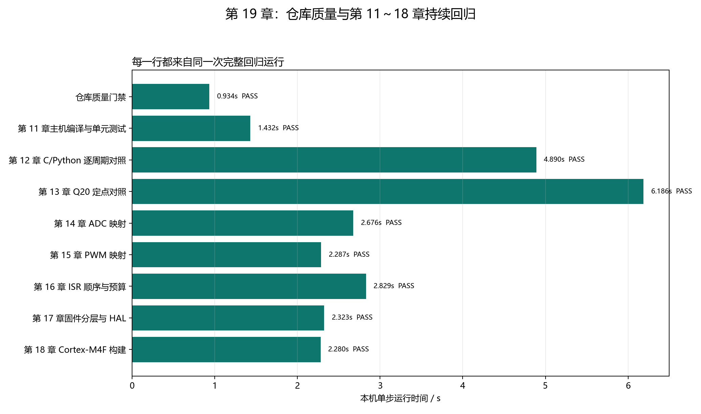

# 【数字电源/MATLAB+PLECS+C】Buck 数字电源开发（十九）如何用 GitHub Actions 持续回归第 11～18 章

第十八章可以生成 Cortex-M4F 映像，但工程代码仍会继续修改。一次改动可能让当前章节通过，却破坏早期行为：例如调整 ADC 映射后，目标 ELF 仍能链接，但 C/Python 对照误差已经超限；修改报告脚本后，测试仍通过，却把本机绝对路径写进公开仓库。

本章建立一条统一回归链：

```text
代码或文章发生变化
→ 仓库质量门禁
→ 依次真实运行第 11～18 章
→ 聚合每一步退出码和摘要
→ 任一步失败，统一入口返回非 0
→ GitHub Actions 标记提交失败并保存证据
```

CI 是 Continuous Integration 的缩写，可以理解为“每次提交后自动在干净环境重跑同一套检查”。它不发明新的技术判据，只负责稳定执行各章节已经建立的 PASS/FAIL 规则。

配套 GitHub 仓库：[digital-power-buck-sim-lab](https://github.com/Old-Ding/digital-power-buck-sim-lab)

本地与 CI 使用同一个入口：

```powershell
python scripts\run_full_regression.py
```

当前本机完整运行得到 `PASS 9 / FAIL 0`，总耗时 `25.837 s`。

## 谁决定技术正确，谁负责调度

| 角色 | 文件或程序 | 责任 |
| --- | --- | --- |
| 各章测试 | `run_host_build_tests.py` 到 `build_cortex_m4f_firmware.py` | 判断编译、数值、顺序、映像等技术行为 |
| 仓库质量门禁 | `check_repository_quality.py` | 判断公开文件、图片、机器路径和证据包完整性 |
| 全回归聚合器 | `run_full_regression.py` | 顺序启动、记录退出码、汇总 CSV/PNG/报告 |
| GitHub Actions | `.github/workflows/firmware-regression.yml` | 在干净 Windows runner 上安装环境并调用统一入口 |

聚合器不重新判断 duty 误差、OCP 顺序或 ELF 入口。技术结论仍由对应章节的断言和指标负责；聚合器只相信子进程退出码和 `summary,...` 行。

## 第一层：仓库质量门禁检查什么

质量门禁当前包含 9 项：

| 检查 | 当前结果 | 防止的问题 |
| --- | --- | --- |
| 公开文本无草稿标记 | PASS | 草稿关键词或未定稿内容进入教程 |
| 公开文本/数据无机器路径 | PASS | Windows 用户目录或工作区绝对路径泄漏 |
| 博客本地图片可解析 | PASS | Markdown 图片复制或发布后失效 |
| 第 11～18 章证据包完整 | PASS | 只有文章，没有脚本、CSV、PNG 或报告 |
| 本地产物未被 Git 跟踪 | PASS | `artifacts/`、CSDN 本地包、cache 进入仓库 |
| 全部 Python 脚本可编译 | PASS | 语法错误到运行时才暴露 |
| Cortex-M4F 产物存在 | PASS | README 指向不存在的 ELF/BIN/map/list |
| GitHub workflow 调用统一入口 | PASS | CI 与本地维护两套流程 |
| `git diff --check` | PASS | 空白错误和补丁格式问题 |

本章开发门禁时实际发现了两类历史问题：第 11 章报告曾记录本机 Zig 和工作目录绝对路径；第 19 章首轮聚合 CSV 也曾记录 `sys.executable` 的绝对路径。两处根因都在证据生成器中修复，门禁现在同时扫描编号 Markdown、报告、固件 map/list 和波形 CSV。

质量门禁的当前输出保存在 `waveforms/19-repository-quality.csv`，共扫描 98 个公开文本/数据文件，并检查 66 个博客本地图片引用。

## 第二层：九个顶层步骤怎样串起来

全回归按固定顺序执行：

| 顶层步骤 | 当前摘要 |
| --- | --- |
| 仓库质量 | `9 PASS / 0 FAIL` |
| 第 11 章主机构建 | `4 PASS / 0 FAIL` |
| 第 12 章 C/Python 对照 | `55 PASS / 0 FAIL / 80400 行` |
| 第 13 章 Q20 定点对照 | `74 PASS / 0 FAIL / 80400 行` |
| 第 14 章 ADC 映射 | `22 PASS / 0 FAIL / 4 INFO` |
| 第 15 章 PWM 映射 | `15 PASS / 0 FAIL` |
| 第 16 章 ISR | `13 PASS / 0 FAIL / 4 INFO` |
| 第 17 章固件分层 | `21 PASS / 0 FAIL / 34 事件` |
| 第 18 章 Cortex-M4F 构建 | `13 PASS / 0 FAIL / 1 INFO` |

INFO 不会让步骤失败。它用于保存需要后续实测或仅作对照的数据，例如未校准误差、Windows 主机计时和 64 位整数除法助手。只有对应章节定义的 FAIL 或非 0 退出码会中止提交质量结论。

## 完整算例：一个子步骤怎样影响总结果

聚合器启动每个子脚本后记录：

```text
step
label
exit_code
duration_s
summary
command
```

以第 15 章为例，子脚本输出：

```text
summary,pass=15,fail=0,rows=640
```

并返回退出码 0，因此聚合行为：

```text
chapter15_pwm_map,PASS,0,...
```

若任一 PWM 边界指标变成 FAIL，`run_pwm_mapping_tests.py` 返回 1；聚合器仍继续运行后续步骤以收集完整故障面，但最终 `run_full_regression.py` 返回 1。GitHub Actions 因此显示红色失败状态。

这个关系保证 PASS/FAIL 只有一个来源：第 15 章测试拥有 PWM 正确性判断，第 19 章只传播结果，不再增加一套重复判断。

## 当前全回归时间分布



图中每一行来自同一次完整运行。当前较慢的步骤是第 13 章 Q20 对照和第 12 章 C/Python 对照，因为它们分别处理 80,400 个控制周期；Cortex-M4F 双构建约 2 秒级。

当前本机结果：

| 指标 | 数值 |
| --- | ---: |
| 顶层步骤 | 9 |
| PASS / FAIL | 9 / 0 |
| 总耗时 | 25.837 s |
| 最长步骤 | 第 13 章 Q20 对照 |

步骤时间不是跨机器硬门限。CI runner 和本机性能不同，门禁使用退出码和技术指标，不使用总耗时判断正确性；工作流只设置 30 分钟防卡死超时。

## GitHub Actions 在干净环境做什么

`.github/workflows/firmware-regression.yml` 在 `push master`、Pull Request 和手动触发时运行：

```text
Windows latest
→ Python 3.13
→ Zig 0.16.0
→ 按 requirements-ci.txt 安装 Python 依赖
→ python scripts\run_full_regression.py
→ 无论成功或失败都上传第 19 章报告、CSV 和 PNG
```

CI 使用 Windows 是为了与本项目的 PowerShell 复现命令一致。测试脚本仍支持 GCC、Clang 或 MSVC 的主机编译器，但 workflow 固定 Zig，避免不同提交因自动选择到不同编译器而产生不可比较结果。

## 本地怎样先复现 CI

安装依赖：

```powershell
python -m pip install -r requirements-ci.txt
```

只检查仓库质量：

```powershell
python scripts\check_repository_quality.py
```

运行全部步骤：

```powershell
python scripts\run_full_regression.py
```

当前最终摘要：

```text
summary,pass=9,fail=0,steps=9,duration_s=25.837
```

## 如何定位失败

先看 `waveforms/19-full-regression.csv` 中第一个 FAIL 行，再直接运行该行的 `command`。例如：

```powershell
python scripts\run_fixed_point_parity.py
```

子脚本会输出更具体的场景、指标和报告路径。不要从 GitHub Actions 红色状态直接猜根因，也不要在第 19 章聚合器里给某个章节增加特殊放行。

| 聚合失败步骤 | 下一份证据 |
| --- | --- |
| `repository_quality` | `waveforms/19-repository-quality.csv` |
| `chapter12_c_python` | `reports/12-c-python-parity-report.md` |
| `chapter13_fixed_point` | `reports/13-fixed-point-parity-report.md` |
| `chapter16_isr` | `reports/16-isr-timing-report.md` |
| `chapter18_target` | `reports/18-target-build-report.md` |

## 不要误读本章结果

| 本章证据说明 | 不要误读成 |
| --- | --- |
| 第 11～18 章在同一次运行中全部通过 | 每个可能输入和硬件故障都已覆盖 |
| GitHub Actions 会在干净环境自动重跑 | CI 可以替代工程师分析失败根因 |
| 公开路径、图片和证据包通过质量门禁 | 文章技术内容一定没有概念错误 |
| Cortex-M4F 构建纳入持续回归 | 目标板已经烧录和运行 |
| 全回归总耗时约 26 秒 | 任一步骤都应设置固定秒级性能门限 |

## 配套文件

| 类型 | 文件 |
| --- | --- |
| 教程 | `blog/19-ci-full-regression.md` |
| 复现说明 | `docs/19-ci-full-regression-reproduce.md` |
| 仓库质量脚本 | `scripts/check_repository_quality.py` |
| 全回归入口 | `scripts/run_full_regression.py` |
| GitHub Actions | `.github/workflows/firmware-regression.yml` |
| CI 依赖清单 | `requirements-ci.txt` |
| 质量门禁数据 | `waveforms/19-repository-quality.csv` |
| 全回归数据 | `waveforms/19-full-regression.csv` |
| 耗时图 | `waveforms/19-full-regression-duration.png` |
| 报告 | `reports/19-full-regression-report.md` |

## 本章结论

第 11～18 章现在不再是八个相互独立的手工命令：仓库质量、主机编译、数值对照、定点与映射、ISR/HAL 和 Cortex-M4F 构建已经由一个本地入口统一执行，并由 GitHub Actions 自动复现。

当前 9 个顶层步骤全部通过；质量门禁在建立过程中发现并修复了两处机器绝对路径污染，说明 CI 本身也必须接受真实数据和失败反馈。

下一章将把软件证据转换为低压 HIL/实物验收表：明确需要哪块板、哪些仪器、每个接线与测量步骤、PASS 门限，以及在没有硬件时哪些结论必须保持未验收。
