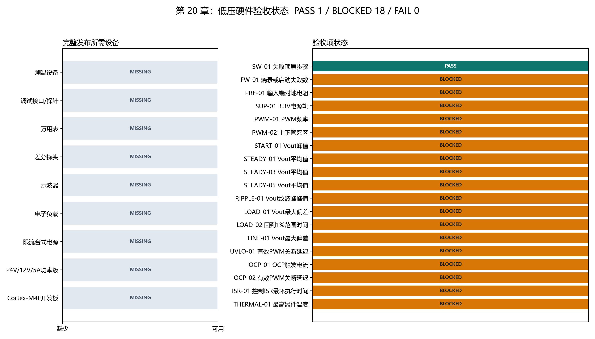

# 【数字电源/MATLAB+PLECS+C】Buck 数字电源开发（二十）如何完成低压硬件验收并决定能否发布 v1.0

第十九章在本机和 GitHub Actions 上全部通过，只能说明软件、数值对照和 Cortex-M4F 目标构建同时成立。它无法回答门极是否真的有 100 ns 死区、24 V 上电是否过冲、OCP 多快关闭 MOSFET，以及 5 A 连续运行时器件温度是否安全。

最终验收必须把软件命令、真实 ADC/PWM、电源级和仪器证据连成一条链：

```text
测试计划给出单位和上下限
→ 台架按安全顺序施加输入与负载
→ 仪器导出测量值和截图/CSV
→ 本地记录只填写数值与证据路径
→ 脚本计算 PASS / FAIL / BLOCKED
→ 全部通过后才允许创建 v1.0 标签
```

配套 GitHub 仓库：[digital-power-buck-sim-lab](https://github.com/Old-Ding/digital-power-buck-sim-lab)

验收入口：

```powershell
python scripts\run_hardware_acceptance.py
```

## 选择怎样的硬件路线

与第十八章 Cortex-M4F/170 MHz 目标最一致的控制板是 STM32G474 类开发板，例如 NUCLEO-G474RE。它有 Cortex-M4F、足够的 ADC/定时器资源和板载 ST-LINK，适合把第十七章 HAL 替换为真实外设实现。

功率级必须是可控的 24 V 输入、12 V/5 A 同步或异步 Buck 电路，具备：

- 额定电压和电流留量；
- 栅极驱动与上下管互锁；
- 输入/输出电容、22 uH 量级电感和电流采样；
- PWM 关闭时功率管默认关断；
- 测试点和短而清晰的功率回路。

B-G474E-DPOW1 等数字电源套件可以用于学习 HRTIM 和低功率拓扑，但只有电压、电流、拓扑和采样网络与本项目一致时，才能作为 24 V/12 V/5 A 验收对象。普通成品 Buck 模块若无法接管 PWM、ADC 和保护路径，也不能证明本仓库固件工作。

另一条路线是 PLECS RT Box 等实时仿真器连接真实 MCU。HIL 可以验证 ADC/PWM I/O、周期延迟、故障注入和 ISR 时间，但普通电脑上的 PLECS 离线仿真不是 HIL；HIL 也不能替代功率器件死区、EMI 和温升实测。本章选择低压实物路线作为 v1.0 完整门禁。

## 进入台架前：先让目标 HAL 接上真实外设

第十八章的 `target/cortex-m4f/firmware_entry.c` 仍用 `CortexM4fRegisterStub` 保存 ADC 和 PWM 数值。它证明 Cortex-M4F 映像能构建，但把数字写进这个结构体不会产生门极波形。

上板前需要保留第十七章的控制层，只替换 `TARGET_HAL` 对应的板级动作：

| 板级动作 | 真实实现应连接到 |
| --- | --- |
| PWM 周期同步与预装载 | STM32G4 HRTIM/TIM 更新事件和比较寄存器 |
| ADC 采样读取 | 定时器触发的 ADC/DMA 完成数据 |
| 立即关断 PWM | 定时器输出使能或硬件 fault/break 路径 |
| 临界区 | Cortex-M4F PRIMASK，保持第十七章短临界区边界 |
| 5 us 控制入口 | 200 kHz PWM 更新中断中的 `DpFirmware_ControlIsr` |

`FW-01` 记录板级 HAL 的构建、烧录和复位启动结果：`measured_value=0` 表示这三个步骤均无失败，证据文件保存构建日志以及调试器或启动遥测记录。`FW-01` 未通过时，不进入 PWM 和功率级测量。

## 最小台架设备

| 设备 | 建议能力 | 用途 |
| --- | --- | --- |
| Cortex-M4F 开发板 | STM32G474 类 | 运行真实 HAL 和控制 ISR |
| 调试接口/探针 | 板载 ST-LINK 或外置 J-Link，能稳定连接目标 | 构建下载、复位启动和 DWT 测时 |
| Buck 功率级 | 24 V 输入、12 V/5 A 输出 | 被控对象 |
| 台式电源 | 0～30 V、至少 5 A、可限流 | 安全上电和输入切换 |
| 电子负载 | 0～30 V、至少 10 A/100 W、动态模式 | 稳态、负载瞬态和 OCP |
| 示波器 | 100 MHz 或更高 | PWM、Vout、保护和 ISR 时序 |
| 差分探头 | 100 MHz 或更高，差模与共模额定值覆盖被测节点 | 安全测量开关节点/互补门极 |
| 万用表 | 电阻、电压、电流 | 断电检查和电源轨确认 |
| 热成像或热电偶 | 必需，量程覆盖 0～100°C 以上 | 5 A 温升记录 |

示波器地夹通常与保护地相连。不能把普通地夹接到上管源极或开关节点，否则可能直接短路功率回路。测量互补门极、Vds 或开关节点时使用额定合适的差分探头或隔离方案。

## 验收文件怎样分工

| 文件 | 责任 |
| --- | --- |
| `hardware/acceptance/test-plan.csv` | 定义测试 ID、测量量、单位和上下限 |
| `inventory.local.csv` | 记录本地设备型号，不提交 Git |
| `measurements.local.csv` | 记录实测数字和证据相对路径，不提交 Git |
| `evidence/public/` | 保存可以公开的示波器截图、照片和 CSV |
| `run_hardware_acceptance.py` | 检测设备、读取数值、检查证据并计算状态 |
| `20-acceptance-summary.csv` | 保存脚本最终判定 |

记录人员不在 `measurements.local.csv` 中填写 PASS。脚本从 test plan 读取本项设备依赖和上下限，只有依赖设备可用、数值在范围内且证据文件存在时才判 PASS；缺少本项设备、测量值或证据时判 BLOCKED，不会阻止其他已具备条件的项目先验收。

## 第一步：准备本地设备与测量文件

复制模板：

```powershell
Copy-Item hardware\acceptance\inventory-template.csv `
  hardware\acceptance\inventory.local.csv

Copy-Item hardware\acceptance\measurements-template.csv `
  hardware\acceptance\measurements.local.csv
```

在 inventory 中把实际可用设备改为 `yes`，并填写型号。调试探针还要能被 Windows PnP 检测到；开发板的 PnP 数量只作参考，因为 SWD 目标不会稳定显示为独立设备。安装了 J-Link 软件不代表 USB 调试器已连接。

证据文件使用仓库相对路径，例如：

```text
hardware/acceptance/evidence/public/PWM-02-deadtime.png
```

绝对路径、目录外路径或不存在的文件不会通过证据检查。

## 第二步：断电检查和控制板低压供电

在 24 V 功率输入断开、输入电容放电后执行：

1. 测输入正端对地电阻，稳定值应大于 1 kΩ。
2. 检查 MOSFET D-S、G-S 没有明显短路。
3. 只给控制板供电，功率级保持断电。
4. 测 3.3 V 电源轨，验收范围为 3.20～3.40 V。
5. 复位、下载和调试连接应稳定，PWM 默认关闭。

`PRE-01` 和 `SUP-01` 未通过前，不进入功率级上电。

## 第三步：功率级不加电时检查 PWM

保持 24 V 输入断开，只观察 MCU 或驱动器低压侧：

| ID | 测量 | PASS 范围 |
| --- | --- | ---: |
| `PWM-01` | PWM 频率 | 198～202 kHz |
| `PWM-02` | 上下管死区 | 80～120 ns |

同时确认：

- 清故障后的重新使能发生在更新事件；
- disable 命令能关闭有效输出；
- 上电和复位期间不会出现窄脉冲；
- 示波器截图包含时间刻度、通道名称和测量游标。

第十五章的 17 counts 只给出软件目标，`PWM-02` 的示波器值才是门极死区证据。

## 第四步：24 V 限流空载启动

首次功率上电步骤：

1. 电子负载保持关闭。
2. 台式电源设为 0 V，限流先设 0.2 A。
3. 示波器同时观察 Vout、PWM enable 和电感电流或输入电流。
4. 缓慢升到 24 V，再发送 enable。
5. 若电源立即进入限流、Vout 不受控或波形异常，先关闭输入。

`START-01` 要求 Vout 峰值不超过 13.2 V。不能为了得到截图临时移除 OVP 或 duty 上限。

## 第五步：稳态、纹波与瞬态

确认空载正常后逐级增加负载：

| 测试 | 工况 | PASS 门限 |
| --- | --- | --- |
| `STEADY-01` | 24 V / 1 A | Vout 11.88～12.12 V |
| `STEADY-03` | 24 V / 3 A | Vout 11.88～12.12 V |
| `STEADY-05` | 24 V / 5 A | Vout 11.88～12.12 V |
| `RIPPLE-01` | 24 V / 5 A | Vout 纹波 ≤100 mVpp |
| `LOAD-01` | 2.5 A↔5 A | 最大偏差 ≤1.2 V |
| `LOAD-02` | 2.5 A↔5 A | 回到 ±1% ≤12 ms |
| `LINE-01` | 20 V↔28 V / 3 A | 最大偏差 ≤0.24 V |

纹波测量使用短地弹簧或差分探头，并记录带宽限制。负载瞬态截图至少包含负载电流、Vout 和 duty/PWM 之一，避免只看到输出变化却无法区分控制饱和和负载边沿。

## 第六步：保护、ISR 和温升

| ID | 测试 | PASS 门限 |
| --- | --- | --- |
| `UVLO-01` | Vin 降到 17 V | active PWM ≤5 us 关闭 |
| `OCP-01` | 电子负载电流斜坡 | 6.5～7.0 A 触发 |
| `OCP-02` | OCP 触发到门极关闭 | ≤5 us |
| `ISR-01` | 最坏控制路径 | ≤3.5 us |
| `THERMAL-01` | 24 V/5 A 运行 10 分钟 | 最高器件温度 ≤90°C |

OCP 使用受控电流斜坡或限时脉冲，不用导线直接短路输出。ISR 时间可用 DWT 周期计数器，或在入口/出口翻转 GPIO 后用示波器测量；Windows 主机 P99 不能填入 `ISR-01`。

温升证据应同时记录环境温度、MOSFET、电感和电容。若器件数据手册或 PCB 额定值要求更低温度，应把 test plan 上限改得更严格并说明依据。

## 脚本如何计算一个真实 PASS

`SW-01` 使用当前已有证据演示判定链：

```text
test-plan: 失败顶层步骤，允许范围 0～0
measurement: 从 waveforms/19-full-regression.csv 自动统计
实际值: 0
evidence: 第19章全回归 CSV 存在
result: PASS
```

硬件行使用同一逻辑。例如 `STEADY-05` 只有同时具备该行列出的开发板、功率级、电源、电子负载和万用表，且实测 Vout 在 11.88～12.12 V 内并有公开证据文件，才会得到 PASS。

## 当前电脑的真实验收结果

当前运行：

```powershell
python scripts\run_hardware_acceptance.py
```

输出：

```text
summary,pass=1,blocked=18,fail=0,tests=19,v1=BLOCKED
hardware,probe=0,board=0,serial=0
```



图左显示完整发布所需的九类设备均未登记为可用；图右显示第十九章软件回归 PASS，目标固件与 17 项硬件测量共 18 项 BLOCKED。J-Link 软件已安装，但没有检测到 USB 调试探针、开发板或串口。

BLOCKED 表示证据前置条件不足，不等于测量值超限；FAIL 则表示已有测量或证据不满足 test plan。脚本在 BLOCKED 时返回非 0，防止发布流程忽略未验收项。

## 什么条件允许创建 v1.0

`RELEASE_READINESS.md` 定义最终门禁：

1. 第十九章全回归通过。
2. 第 20 章脚本返回退出码 0。
3. `20-acceptance-summary.csv` 没有 BLOCKED 或 FAIL。
4. 每个硬件 PASS 都有仓库相对公开证据。
5. 目标 HAL 已替换可编译寄存器模型，并记录开发板和功率级版本。
6. ISR 最坏执行时间不超过 3.5 us。
7. 24 V/12 V/5 A 稳态、瞬态、保护和温升全部达标。

当前软件基线可以继续使用和展示，但 `v1.0.0` 标签保持 BLOCKED。创建一个没有硬件证据的 v1.0，只会把“代码能编译”误写成“电源已经验收”。

## 不要误读本章结果

| 本章证据说明 | 不要误读成 |
| --- | --- |
| 最终台架步骤、单位和上下限已经固化 | 17 个硬件项目已经执行 |
| 第十九章软件回归自动得到 PASS | Cortex-M4F 已在开发板运行 |
| J-Link 软件存在 | USB 调试探针已连接 |
| PLECS 离线模型可以继续复现 | 当前电脑具备实时 HIL |
| 当前没有 FAIL | 当前已经具备发布 v1.0 的资格 |

## 配套文件

| 类型 | 文件 |
| --- | --- |
| 教程 | `blog/20-low-voltage-hardware-acceptance.md` |
| 复现说明 | `docs/20-low-voltage-hardware-acceptance-reproduce.md` |
| 验收目录说明 | `hardware/acceptance/README.md` |
| 测试计划 | `hardware/acceptance/test-plan.csv` |
| 设备/测量模板 | `hardware/acceptance/*-template.csv` |
| 验收脚本 | `scripts/run_hardware_acceptance.py` |
| 当前设备检测 | `waveforms/20-hardware-inventory.csv` |
| 当前验收结果 | `waveforms/20-acceptance-summary.csv` |
| 状态图 | `waveforms/20-acceptance-status.png` |
| 报告 | `reports/20-hardware-acceptance-report.md` |
| 发布门禁 | `RELEASE_READINESS.md` |

## 第二季结论

第二季第 11～19 章已经完成从主机编译、逐周期对照、Q20 定点化、ADC/PWM 映射、ISR/HAL 分层、Cortex-M4F 目标构建到 GitHub 持续回归的完整软件链。

第 20 章已经把低压实物验收变成可执行、可计算、可追溯的测试包。当前真实状态是软件基线 READY、硬件验收 BLOCKED、v1.0 BLOCKED；接入开发板和台架后，先完成板级 HAL 与 `FW-01`，再按本章顺序补齐 17 项测量，才能关闭最终门禁。
