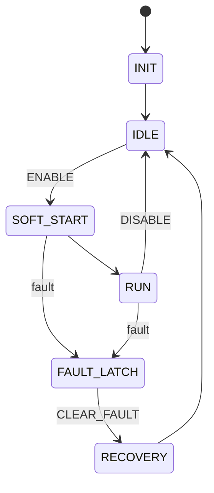

# 电源状态机

## 状态

```text
INIT
IDLE
SOFT_START
RUN
FAULT_LATCH
RECOVERY
```

## 状态图


```mermaid
stateDiagram-v2
  [*] --> INIT
  INIT --> IDLE
  IDLE --> SOFT_START: ENABLE
  SOFT_START --> RUN
  RUN --> IDLE: DISABLE
  SOFT_START --> FAULT_LATCH: fault
  RUN --> FAULT_LATCH: fault
  FAULT_LATCH --> RECOVERY: CLEAR_FAULT
  RECOVERY --> IDLE
```

## 设计理由

故障态采用锁存，是为了保留故障码和现场变量，方便调试。自动恢复策略后续再加，不在第一版里提前复杂化。
